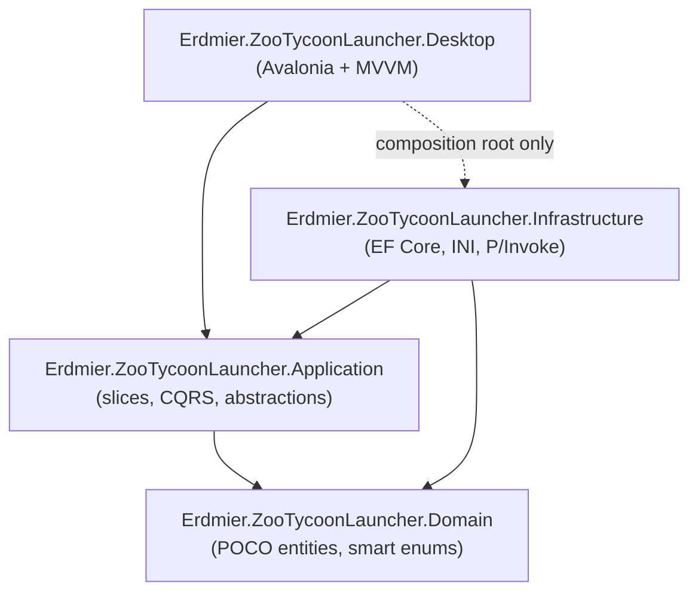
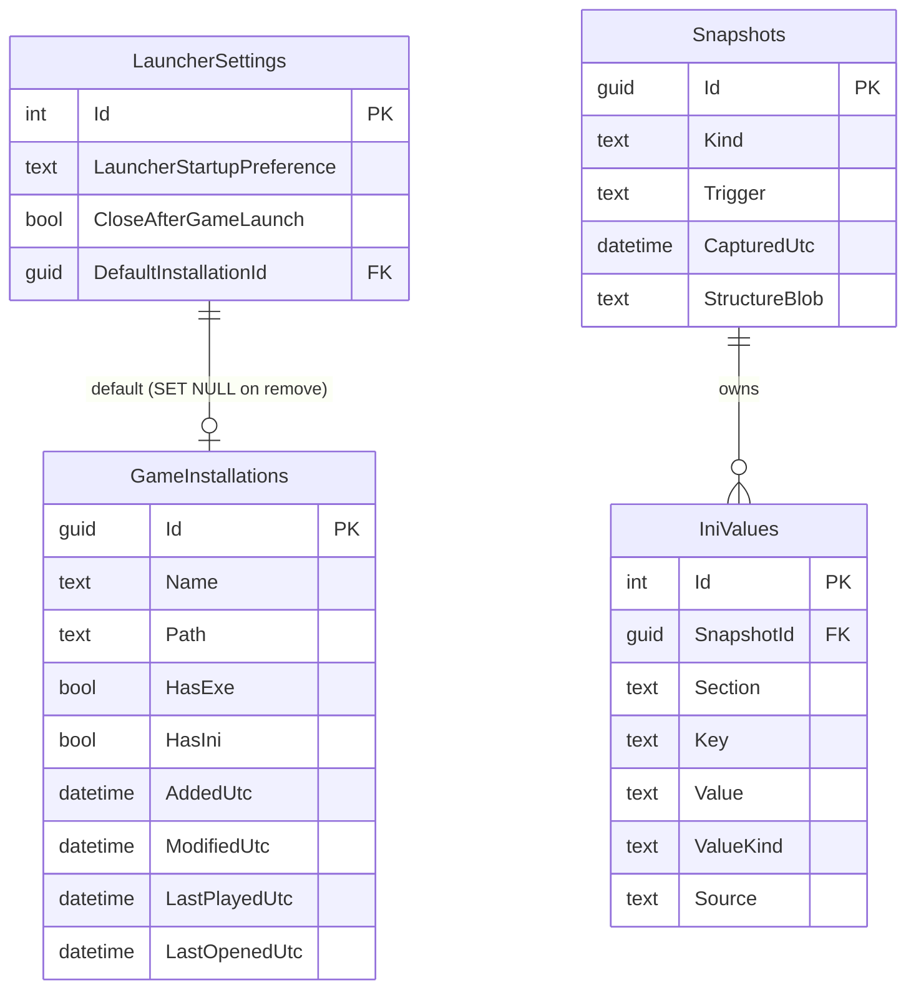
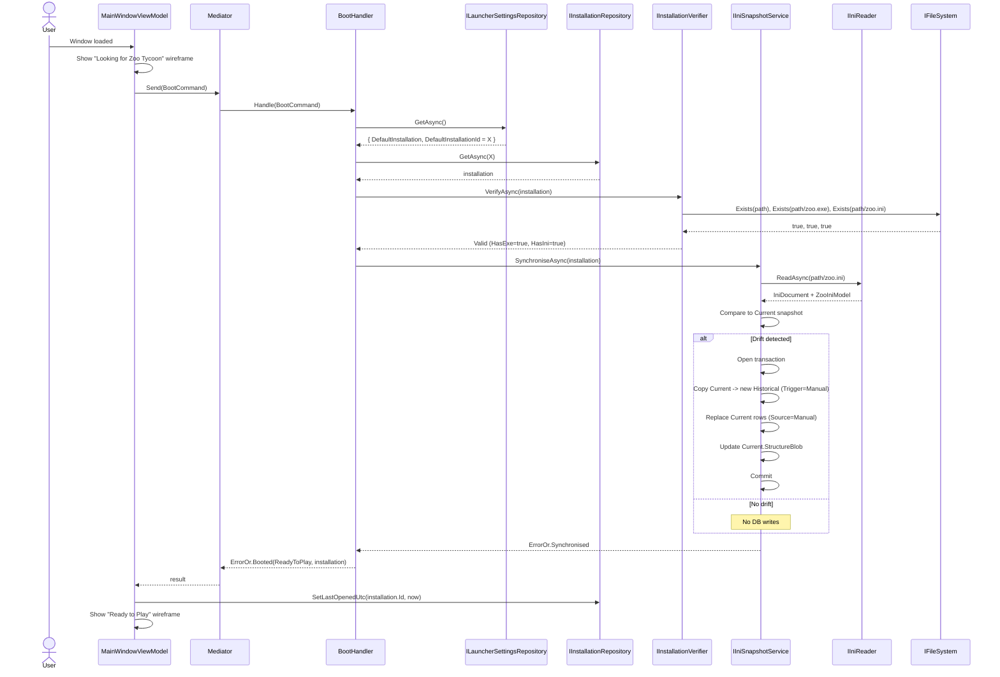

# Zoo Tycoon Launcher — Software Design Document

> A native Windows desktop launcher for **Zoo Tycoon (2001)**: multi-installation discovery and management, exhaustive INI configuration with full historical versioning, and one-click launch. Avalonia 11 + Classic.Avalonia, .NET 10, C# 13.

---

## Document control

| Field                    | Value                             |
|--------------------------|-----------------------------------|
| **Project**              | Zoo Tycoon Launcher               |
| **Document**             | Software Design Document (SDD)    |
| **Version**              | 1.2                               |
| **Status**               | Draft for implementation          |
| **Author**               | Justinian                         |
| **Last updated**         | 26 May 2026                       |
| **Language conventions** | Standard Southern British English |

### Revision history

| Version | Date        | Author    | Notes                                                                                                                                                       |
|---------|-------------|-----------|-------------------------------------------------------------------------------------------------------------------------------------------------------------|
| 0.1     | 26 May 2026 | Justinian | Initial full draft, developed from the rewrite brief and confirmed brainstorming outcomes (architecture, persistence, startup, installation, INI tab).      |
| 1.0     | 26 May 2026 | Justinian | Baselined for implementation; status changed from Draft to Draft for implementation pending Phase 0 research spikes (§7.8, §7.9).                           |
| 1.1     | 26 May 2026 | Justinian | Added view-composition convention: each main-window state, each tab, and each INI section is its own UserControl + ViewModel pair (§9.2). Architecture test in §11.4 enforces the every-VM-has-a-View rule. |
| 1.2     | 27 May 2026 | Justinian | Hi-fi prototype consumed and merged into §9 — File/Help menus only, no min/max chrome, 720 px main window, button-label cleanup (no ellipses on buttons); Installation Manager rename; new INI Config tab layout (sectioned list on the left, scrolling form on the right, hover + status help affordance, no dedicated help groupbox); Add/Edit Installation dialogue gains a folder input with `Browse…` (no picker-first flow); Restore Previous INI dialogue gains an inline diff (key · current · snapshot) and drops the Note column; Cannot Play Display section matches Ready's layout (muted, with a one-liner); Last played surfaced even in Cannot Play; [ai] section carries a stock-limit blurb; INI Config tab disabled in Looking / NoInstall / OpenPicker states; Settings dialogue picks up a `Theme` choice (System / Light / Dark) and a corresponding entity field. Old `docs/wireframes/` JPGs removed; replaced by a single screen-recording GIF at `docs/user-interface-design/ZooTycoonLauncherHiFiUIPrototype.gif`. The live hi-fi prototype in Claude Design remains the authoritative visual reference; the GIF is a quick in-repo glance. |

---

## Table of contents

1. [Introduction](#1-introduction)
2. [Product overview](#2-product-overview)
3. [Goals and non-goals](#3-goals-and-non-goals)
4. [Architecture](#4-architecture)
5. [Domain model](#5-domain-model)
6. [Persistence design](#6-persistence-design)
7. [Functional design](#7-functional-design)
8. [Algorithms and defaults](#8-algorithms-and-defaults)
9. [User interface](#9-user-interface)
10. [Cross-cutting concerns](#10-cross-cutting-concerns)
11. [Testing strategy](#11-testing-strategy)
12. [Cross-platform readiness](#12-cross-platform-readiness)
13. [Delivery roadmap](#13-delivery-roadmap)
14. [Risks, assumptions, and open questions](#14-risks-assumptions-and-open-questions)
15. [Glossary](#15-glossary)
16. [References](#16-references)

---

## 1. Introduction

### 1.1 Purpose of this document

This document specifies the design of the **Zoo Tycoon Launcher**, a native Windows desktop application that discovers, configures, and launches **Zoo Tycoon (2001)** game installations. It is intended to be an implementation-ready reference covering architecture, the domain and data models, the principal workflows, the supporting algorithms, the user interface, and the phased delivery plan.

### 1.2 The name

*Zoo Tycoon Launcher.* The name is descriptive rather than evocative; the application is a launcher in the established game-launcher tradition (think GoG Galaxy, Steam, MO2) but narrowly focused on the 2001 game and its INI-driven configuration surface.

### 1.3 Scope

This document covers the **Minimum Viable Product (MVP)** in full detail and sketches the post-MVP roadmap at lower fidelity. The MVP is a **Windows-only** desktop application; cross-platform support is **not** a goal at any stage because Zoo Tycoon (2001) itself runs only on Windows ([Section 12](#12-cross-platform-readiness)). The MVP delivers:

- Multi-installation discovery and management.
- Exhaustive INI configuration per installation with full historical versioning persisted in SQLite.
- Verified Scenarios management (post-research; [Section 7.8](#78-scenarios-research-workflow)).
- Display-mode enumeration and ZT1-compatible resolution filtering (post-research; [Section 7.9](#79-screen-modes-calculation)).

Saves management and mods management are reserved for V2 and sketched in [Section 13](#13-delivery-roadmap).

### 1.4 Intended audience

The primary audience is the single maintainer. The document is also written so a future contributor (or an AI coding assistant working from CLAUDE.md and this spec) can understand the rationale behind the principal decisions without prior context.

### 1.5 Relationship to the prior reference build

A working, single-project prototype existed at the start of this rewrite. That build (the *Ref* assembly) has been retained in the repository under `References/Erdmier.ZooTycoonLauncherRef/` for read-only inspiration; nothing in the new launcher is copy-pasted from it. The Ref build informed the design where its choices proved sound (the line-preserving INI tokeniser, the `IFileSystem`/`IRegistryReader` abstractions, the `ZooIniDefaults` registry pattern, the `ViewLocator` convention); each is reimplemented from scratch against the new layered architecture and is referenced inline where applicable.

---

## 2. Product overview

### 2.1 Problem statement

Zoo Tycoon (2001) is a beloved classic with two long-standing pain points for modern players:

1. **INI configuration is opaque.** The game reads dozens of behaviour, AI, debug, and rendering settings from `zoo.ini`, but offers no in-game UI to edit most of them. Players resort to hand-editing the file (risking syntax errors), undoing changes (which the game does not support), or running brittle third-party tools that mutate files without preserving structure or providing history.
2. **Installations multiply.** Many players keep more than one ZT1 installation — one stock, one with the Complete Collection content, one with community mod packs — and switching between them, knowing which is which, and applying installation-specific settings is a manual file-shuffling exercise.

The launcher solves both: it persists strongly typed INI state in SQLite with full history, edits the file atomically with crash-recoverable ordering, and treats multiple installations as a first-class concept with a dedicated management surface.

### 2.2 Central concepts

**Installation.** A discrete `Microsoft Games\Zoo Tycoon\`-shaped directory containing at minimum `zoo.exe` (the launchable game) and ideally `zoo.ini` (the configuration file). The launcher tracks any number of installations by `Guid`, each with its own database (see [Section 6](#6-persistence-design)).

**Default installation.** Exactly one installation, when there is at least one, is the **default**. It is the installation the launcher opens on start when `LauncherStartupPreference = DefaultInstallation`, the row whose name is rendered **bold** in the Installation Manager dialogue, and the implicit "if I had to pick one, this one" target.

**INI snapshot.** A point-in-time materialisation of every recognised `zoo.ini` setting plus the original file's structure (comments, blank lines, key ordering, unknown keys). The launcher tracks three kinds: `Original` (captured once when the installation was first added), `Current` (the value the launcher believes is on disk *right now*), and `Historical` (every prior `Current` state, retained for restore).

**Scenarios.** The `[scenario]` section of `zoo.ini` is a list of two-letter keys whose values control which scenarios are flagged complete or locked. The full mapping (key → scenario, value → state) is unverified at the time of writing and is a Phase 0 research deliverable ([Section 7.8](#78-scenarios-research-workflow)).

**Display modes (screen modes).** Windows reports a list of supported `(width, height, colour depth, refresh rate, orientation)` tuples per attached display device via `EnumDisplaySettingsEx`. ZT1 can only drive a subset — colour-depth-, resolution-, and refresh-rate-bound. The launcher's Home/General tab surfaces both counts; the filter predicate is a Phase 0 deliverable ([Section 7.9](#79-screen-modes-calculation)).

### 2.3 Primary user and assumptions

- A single user operating on a single Windows machine at a time.
- The user is comfortable installing a desktop application and granting it access to local folders, but is **not** expected to use a registry editor, a hex editor, or a command-line tool to fix ZT1 configuration.
- The user may have one or many ZT1 installations and may add or remove them at any time.
- ZT1 itself runs unmodified — the launcher never patches the executable, never injects code, and never replaces game files outside `zoo.ini`.

### 2.4 Windows-only is deliberate, not provisional

Unlike the *Reliquary* project (which is Windows-only for now with an explicit path to other platforms), the Zoo Tycoon Launcher is **permanently Windows-only**. The game binary is a 32-bit Windows executable from 2001; Avalonia's cross-platform UI capability is incidental, retained only because Classic.Avalonia (the chosen theme library) builds on Avalonia 11. See [Section 12](#12-cross-platform-readiness).

---

## 3. Goals and non-goals

### 3.1 MVP goals

1. **Discover installations** automatically (registry, hard-coded vendor paths, persisted last-known directory) and let the user add more by folder selection.
2. **Manage installations** through a dedicated dialogue: add, edit (rename, change default), delete, fix invalid, view info.
3. **Persist launcher state** to SQLite under `%LOCALAPPDATA%\ZooTycoonLauncher\Data\` with code-first EF Core migrations.
4. **Persist per-installation INI state** to a per-installation SQLite database, modelled as EAV snapshots with `Original`, `Current`, and `Historical` tables.
5. **Parse `zoo.ini`** into a strongly typed `ZooIniModel`, preserving comments, blank lines, key ordering, and unknown keys for byte-fidelity round-trip writes.
6. **Edit every recognised INI setting** through a dedicated INI Config tab, grouped by section, with strongly typed inputs (checkbox, NumericUpDown, TextBox, ComboBox).
7. **Atomic INI writes** with crash-recoverable ordering: archive `Current` → write file → replace `Current`, in a single EF transaction; the file write itself is temp-file + `Move(overwrite: true)`.
8. **Manual-edit detection.** When `zoo.ini` is mutated outside the launcher between sessions, the launcher detects the drift on next open and archives the prior `Current` to `Historical` before adopting the file's values.
9. **Historical restore.** The Undo button on the INI tab opens a dialogue listing every prior version (timestamped) and lets the user restore any of them.
10. **Three-state INI tab** that switches between IniPresent / NoIniPresent / CorruptedIni based on the installation's state, with dedicated recovery actions in the latter two.
11. **Scenarios section** with verified key→scenario→tier mapping (Phase 0 research) rendered as a checkbox grid.
12. **Screen modes panel** on the General tab showing the total available display modes and the ZT1-compatible subset, with a research-driven filter predicate (Phase 0).
13. **Launch Game** kicks the game off as a child process with the correct working directory and respects the `CloseAfterGameLaunch` setting.

### 3.2 Non-goals (deferred or excluded permanently)

- **Cross-platform support.** Permanently excluded ([Section 2.4](#24-windows-only-is-deliberate-not-provisional), [Section 12](#12-cross-platform-readiness)).
- **Patching `zoo.exe` or any game binary.** Permanently excluded.
- **Saves management.** Deferred to V2 ([Section 13](#13-delivery-roadmap)).
- **Mods / custom-content manager.** Deferred to V2.
- **Recommended-resolution heuristic.** A DPI-aware "this resolution looks best on your panel" recommendation. Deferred to V3 / Quality of Life.
- **Historical-snapshot retention cap.** MVP retains all historical snapshots; a configurable cap is V3.
- **Localisation beyond British English.** The launcher targets British English throughout; broader localisation is V3.

---

## 4. Architecture

### 4.1 Architectural style

The launcher follows the same principles as *Reliquary*:

- **Clean Architecture** for dependency direction: inner layers (Domain, Application) have no dependency on outer layers (Infrastructure, Desktop).
- **Vertical Slice Architecture (VSA)** for application code: each user-facing operation is a self-contained slice (request, handler, validator, response) rather than spread across horizontal service/repository layers.
- **CQRS** via source-generated mediation (see [Section 4.4](#44-mediation-and-cqrs)).
- **POCO domain entities** — Domain-Driven Design as a methodology is *not* used; entities are plain CLR objects with `SmartEnum` providing richer enumerations where helpful.

### 4.2 Solution structure

```text
Erdmier.ZooTycoonLauncher.slnx
├── Source/
│   ├── Erdmier.ZooTycoonLauncher.Domain/         # POCO entities, smart enums, INI key registry, scenario key registry
│   ├── Erdmier.ZooTycoonLauncher.Application/    # VSA slices: commands, queries, handlers, validators, abstractions
│   ├── Erdmier.ZooTycoonLauncher.Infrastructure/ # EF Core + SQLite, INI parser, Win32 P/Invoke, Serilog
│   └── Erdmier.ZooTycoonLauncher.Desktop/        # Avalonia views (AXAML), view models, DI composition root
├── Tests/
│   ├── Erdmier.ZooTycoonLauncher.Domain.Tests.Unit/
│   ├── Erdmier.ZooTycoonLauncher.Application.Tests.Unit/
│   ├── Erdmier.ZooTycoonLauncher.Infrastructure.Tests.Integration/
│   └── Erdmier.ZooTycoonLauncher.Tests.Architecture/
└── References/
    └── Erdmier.ZooTycoonLauncherRef/             # Renamed legacy single-project assembly, retained for reference
```

A separate `Erdmier.ZooTycoonLauncherRef.slnx` opens the Ref assembly in isolation for visual lookup; the main `Erdmier.ZooTycoonLauncher.slnx` keeps the Ref project included so a single solution opens both worlds.

The root namespace for every new project is `Erdmier.ZooTycoonLauncher`. Production projects live under `Source/`; test projects under `Tests/`; the Ref assembly under `References/`. Test projects follow `<Project/Assembly Name>.Tests.<Category>` where the category is `Unit`, `Integration`, `Architecture` (e.g. `Erdmier.ZooTycoonLauncher.Domain.Tests.Unit`); solution-spanning architecture tests attach to the root name (`Erdmier.ZooTycoonLauncher.Tests.Architecture`).

Dependency direction: `Desktop → Application → Domain`, and `Infrastructure → Application/Domain`, with `Desktop` composing `Infrastructure` only at the composition root. The Application layer defines interfaces (e.g. `IInstallationRepository`, `IIniSnapshotRepository`, `ILauncherSettingsRepository`, `IInstallationVerifier`, `IInstallationLocator`, `IIniReader`, `IIniWriter`, `IIniSnapshotService`, `IScreenModeEnumerator`, `IZooTycoonResolutionFilter`, `IFileSystem`, `IRegistryReader`, `IAppStorageLocations`, `IProcessLauncher`); Infrastructure provides the implementations.



### 4.3 Presentation: Avalonia 11 + Classic.Avalonia + MVVM

- **UI framework:** Avalonia 11.3 (current 11.x line). Avalonia 12 is not adopted because Classic.Avalonia — the theme library that makes the launcher look like a Windows 95/98 application — has a hard dependency on Avalonia 11. The maintainer prefers the Windows 9x aesthetic as a default (a deliberate design preference, not a fallback).
- **Theme:** `Classic.Avalonia.Theme` (+ `.DataGrid`, `.Dock` add-ons). This styles every control to look and feel like a Windows 95/98 application, matching the ZT1 era.
- **MVVM:** `CommunityToolkit.Mvvm` for `ObservableObject`, source-generated `[ObservableProperty]` on `partial` properties, `[RelayCommand]` on private async methods, and `IMessenger` for cross-view-model notifications. Used **in conjunction with** Avalonia's compiled bindings — Avalonia handles binding/styling/the compiled-binding pipeline, the toolkit reduces view-model boilerplate.
- **View resolution:** the `ViewLocator` registered as an `Application.DataTemplates` entry maps each `*ViewModel` to its `*View` by string-replacing `"ViewModel"` → `"View"` and `Activator.CreateInstance`-ing it. Don't rename one half without the other.
- **Compiled bindings:** `AvaloniaUseCompiledBindingsByDefault` is on; every XAML file declares `x:DataType` for bindings to compile.
- **View composition:** the Desktop layer composes views the way Blazor / React / Angular compose components — `MainWindow.axaml` hosts only application chrome, with each main-window state, each tab, and each INI section landing as its own `UserControl` + `ViewModel` pair. Full convention in [Section 9.2](#92-view-composition).

### 4.4 Mediation and CQRS

CQRS is implemented with **Martin Othamar's `Mediator`** library (source-generated, allocation-light). Each vertical slice defines an `IRequest` / `IRequestHandler` pair; cross-cutting behaviour (validation, logging) is layered with pipeline behaviours. Handlers return `ErrorOr<T>` — expected failure paths (validation errors, missing files, parse errors) are values, not exceptions.

### 4.5 Cross-cutting libraries (carried over)

- **ErrorOr** (Amichai Mantinband) — discriminated result type for handler return values.
- **FluentValidation** — request validation, executed in a mediator pipeline behaviour.
- **Ardalis.SmartEnum** — richer enumerations.
- **Serilog** — structured logging with a **file-only** sink under `%LOCALAPPDATA%\ZooTycoonLauncher\Logs\`.
- **Microsoft.Extensions.DependencyInjection** — DI container, composed in `App.OnFrameworkInitializationCompleted` and exposed as `App.Services`.
- **System.IO.Abstractions** — `IFileSystem` for testable file-system access.
- **JetBrains.Annotations** — `[UsedImplicitly]` on designer/runtime-only types to keep ReSharper/Rider quiet.

### 4.6 Dependencies and licensing

| Dependency                                  | Purpose                                  | Licence                | Notes                                                                                  |
|---------------------------------------------|------------------------------------------|------------------------|----------------------------------------------------------------------------------------|
| .NET 10                                     | Target framework (`net10.0`)             | MIT                    | —                                                                                      |
| Avalonia 11.3.x                             | UI framework                             | MIT                    | Pinned to 11.x for Classic.Avalonia compatibility.                                     |
| Classic.Avalonia.Theme (+ DataGrid, + Dock) | Windows 9x theme                         | MIT (confirm)          | Hard dependency on Avalonia 11.                                                        |
| Avalonia.Fonts.Inter                        | Bundled fallback font                    | MIT                    | —                                                                                      |
| CommunityToolkit.Mvvm                       | MVVM helpers                             | MIT                    | Source generators.                                                                     |
| `Mediator` (martinothamar)                  | Source-generated CQRS                    | MIT (confirm)          | —                                                                                      |
| ErrorOr                                     | Result type                              | MIT (confirm)          | —                                                                                      |
| FluentValidation                            | Validation                               | Apache 2.0 (confirm)   | —                                                                                      |
| Ardalis.SmartEnum                           | Smart enumerations                       | MIT (confirm)          | —                                                                                      |
| Serilog (+ File sink)                       | Logging                                  | Apache 2.0 (confirm)   | File-only sink.                                                                        |
| Microsoft.EntityFrameworkCore.Sqlite        | ORM + SQLite provider                    | MIT                    | Code-first migrations.                                                                 |
| System.IO.Abstractions                      | File-system abstraction                  | MIT                    | —                                                                                      |
| JetBrains.Annotations                       | Designer/runtime-only attribute          | MIT                    | —                                                                                      |

> Licences marked "confirm" are carried over by prior use; re-verify against each package's repository at implementation time.

### 4.7 Configuration and storage locations

All launcher data lives under `%LOCALAPPDATA%\ZooTycoonLauncher\`:

```text
%LOCALAPPDATA%\ZooTycoonLauncher\
├── Data\
│   ├── Launcher.db                                     # Settings + installation registry
│   └── {installationId}.db                             # One per GameInstallation row
└── Logs\
    ├── Launcher.log                                    # Rolling daily, Serilog file sink
    └── Installations\
        └── {installationId}.log                        # Per-installation log
```

`%LOCALAPPDATA%` is preferred over `%APPDATA%` because the database is machine-specific and may grow with historical snapshots; roaming the data across machines is not a goal.

All path construction goes through `IAppStorageLocations` so the locations are swappable in tests:

```csharp
public interface IAppStorageLocations
{
    string AppDataRoot { get; }                                 // %LOCALAPPDATA%\ZooTycoonLauncher
    string DataRoot { get; }                                    // ...\Data
    string LogsRoot { get; }                                    // ...\Logs
    string LauncherDatabasePath { get; }                        // ...\Data\Launcher.db
    string LauncherLogPath { get; }                             // ...\Logs\Launcher.log
    string InstallationDatabasePath(Guid installationId);
    string InstallationLogPath(Guid installationId);
}
```

There is no legacy migration: greenfield rewrite, no users on the prior `launcher.config` JSON file to bring forward. The Ref assembly continues to read/write its old config under `%APPDATA%\ZooTycoonLauncher\launcher.config` and the two coexist without crosstalk.

---

## 5. Domain model

### 5.1 Entities

Entities are POCOs. The principal entities are `GameInstallation`, `IniSnapshot`, and `IniValue`.

```csharp
public sealed class GameInstallation
{
    public Guid Id { get; init; }
    public string Name { get; set; } = string.Empty;
    public string Path { get; init; } = string.Empty;
    public bool HasExe { get; set; }
    public bool HasIni { get; set; }
    public DateTime AddedUtc { get; init; }
    public DateTime? ModifiedUtc { get; set; }
    public DateTime? LastPlayedUtc { get; set; }
    public DateTime? LastOpenedUtc { get; set; }
}

public sealed class IniSnapshot
{
    public Guid Id { get; init; }
    public IniSnapshotKind Kind { get; init; } = IniSnapshotKind.Current;       // Original | Current | Historical
    public IniSnapshotTrigger Trigger { get; init; } = IniSnapshotTrigger.OriginalImport;  // OriginalImport | LauncherGui | Manual
    public DateTime CapturedUtc { get; init; }
    public string StructureBlob { get; set; } = string.Empty;                   // The raw INI text at capture time
    public IList<IniValue> Values { get; init; } = new List<IniValue>();
}

public sealed class IniValue
{
    public long Id { get; init; }
    public Guid SnapshotId { get; init; }
    public string Section { get; init; } = string.Empty;
    public string Key { get; init; } = string.Empty;
    public string? Value { get; set; }                                          // Stringly typed at the row; ValueKind drives parsing
    public IniValueKind ValueKind { get; init; } = IniValueKind.Str;            // Bool | Int | NullableInt | Str | NullableStr | Scenario
    public IniValueSource Source { get; set; } = IniValueSource.OriginalImport; // OriginalImport | LauncherGui | Manual
}

public sealed class LauncherSettings
{
    public int Id { get; init; } = 1;                                           // Single-row by convention; CHECK (Id = 1)
    public LauncherStartupPreference LauncherStartupPreference { get; set; }
        = LauncherStartupPreference.DefaultInstallation;
    public bool CloseAfterGameLaunch { get; set; }
    public Guid? DefaultInstallationId { get; set; }
    public LauncherTheme Theme { get; set; } = LauncherTheme.System;            // System | Light | Dark
}
```

Notes:

- **Identity is the `Guid`.** Installations carry an init-only `Id` set at creation by the application layer (`Guid.CreateVersion7()` so identifiers sort chronologically and play well with SQLite's TEXT-stored GUIDs).
- **Mutable attributes vs. identity.** `Name`, `HasExe`, `HasIni`, `ModifiedUtc`, `LastPlayedUtc`, `LastOpenedUtc` are mutable. `Path` is `init`-only — relocating an installation means editing the row in place (the Fix dialogue) but the `Path` setter exists in the persistence layer; the domain model expresses the intent that *renaming* the path is not a separate workflow.
- **Snapshots vs. values.** A snapshot is the unit of restore (a point in time); a value is the unit of EAV storage. Each `IniValue` belongs to exactly one snapshot, and an `(Section, Key)` pair is unique within a snapshot.
- **`Source` on each value, not on each snapshot.** The brief asked for a per-field flag of "GUI vs manual edit". In the EAV model that's just a column on the row. A snapshot can mix sources: `Current` after the user edits two fields by hand in `zoo.ini` and then clicks Save for a third in the GUI shows two `Manual` rows and one `LauncherGui` row.
- **Timestamps are UTC.** Every `*Utc` column is stored as ISO-8601 TEXT in SQLite and rendered in the user's local timezone in the UI.

### 5.2 Enumerations (SmartEnums)

```csharp
public sealed class LauncherStartupPreference : SmartEnum<LauncherStartupPreference>
{
    public static readonly LauncherStartupPreference DefaultInstallation    = new("DefaultInstallation",    1);
    public static readonly LauncherStartupPreference LastPlayedInstallation = new("LastPlayedInstallation", 2);
    public static readonly LauncherStartupPreference LastOpenedInstallation = new("LastOpenedInstallation", 3);
    public static readonly LauncherStartupPreference NoInstallation         = new("NoInstallation",         4);

    private LauncherStartupPreference(string name, int id) : base(name, id) { }
}

public sealed class LauncherTheme : SmartEnum<LauncherTheme>
{
    public static readonly LauncherTheme System = new("System", 1);
    public static readonly LauncherTheme Light  = new("Light",  2);
    public static readonly LauncherTheme Dark   = new("Dark",   3);

    private LauncherTheme(string name, int id) : base(name, id) { }
}

public sealed class IniSnapshotKind : SmartEnum<IniSnapshotKind>
{
    public static readonly IniSnapshotKind Original   = new("Original",   1);
    public static readonly IniSnapshotKind Current    = new("Current",    2);
    public static readonly IniSnapshotKind Historical = new("Historical", 3);

    private IniSnapshotKind(string name, int id) : base(name, id) { }
}

public sealed class IniSnapshotTrigger : SmartEnum<IniSnapshotTrigger>
{
    public static readonly IniSnapshotTrigger OriginalImport = new("OriginalImport", 1);
    public static readonly IniSnapshotTrigger LauncherGui    = new("LauncherGui",    2);
    public static readonly IniSnapshotTrigger Manual         = new("Manual",         3);

    private IniSnapshotTrigger(string name, int id) : base(name, id) { }
}

public sealed class IniValueSource : SmartEnum<IniValueSource>
{
    public static readonly IniValueSource OriginalImport = new("OriginalImport", 1);
    public static readonly IniValueSource LauncherGui    = new("LauncherGui",    2);
    public static readonly IniValueSource Manual         = new("Manual",         3);

    private IniValueSource(string name, int id) : base(name, id) { }
}

public sealed class IniValueKind : SmartEnum<IniValueKind>
{
    public static readonly IniValueKind Bool        = new("Bool",        1);
    public static readonly IniValueKind Int         = new("Int",         2);
    public static readonly IniValueKind NullableInt = new("NullableInt", 3);
    public static readonly IniValueKind Str         = new("Str",         4);
    public static readonly IniValueKind NullableStr = new("NullableStr", 5);
    public static readonly IniValueKind Scenario    = new("Scenario",    6);

    private IniValueKind(string name, int id) : base(name, id) { }
}

public sealed class InstallationValidity : SmartEnum<InstallationValidity>
{
    public static readonly InstallationValidity Valid                   = new("Valid",                   1, "Valid",                   "Green");
    public static readonly InstallationValidity InvalidNoExe            = new("InvalidNoExe",            2, "Invalid — No EXE",        "Red");
    public static readonly InstallationValidity InvalidNoIni            = new("InvalidNoIni",            3, "Invalid — No INI",        "Red");
    public static readonly InstallationValidity InvalidNoExeOrIni       = new("InvalidNoExeOrIni",       4, "Invalid — No EXE or INI", "Red");

    public string DisplayName { get; }
    public string ColourToken { get; }

    private InstallationValidity(string name, int id, string displayName, string colourToken)
        : base(name, id) { DisplayName = displayName; ColourToken = colourToken; }

    public static InstallationValidity From(bool hasExe, bool hasIni) =>
        (hasExe, hasIni) switch
        {
            (true,  true)  => Valid,
            (false, true)  => InvalidNoExe,
            (true,  false) => InvalidNoIni,
            (false, false) => InvalidNoExeOrIni,
        };
}
```

### 5.3 INI key registry (`ZooIniDefaults`)

The Domain layer ships a single static registry — `ZooIniDefaults` — naming every recognised INI key as an `IniKeySpec`. The Ref assembly's pattern is preserved: each entry binds `[section]/key` to a strongly typed property on `ZooIniModel.{User, UI, Map, Advanced, AI, Debug, Language, Scenario}`, with optional `Min` / `Max` validation bounds drawn from `IniRanges`. Adding a new INI key means three coordinated edits: a row in `ZooIniDefaults`, a property on the matching submodel, and (for numeric keys) a `Min`/`Max` pair in `IniRanges` consumed by both the registry and the XAML NumericUpDown. Section and key matching is case-insensitive; round-trip writes preserve original casing, comments, blanks, and key ordering by re-emitting from the cached `IniDocument` (see [Section 8.1](#81-ini-parser-and-serialiser)). Out-of-range or unparseable values silently fall back to the property's current value (intentional behaviour, surfaced as a count on `ParseResult` and logged).

### 5.4 Scenario key registry (`ScenarioKeyRegistry`)

The `[scenario]` section has its own registry, populated by the Phase 0 research spike ([Section 7.8](#78-scenarios-research-workflow)):

```csharp
public sealed record ScenarioDescriptor(
    string Key,                         // e.g. "tutorial", "ag"
    string FriendlyName,                // e.g. "African Adventure"
    ScenarioCampaignTier CampaignTier,  // Beginner | Intermediate | Advanced | Expert | Tutorial | Expansion | Unknown
    bool IsExpansionContent,
    string SourceCitation);

public static class ScenarioKeyRegistry
{
    public static IReadOnlyDictionary<string, ScenarioDescriptor> Descriptors { get; }
    public static IReadOnlyDictionary<string, ScenarioDescriptor> UnknownKeysFallback { get; }
}
```

`ScenarioCampaignTier` is a SmartEnum with display ordering used by the UI to group checkboxes. Lock/unlock value semantics live on `ZooIniDefaults.Scenario`:

```csharp
public static class ZooIniDefaults
{
    public static class Scenario
    {
        public const int CompleteValue = 0;  // Verified during Phase 0
        public const int LockedValue   = 1;  // Verified during Phase 0 (TBC)
    }
}
```

### 5.5 Entity-relationship overview



`LauncherSettings` and `GameInstallations` live in `Launcher.db`. `Snapshots` and `IniValues` live in `{installationId}.db`; no cross-database foreign key is modelled (SQLite doesn't support it; the application layer enforces existence).

---

## 6. Persistence design

### 6.1 Engine and approach

- **SQLite** via **EF Core**, **code-first** with migrations.
- **One database per scope:** `Launcher.db` holds launcher-global state (settings, installation registry); each installation gets its own `{installationId}.db` holding only that installation's INI snapshots. There is no global "all installations' INI history in one place" table.

### 6.2 `Launcher.db` schema

| Table              | Column                        | Type             | Constraints                                                                          |
|--------------------|-------------------------------|------------------|--------------------------------------------------------------------------------------|
| `LauncherSettings` | `Id`                          | INTEGER          | PK, `CHECK (Id = 1)`                                                                 |
|                    | `LauncherStartupPreference`   | TEXT (SmartEnum) | Not null                                                                             |
|                    | `CloseAfterGameLaunch`        | INTEGER (bool)   | Not null, default `0`                                                                |
|                    | `DefaultInstallationId`       | TEXT (GUID)      | Nullable; FK → `GameInstallations.Id` `ON DELETE SET NULL` (defensive; see §7.2.4)   |
|                    | `Theme`                       | TEXT (SmartEnum) | Not null, default `System`; one of `System` / `Light` / `Dark` (see §9.11)           |
| `GameInstallations`| `Id`                          | TEXT (GUID)      | PK                                                                                   |
|                    | `Name`                        | TEXT             | Not null, **unique**                                                                 |
|                    | `Path`                        | TEXT             | Not null, **unique**                                                                 |
|                    | `HasExe`                      | INTEGER (bool)   | Not null                                                                             |
|                    | `HasIni`                      | INTEGER (bool)   | Not null                                                                             |
|                    | `AddedUtc`                    | TEXT             | Not null                                                                             |
|                    | `ModifiedUtc`                 | TEXT             | Nullable                                                                             |
|                    | `LastPlayedUtc`               | TEXT             | Nullable                                                                             |
|                    | `LastOpenedUtc`               | TEXT             | Nullable                                                                             |

Indexes: unique on `GameInstallations.Name` (case-insensitive collation), unique on `GameInstallations.Path` (case-insensitive collation, normalised through `Path.GetFullPath` before insert).

### 6.3 Per-installation schema

| Table        | Column          | Type             | Constraints                                                              |
|--------------|-----------------|------------------|--------------------------------------------------------------------------|
| `Snapshots`  | `Id`            | TEXT (GUID)      | PK                                                                       |
|              | `Kind`          | TEXT (SmartEnum) | Not null; one of `Original` / `Current` / `Historical`                   |
|              | `Trigger`       | TEXT (SmartEnum) | Not null; one of `OriginalImport` / `LauncherGui` / `Manual`             |
|              | `CapturedUtc`   | TEXT             | Not null                                                                 |
|              | `StructureBlob` | TEXT             | Not null; the raw INI text captured with this snapshot                   |
| `IniValues`  | `Id`            | INTEGER          | PK (autoincrement)                                                       |
|              | `SnapshotId`    | TEXT (GUID)      | FK → `Snapshots.Id` `ON DELETE CASCADE`                                  |
|              | `Section`       | TEXT             | Not null                                                                 |
|              | `Key`           | TEXT             | Not null                                                                 |
|              | `Value`         | TEXT             | Nullable                                                                 |
|              | `ValueKind`     | TEXT (SmartEnum) | Not null                                                                 |
|              | `Source`        | TEXT (SmartEnum) | Not null                                                                 |
| `InstallationMetadata` | single row | —             | `InstallationId`, `SchemaVersion`, `CreatedUtc`; self-description        |

Indexes:

- Unique composite on `IniValues (SnapshotId, Section, Key)` — no duplicate keys per snapshot.
- Partial unique on `Snapshots (Kind) WHERE Kind = 'Original'` — at most one Original snapshot.
- Partial unique on `Snapshots (Kind) WHERE Kind = 'Current'` — at most one Current snapshot.
- Non-unique on `Snapshots (Kind, CapturedUtc DESC)` — list historical versions newest first.

`Historical` is unbounded by design; size cost is small (~5 KB structure blob + ~100 EAV rows × ~80 bytes ≈ 13 KB per snapshot), and a configurable retention cap is V3.

### 6.4 Migrations

EF Core code-first. `Database.Migrate()` runs:

- on `Launcher.db` at app start;
- on each `{installationId}.db` when its installation is opened for the first time in a session (cached for subsequent opens to avoid repeated work).

Two `DbContext` types — `LauncherDbContext` and `InstallationDbContext` — with separate migration histories. The installation context takes a `string connectionString` in its constructor so a per-installation database can be opened without static state.

### 6.5 Historical-snapshot housekeeping

MVP: none — every restore appends; nothing is deleted. V3 introduces a configurable cap (e.g. "keep last 50 snapshots per installation, plus all `OriginalImport` and `LauncherGui` ones"); the schema supports this without rework.

---

## 7. Functional design

### 7.1 Startup flow

The main window opens immediately in the **Looking for Zoo Tycoon** state and never blocks the UI thread; the launch sequence runs as a single mediator command (`BootCommand` → `BootHandler`) that resolves the main window to one of five terminal wireframes: **Ready to Play**, **Cannot Play**, **No Game Installation Found**, **Open Game Installation**, or **Looking for Zoo Tycoon** persists briefly while research runs.

#### 7.1.1 State diagram

```mermaid
stateDiagram-v2
    [*] --> LookingForZooTycoon
    LookingForZooTycoon --> ResolvingPreference: Launcher.db migrated, settings loaded

    ResolvingPreference --> AutoLocate: pref = DefaultInstallation and DefaultId is null and no rows exist
    ResolvingPreference --> PromoteDefault: pref = DefaultInstallation and DefaultId is null and rows exist
    ResolvingPreference --> VerifyDefault: pref = DefaultInstallation and DefaultId is set
    ResolvingPreference --> VerifyLastPlayed: pref = LastPlayedInstallation and a row has LastPlayedUtc
    ResolvingPreference --> VerifyLastOpened: pref = LastOpenedInstallation and a row has LastOpenedUtc
    ResolvingPreference --> ResolvingPreference: LastPlayed/LastOpened but no candidate (fall back to DefaultInstallation)
    ResolvingPreference --> OpenGameInstallation: pref = NoInstallation

    PromoteDefault --> VerifyDefault: alphabetically-first row promoted, settings updated

    AutoLocate --> AddInstallationDialogue: candidate found and valid
    AutoLocate --> CannotPlay: candidate found but invalid
    AutoLocate --> NoGameInstallationFound: no candidate

    AddInstallationDialogue --> ParseIni: dialogue confirmed, installation persisted
    AddInstallationDialogue --> NoGameInstallationFound: user cancelled

    VerifyDefault --> ParseIni: valid
    VerifyDefault --> CannotPlay: invalid
    VerifyLastPlayed --> ParseIni: valid
    VerifyLastPlayed --> CannotPlay: invalid
    VerifyLastOpened --> ParseIni: valid
    VerifyLastOpened --> CannotPlay: invalid

    ParseIni --> ReadyToPlay: parse OK; Current updated if drift detected
    ParseIni --> ReadyToPlay: HasIni = false (Ready, but INI tab routes to NoIniPresent)
    ParseIni --> CannotPlay: parse or persist error (INI tab routes to CorruptedIni)

    ReadyToPlay --> [*]
    CannotPlay --> [*]
    NoGameInstallationFound --> [*]
    OpenGameInstallation --> [*]
```



#### 7.1.2 Resolution rules

- **`DefaultInstallation` + null `DefaultInstallationId`.** Count `GameInstallations`. If zero, fall to `AutoLocate`. If at least one, promote the alphabetically-first row to default (case-insensitive on `Name`), write back to `LauncherSettings`, then `VerifyDefault`.
- **`LastPlayedInstallation` / `LastOpenedInstallation`** with no candidate → fall back to `DefaultInstallation` resolution.
- **Verify** = "directory exists; `zoo.exe` present (drives `HasExe`); `zoo.ini` present (drives `HasIni`); persist any change to the row, including `ModifiedUtc`".
- **ParseIni** runs only when the installation has `HasExe = true`. When `HasIni = false`, the window settles to **Ready to Play** with the Launch Game button enabled; the INI tab routes to `NoIniPresent`. When parsing or persisting fails, the window settles to **Cannot Play** with Launch Game disabled; the INI tab routes to `CorruptedIni`.
- **`LastOpenedUtc` semantics.** Set every time an installation becomes the active installation in the main window — auto-resolved at startup, picked from the picker, or selected from the Installation Manager dialogue. Distinct from `LastPlayedUtc`, which is set only when the Launch Game button kicks off a successful process start.

#### 7.1.3 Sequence diagram — happy path

The diagram traces `DefaultInstallation` with a stored ID, valid installation, drifted `zoo.ini`:



### 7.2 Installation lifecycle

#### 7.2.1 Add Installation

Three entry points share one slice (`AddInstallationCommand`):

1. **Auto-locate at startup** — the `IInstallationLocator` walks: persisted last-known path → hard-coded `Program Files [(x86)]\Microsoft Games\Zoo Tycoon` → registry value-name variants under `HKLM\SOFTWARE\Microsoft\Microsoft Games\Zoo Tycoon\1.0`. First directory containing `zoo.exe` wins. The locator returns `LocatedDirectory | NotFound`. The Ref launcher's locator code informed this design; the new implementation is written fresh.
2. **Manual from the Installation Manager dialogue** — user clicks `Add`.
3. **Manual from the No Game Installation Found state** — user clicks `Add Installation`.

`AddInstallationCommand` opens the **Add Installation** dialogue directly (the prototype rejected the earlier picker-first flow as un-Windows-95). The dialogue exposes:

- **Name input.** Placeholder rules:
  - Zero existing installations → placeholder `Main`.
  - ≥ 1 existing → placeholder `Installation N` where `N = COUNT(*) + 1`; if that name collides with an existing installation (case-insensitive), increment `N` until unique.
- **Folder input.** A read-write `TextBox` paired with a `Browse…` button. The user can type or paste the path directly, or click `Browse…` to open a folder picker rooted at `Program Files (x86)\Microsoft Games\`. Either way, the resolved path is committed to the field; verification (`HasExe` / `HasIni`) runs against that path on Save. This mirrors the conventional Win95 "input + button" idiom.
- **Default checkbox.** When there are zero existing installations, the checkbox is **disabled and pre-checked** (the first installation is automatically the default). Otherwise unchecked by default.

`Save` is disabled until both the name (trimmed, non-empty, not colliding case-insensitively with another installation) and the path (non-empty) are valid. `Cancel` discards the dialogue.

On confirm:

1. Persist new `GameInstallation` row with `Id = Guid.CreateVersion7()`, `AddedUtc = now`, `HasExe` and `HasIni` from the verifier.
2. If Default was checked (or this is the first installation), set `LauncherSettings.DefaultInstallationId = newId`.
3. Create `{newId}.db`; run migrations.
4. If `HasIni = true`, parse `zoo.ini` and write `Original` + `Current` snapshots in one transaction (`Source = OriginalImport`, `Trigger = OriginalImport`).
5. Publish `InstallationAddedMessage` (CommunityToolkit messenger) so the Installation Manager dialogue and main window refresh.

#### 7.2.2 Installation Manager dialogue

A modal hosting a `DataGrid` with two unheadered columns (Name, Status) and a right-side action panel (`Add`, `Info`, `Edit`, `Delete`, `Fix`).

- **Sort order.** The default installation pins to the top with its `Name` rendered **bold**; remaining rows sort alphabetically case-insensitive. Implementation: an `IComparer<InstallationRow>` so the grid stays simple.
- **Status column.** `InstallationValidity.DisplayName` rendered in `Valid → Green`, others `Red`.
- **Action enablement.**
  - `Add` always enabled.
  - `Info`, `Edit`, `Delete` require a selected row.
  - `Fix` requires a selected row whose validity is not `Valid`.

Changes propagate via `IMessenger.Send(InstallationChangedMessage | InstallationAddedMessage | InstallationDeletedMessage | DefaultInstallationChangedMessage)`. Subscribers: the Installation Manager dialogue's grid, the main window's tab content, the picker dialogue's grid.

#### 7.2.3 Edit Installation

Same view as Add Installation; title swapped to `Edit Installation`; inputs pre-populated from the row. Submitting runs `UpdateInstallationCommand` which:

1. Validates uniqueness on `Name` (case-insensitive) excluding the current row.
2. Updates `Name`, sets `ModifiedUtc = now`.
3. If the Default checkbox state changed: when ticked, set `LauncherSettings.DefaultInstallationId = id`; when unticked, the dialogue **refuses** the change with a message ("Choose another default first") — the launcher always has a default when at least one installation exists (cf. §7.2.4).
4. Publishes `InstallationChangedMessage`.

#### 7.2.4 Delete Installation

Opens a `ConfirmDialog`. On confirm, in one transaction on `Launcher.db`:

1. Remove the `GameInstallations` row.
2. If the removed row was the default:
   - `COUNT(*) FROM GameInstallations` after delete.
   - Zero remaining → `LauncherSettings.DefaultInstallationId = NULL`.
   - One or more remaining → pick the alphabetically-first row (case-insensitive on `Name`), set `LauncherSettings.DefaultInstallationId` to its `Id`, publish `DefaultInstallationChangedMessage` so the grid re-bolds the new default.
3. Commit.
4. Delete `Data\{id}.db` (and any sidecar journal) via `IFileSystem.File.Delete`.
5. Publish `InstallationDeletedMessage`.

If the deleted installation was the active one in the main window, the main window re-enters `ResolvingPreference` (§7.1) and settles to whichever wireframe is appropriate.

#### 7.2.5 Fix Installation

Enabled only when validity is not `Valid`. Per-validity flow:

- **`InvalidNoExe`** → folder picker rooted at current `Path`. If the chosen folder contains `zoo.exe`, update `Path`, recompute `HasExe` / `HasIni`, set `ModifiedUtc = now`. If still no `zoo.exe`, surface a non-blocking error in the dialogue.
- **`InvalidNoIni`** → three options identical to the **No INI Present** group box ([Section 7.4](#74-ini-config-tab-no-ini-present-state)): `Create Default`, `Locate Manually`, `Copy From Another Installation`. Successful fix writes `Original` and `Current` snapshots.
- **`InvalidNoExeOrIni`** → relocation prompt first; if the new folder contains `zoo.exe` but no `zoo.ini`, the dialogue advances to the No-INI options without closing.

On dialogue close, the row's status re-evaluates and the grid refreshes.

#### 7.2.6 Info dialogue

Read-only modal showing `AddedUtc`, `LastOpenedUtc`, `LastPlayedUtc`, all rendered in the user's local timezone (storage is UTC, display is localised per the conventions). The `Path` is shown but not editable from here.

#### 7.2.7 Picker dialogue (active-installation switcher)

The same data grid as the Installation Manager dialogue without the action panel; selecting a row + clicking `OK` runs `SwitchInstallationCommand`, which re-enters the startup pipeline pointed at the chosen installation. If the active installation has unsaved INI changes, an unsaved-changes guard prompts first ([Section 7.3](#73-ini-config-tab-ini-present-state)).

### 7.3 INI Config tab — Ini Present state

The default state when `HasIni = true` and the last parse succeeded. Sections rendered top-to-bottom in the order: **User**, **UI**, **Map**, **Advanced**, **AI**, **Debug**, **Language**, **Scenarios**. Each section is a collapsible group with controls matched to its values' `IniValueKind`:

| Kind            | Control                                      |
|-----------------|----------------------------------------------|
| `Bool`          | Checkbox                                     |
| `Int`           | NumericUpDown (bounds from `IniRanges`)      |
| `NullableInt`   | NumericUpDown with clear-to-empty affordance |
| `Str`           | TextBox                                      |
| `NullableStr`   | TextBox                                      |
| `Scenario`      | Checkbox (Scenarios section)                 |
| `Str` + enum    | ComboBox (e.g. `LanguageOption`)             |

#### 7.3.1 Tooltip parity for labels

In the Ref launcher, hovering a checkbox row anywhere shows the tooltip; for NumericUpDown / TextBox / ComboBox the tooltip only fires when hovering the input itself, not the label. The fix: host every input in a horizontal stack panel (`Label + Input`) whose `ToolTip.Tip` is set on the **parent panel**, not on the individual control. Avalonia 11's tooltip propagates from the hovered visual up the parent chain, so attaching to the panel makes the whole row trigger the tip.

#### 7.3.2 Save semantics

All edits are pending in the view model until the user clicks **Save**. Pending changes:

- Disable **Launch Game** on the General tab.
- Disable installation switching (the Picker and Management dialogues' `OK` paths route through `IPendingChangesGuard`, which prompts; cancel keeps the pending edits).
- Disable closing the main window (the close handler intercepts and routes through the same guard).

The Save command runs `SaveIniCommand` ([Section 8.2](#82-atomic-write-ordering)):

1. Open transaction on the per-installation DB.
2. Copy the current `Current` rows into a new `Historical` snapshot (`Trigger = LauncherGui`, `CapturedUtc = now`).
3. Build a new `IniDocument` by mutating the cached one from `Current.StructureBlob`.
4. Write `zoo.ini` via temp-file + `File.Move(overwrite: true)`.
5. Replace `Current` rows in DB with the new values (`Source = LauncherGui`); update `Current.StructureBlob` with the just-emitted text.
6. Commit transaction. Publish `IniChangedMessage`.

#### 7.3.3 Undo button

Opens the Historical INI Config dialogue ([Section 7.6](#76-historical-ini-config-dialogue)).

#### 7.3.4 Scenarios section

A two-column grid of checkboxes, one per scenario key:

- Checkbox state: **checked = locked**, **unchecked = complete** (verified during Phase 0; the LockedValue is `TBC` until the spike lands).
- Label: friendly name from `ScenarioKeyRegistry`. Unmapped keys fall through to monospaced raw-key labels under an **Unmapped scenarios** sub-header at the end of the section.
- Tier grouping: checkboxes are grouped by `ScenarioCampaignTier` (Tutorial first, then Beginner / Intermediate / Advanced / Expert, then Expansion content, then Unknown). Tier labels are rendered as small read-only headers between groups.

### 7.4 INI Config tab — No INI Present state

The tab is cleared and replaced with a single group box labelled **No INI Present**, explaining that `zoo.ini` is missing and is required to play. Three buttons, in order, with the third disabled when only one installation is registered:

- **Create Default** → `CreateDefaultIniCommand`. Writes a `zoo.ini` populated from `ZooIniDefaults`' factory values, then runs the standard first-ever parse path (write `Original` + `Current` snapshots, `Source = OriginalImport`). Refreshes the tab into IniPresent.
- **Locate Manually** → `LocateIniCommand`. Opens a file picker filtered to `*.ini`. On choose, copies the source to the installation's directory as `zoo.ini` and runs first-ever parse.
- **Copy From Another Installation** → `CopyIniFromInstallationCommand`. Opens a selector listing the other registered installations with their names + paths; on confirm, copies the chosen installation's `zoo.ini` to this installation's directory and runs first-ever parse.

All three set `HasIni = true` on the row on success.

### 7.5 INI Config tab — Corrupted INI state

The tab is cleared and replaced with a single group box labelled **Corrupted INI**, explaining the launcher cannot read or write the file. Three buttons:

- **Restore Previous Version** → opens the Historical dialogue in a special `CorruptedSource` mode. Differences from the normal undo flow:
  - Tooltips suppress the `Current:` line.
  - Restore does **not** copy `Current` rows into `Historical` (those values may be the very corruption we're trying to escape); the chosen snapshot is written straight to `Current` and to disk.
- **Restore Defaults** → `ResetIniToDefaultsCommand`. Deletes `zoo.ini`, clears the `Current` rows for the installation, writes a fresh default `zoo.ini`, repopulates `Current` from defaults (`Source = OriginalImport`). `Original` is **not** touched — it keeps representing the very first parsed state for audit purposes.
- **Copy From Another Installation** → identical to §7.4; disabled when only one installation is registered.

After any successful action the window re-enters `ResolvingPreference` (so the main window can move from `CannotPlay` to `ReadyToPlay`) and the tab swaps back to IniPresent.

### 7.6 Historical INI Config dialogue

Modal, read-only mirror of the IniPresent tab.

- At the top, a `ComboBox` lists `Historical` snapshots newest first, labelled by `CapturedUtc` (localised) and `Trigger` (e.g. "26 May 2026 14:32 — Manual edit detected").
- Initial state: no snapshot selected, all inputs empty.
- Selecting a snapshot populates every input with that snapshot's values.
- Tooltips show `Default: <value>` plus a `Current: <value>` line *unless* the dialogue was opened from the Corrupted INI flow (where `Current` is untrusted; the line is suppressed).

Buttons: **Restore** and **Cancel**.

**Restore** opens a `ConfirmDialog`. On confirm, `RestoreSnapshotCommand` runs:

1. Open transaction.
2. Copy current `Current` rows into a new `Historical` snapshot (`Trigger = LauncherGui`). Skipped when in Corrupted source mode.
3. Materialise the chosen historical snapshot's values into a `ZooIniModel`.
4. Replay onto the cached `IniDocument` to preserve the Current blob's structure (comments, blanks, key order). Skipped when in Corrupted source mode: in that case, emit from the historical snapshot's own `StructureBlob` instead, since the Current blob is suspect.
5. Write the file (temp + move).
6. Replace `Current` rows with the restored values (`Source = LauncherGui`); update `Current.StructureBlob`.
7. Commit; publish `IniChangedMessage`; close both dialogues.

### 7.7 Atomic INI write and crash recovery

Every INI write — Save, Restore, Create Default, Restore Defaults — follows the §8.2 ordering. Crash residue scenarios and their recovery:

| Crash point                                | Residue                                                       | Recovery on next open                                                                                  |
|--------------------------------------------|---------------------------------------------------------------|--------------------------------------------------------------------------------------------------------|
| Before file write begins                   | None; transaction not started                                 | Nothing to recover.                                                                                    |
| Temp file written, `Move(overwrite)` failed | Stale temp file alongside `zoo.ini`                          | Startup cleanup deletes orphan `*.ini.tmp.<guid>` files; `Current` matches the existing `zoo.ini`.    |
| File replaced, DB commit failed             | File holds new values; `Current` holds the prior values       | ParseIni at next open detects drift, archives the *prior* `Current` to `Historical` (`Trigger=Manual`), adopts the on-disk values as new `Current`. The user effectively loses the granular per-field GUI/Manual source distinction for that save, but the data lands correctly. |
| Mid-DB commit                              | EF transaction auto-rollback; no partial DB state             | None.                                                                                                  |

The file write uses temp + move because `FileStream.Write` mid-write can leave a half-written file; the move is atomic on NTFS.

### 7.8 Scenarios research workflow

**Phase 0 deliverable.** A bounded research spike (target 1–2 days; hard cap 3 days) producing `ScenarioKeyRegistry.cs` and a research log at `docs/research/2026-06-XX-scenario-mapping.md`. Methodology, in priority order:

1. **Inspect the game's own files.** Pull scenario titles from the loaded language pack under `Microsoft Games\Zoo Tycoon\data\language\`. The `lang*.ldb` / `.cfg` files for English are authoritative for the friendly names and the campaign order.
2. **Empirical validation.** On a clean ZT1 install (Complete Collection on the reference machine), set every `[scenario]` key to `0`, launch, observe which scenarios show as complete in the in-game UI. Then set each key to `1`, then `2`, then comment-out, recording `value → state` per scenario tier. This is the only path that confirms the lock value with certainty.
3. **Community sources as corroboration.** ZooTycoon Wiki, the legacy zootycoon.com community downloads, fan sites. Cross-check only; community claims are commonly uncited.
4. **Cross-reference against the longer-than-standard key list.** The maintainer's INI has 47 keys; stock ZT1 ships ~12 base scenarios + Dinosaur Digs + Marine Mania + Complete Collection bundles. The spike identifies which keys are stock-vanilla, which are expansion DLC, and which (if any) are community add-ons.

**Escape hatch.** If empirical validation blocks (e.g. the game refuses to launch under the test config), MVP ships the Scenarios section as an opaque list — raw two-letter keys with the raw integer value displayed numerically and a tooltip note marking the mapping as unverified. Friendly labels are added in a Phase 1.5 follow-up once research completes.

### 7.9 Screen-modes calculation

**Phase 0 deliverable.** A bounded research spike (target 1–2 days; hard cap 3 days) producing two implementations and a research log at `docs/research/2026-06-XX-screen-modes.md`.

#### 7.9.1 `IScreenModeEnumerator`

```csharp
public interface IScreenModeEnumerator
{
    IReadOnlyList<DisplayMode> EnumerateAll();
}

public sealed record DisplayMode(
    string DeviceName,
    int Width,
    int Height,
    int BitsPerPixel,
    int RefreshRateHz,
    DisplayOrientation Orientation);
```

Infrastructure implementation P/Invokes `EnumDisplayDevices` to enumerate attached display devices, then for each device iterates `EnumDisplaySettingsEx` with `iModeNum = 0, 1, …` until it returns `false`, composing `DisplayMode` records from each `DEVMODE`. De-duplicate within a single device (the API returns duplicates by design). React to `WM_DISPLAYCHANGE` to refresh.

#### 7.9.2 `IZooTycoonResolutionFilter`

```csharp
public interface IZooTycoonResolutionFilter
{
    IReadOnlyList<DisplayMode> Filter(IReadOnlyCollection<DisplayMode> all);
}
```

Starting hypothesis (to be calibrated): 16 bpp only, refresh ≥ 60 Hz, no rotation, resolution in a bounded range. Validated against ZT1's in-game video options dropdown on the reference machine; iterate the predicate until the counts match.

**Escape hatch.** If the filter can't be reproduced to match the in-game list within budget, MVP ships only the first figure ("Available Monitor Screen Modes: N"), and the Resolution dropdown's source becomes the raw enumeration filtered to `BitsPerPixel = 16`.

### 7.10 Launch Game

`LaunchGameCommand` starts `zoo.exe` as a child process with working directory set to the installation root:

1. Verify the installation is still valid (re-run the verifier; on any drift, route to `Cannot Play` instead).
2. Start `zoo.exe` via `IProcessLauncher` (a thin abstraction over `Process.Start` so tests don't actually launch the game).
3. On `ProcessStarted`, set `LastPlayedUtc = now` on the row.
4. If `LauncherSettings.CloseAfterGameLaunch = true`, post the main window's close request.

If the process start fails (file in use, antivirus block, permission denied), the launcher surfaces a non-blocking error dialog and stays open.

---

## 8. Algorithms and defaults

### 8.1 INI parser and serialiser

The Ref launcher's tokeniser is the design baseline; the new implementation is written fresh. The parser reads `zoo.ini` line by line into an `IniDocument` carrying `IniLine` records: `IniSectionHeader`, `IniKeyValue`, `IniComment`, `IniBlank`. The parser is permissive: malformed lines become `IniComment` with the raw text preserved, so a round trip is always byte-identical when no edits occur.

Folding into `ZooIniModel` reads each `IniKeyValue` against `ZooIniDefaults`. Unknown keys are stashed in `ZooIniModel.UnknownKeys` keyed `"Section.Key"`. Section and key matching is case-insensitive; round-trip writes preserve the original casing in the file.

Serialisation: mutate the cached `IniDocument` in place — find the matching `IniKeyValue` by case-insensitive section+key, replace its `Value` text, leaving the original line's whitespace, casing, and inline comments alone. Emit by joining lines with the original newline convention (CRLF on Windows for new files, preserved for existing).

### 8.2 Atomic write ordering

Every INI write — Save, Restore, Create Default, Restore Defaults — follows this ordering inside a single EF transaction on the per-installation database:

```text
1. BEGIN TRANSACTION
2. SELECT Current rows; SELECT Current.StructureBlob
3. INSERT new Historical snapshot (Kind=Historical, Trigger, CapturedUtc=now, StructureBlob=Current.StructureBlob)
   INSERT Current rows copied into the new Historical snapshot
4. Build new IniDocument from Current.StructureBlob, replay edits
5. emittedText = IniDocument.Render()
6. File.WriteAllText(tempPath, emittedText)
7. File.Move(tempPath, finalPath, overwrite: true)        # the atomic step on NTFS
8. UPDATE Current rows with new values
9. UPDATE Current.StructureBlob = emittedText
10. COMMIT TRANSACTION
```

Crash recovery scenarios are catalogued in §7.7.

For `CorruptedSource` restores (§7.6), step 4 emits from the *historical* snapshot's `StructureBlob` rather than `Current`'s, and step 3 is skipped (we don't want to archive the corrupted Current).

### 8.3 Scenarios lock/unlock encoding

Verified during Phase 0. The defaults baked into `ZooIniDefaults.Scenario` are:

```csharp
public const int CompleteValue = 0;
public const int LockedValue   = 1;  // TBC until §7.8 spike confirms
```

If Phase 0 reveals the lock value varies by campaign tier (e.g. expansion content uses `2`), `ScenarioDescriptor` grows a `LockedValue` field, the Scenarios UI becomes tri-state (Complete / Locked / Other), and `Other` displays the raw integer in a small inset.

### 8.4 Display-mode enumeration and ZT1 filter

Enumeration via `EnumDisplaySettingsEx` (§7.9.1). Filter predicate, in pseudocode:

```text
isZooTycoonCompatible(mode) :=
       mode.BitsPerPixel  == 16
    && mode.RefreshRateHz >= 60
    && mode.Orientation   == Default
    && WIDTH_MIN  <= mode.Width  <= WIDTH_MAX
    && HEIGHT_MIN <= mode.Height <= HEIGHT_MAX
```

The bounds (`WIDTH_MIN`, etc.) are calibration outputs from Phase 0. The predicate is a strongly typed function so it unit-tests against a fixture of synthetic `DisplayMode` records.

### 8.5 Installation auto-locator

`IInstallationLocator.LocateAsync()` walks the search order:

1. Persisted last-known directory (read from `LauncherSettings` if present; absent on first run).
2. `Program Files\Microsoft Games\Zoo Tycoon\`.
3. `Program Files (x86)\Microsoft Games\Zoo Tycoon\`.
4. Eight `HKLM\SOFTWARE\Microsoft\Microsoft Games\Zoo Tycoon\1.0` registry value-name variants (`InstallPath`, `InstallDir`, `InstallLocation`, `Path`, `GameDir`, `GamePath`, plus two 32-bit-redirected siblings). Each value is read through `IRegistryReader`, normalised through `Path.GetFullPath`, and probed for `zoo.exe`.
5. First directory containing `zoo.exe` wins.

The locator returns `LocatedDirectory(path) | NotFound`. It never opens any dialogue or writes any state; the application layer decides what to do with the result.

---

## 9. User interface

The MVP UI uses **Avalonia 11 + Classic.Avalonia** for a Windows 95/98 aesthetic. The main window is a single `ClassicWindow` with tabs along the top (General, INI Config). Modal dialogues use `ClassicWindow` too so they get proper title bars (a fix established in the Ref build).

Cross-cutting UI conventions — token registry (light/dark swatches), standard INI row layout, group-box + icon header pattern, dialogue footer rules, status-bar help wiring, theming hooks, icon-name contract — live in [`docs/user-interface-design/conventions.md`](../../user-interface-design/conventions.md). When an agent implements one slice of §9, the expected reading order is **SDD §9.x → conventions.md → glance at the prototype GIF**. Don't duplicate conventions in §9; describe screen-specific behaviour here, and point at the conventions doc for everything that recurs.

The authoritative visual reference for the MVP is the **live hi-fi prototype in Claude Design** (HTML/CSS/JS; built from the Claude Design handoff bundle that produced this revision of the SDD). A single screen-recording GIF at [`docs/user-interface-design/ZooTycoonLauncherHiFiUIPrototype.gif`](../user-interface-design/ZooTycoonLauncherHiFiUIPrototype.gif) is committed to the repo as a quick reference covering every state, every dialogue, the INI tab help affordance, and the dark/light theme switch. The prototype is *not* a production target — match the visual output, not its internal structure.

### 9.1 Main window and chrome

- **Title bar.** Single line: small launcher icon (`AppMark` 16 px) + title text (`Zoo Tycoon Launcher V<version>`) + **close-only** button group on the right. The classic minimise and maximise buttons are intentionally absent — the launcher is a fixed-size utility window. `ClassicWindow.CanMinimise` / `.CanMaximise` resolve to `false`.
- **Window size.** Fixed at **720 × 460 px** (silver chrome). The width is sized so the INI Config tab's footer button row (`Undo` · `Restore defaults` · `Save` · `Revert`) sits on a single line; the height is sized so the INI Config form area scrolls within the form pane rather than the window resizing. Both are non-resizable.
- **Menu strip.** Just **File** and **Help** — Edit and View are removed. See §9.10 for the full item list.
- **Tab strip.** Two tabs along the top edge of the content area: **General** (Alt-G) and **INI Config** (Alt-I). The INI Config tab is **disabled** in the Looking, NoGameInstallationFound, and OpenGameInstallation states (no installation is open, so there is nothing to edit). It is **enabled but routes to the No-INI sub-state** in the CannotPlay state when the cause is a missing `zoo.ini`.
- **Status bar.** Three cells along the bottom: (1) elastic primary message (state name + active installation), (2) fixed ~160-px secondary detail (boot phase / display summary / "Fix required" / INI hover help — see §9.3.2), (3) fixed version label (`v<n.n.n>`).

The five top-to-bottom states reflect the startup state machine (§7.1):

- **Looking for Zoo Tycoon** — `Status` group box with a search icon, a bold "Looking for Zoo Tycoon…" line, a marquee progress bar, and a rotating muted-grey sub-line that cycles through the boot phases (`Loading Launcher.db…`, `Reading launcher settings…`, `Querying registry: HKLM\…`, `Probing C:\Program Files (x86)\Microsoft Games…`, `Verifying zoo.exe…`, `Verifying zoo.ini…`, `Parsing INI structure…`). INI Config tab is disabled while this state is live.
- **Ready to Play** — `Installation Profile:` label + bold installation name above two group boxes: **Status** (check icon + EXE / INI / Path table + a prominent `Launch Game` default button at the right) and **Display** (monitor icon + 4-row table: current resolution, adapter, available screen modes count, possible ZT1 modes count — §7.9). A muted footer line shows `Last played: <UTC>` or `Never`.
- **Cannot Play** — same shape as Ready to Play. The Status group box swaps the check icon for a warning icon, headlines `Cannot Play` in maroon, omits the Path row, shows an explanatory muted paragraph, and adds two action buttons (`Fix`, `Manage Installations`). The Launch Game button is disabled. The Display group box has **the same layout as Ready** but the entire group is muted (`opacity: 0.55` or equivalent), with a one-liner appended in italics: *"Display detection succeeded but the game cannot launch until the INI is restored."*. The `Last played` footer line is still shown.
- **No Game Installation Found** — `Status` group box (critical icon + bold heading + muted explanation + prominent `Add Installation` default button) above an `Auto-locate trail` group box: a mono-spaced 4-row table of probed locations and the reason each failed (`no value`, `directory missing`, `empty`).
- **Open Game Installation** — `Status` group box (folder icon + muted "Startup preference is set to `NoInstallation`. Choose an installation below…") above a 3-column data grid (Name, Path, Status) and a button row (`Add` · `Info` · `Manage` · spacer · `Open` default). Double-click on a row also opens the installation. This is the only state reachable when `LauncherStartupPreference = NoInstallation`.

### 9.2 View composition

The Desktop layer composes views the way Blazor / React / Angular compose components. `MainWindow.axaml` holds only the application chrome — the `ClassicWindow`, the menu strip, the status bar, and a `ContentControl` whose `Content` binds to the active `IMainWindowStateViewModel`. Everything else is a self-contained `UserControl` + `ViewModel` pair resolved by the existing `ViewLocator` (`*ViewModel` → `*View` by name).

The motivation is to keep no single XAML file from growing into the unwieldy multi-thousand-line `MainWindow.axaml` of the Ref launcher — every view should be small enough to hold in your head at once.

#### 9.2.1 Three layers of decomposition

**Layer 1 — main-window states.** `MainWindow.axaml` swaps between five UserControls based on the startup state machine (§7.1). Each state is its own VM with only the bindings it needs:

```text
Desktop/Views/States/
├── LookingForZooTycoonView.axaml          (+ .axaml.cs, paired with LookingForZooTycoonViewModel)
├── ReadyToPlayView.axaml                  (hosts the TabControl in §9.1)
├── CannotPlayView.axaml                   (hosts the TabControl in §9.1, Launch Game disabled)
├── NoGameInstallationFoundView.axaml
└── OpenGameInstallationView.axaml
```

`ReadyToPlayView` and `CannotPlayView` both host the tab strip; the two share a base view model (`PlayableStateViewModelBase`) that owns the tab collection. The difference between them is which tabs are enabled and what banner / button state they expose.

**Layer 2 — tabs.** Each tab is a `UserControl` whose `DataContext` is its own `*TabViewModel`. The tab strip in `ReadyToPlayView` and `CannotPlayView` binds `TabControl.ItemsSource` to an `ObservableCollection<ITabViewModel>` and `TabControl.ContentTemplate` to a `DataTemplate` that uses `ViewLocator` to materialise the right `*TabView`:

```text
Desktop/Views/Tabs/
├── GeneralTabView.axaml                   (Launch Game button, screen-mode counters, installation info)
└── IniConfigTabView.axaml                 (hosts a ContentControl that swaps between the three INI sub-states)
```

`IniConfigTabView` holds only a `ContentControl` bound to one of three sub-state view models (`IniPresentViewModel`, `NoIniPresentViewModel`, `CorruptedIniViewModel`); each is its own `UserControl` under `Desktop/Views/IniStates/`. This keeps the tab itself tiny and the §7.3 / §7.4 / §7.5 state handling visually separate.

**Layer 3 — INI sections.** `IniPresentView` lays out one section per `UserControl`, one file each:

```text
Desktop/Views/IniSections/
├── UserSectionView.axaml          (+ UserSectionViewModel)
├── UiSectionView.axaml            (+ UiSectionViewModel)
├── MapSectionView.axaml           (+ MapSectionViewModel)
├── AdvancedSectionView.axaml      (+ AdvancedSectionViewModel)
├── AiSectionView.axaml            (+ AiSectionViewModel)
├── DebugSectionView.axaml         (+ DebugSectionViewModel)
├── LanguageSectionView.axaml      (+ LanguageSectionViewModel)
└── ScenariosSectionView.axaml     (+ ScenariosSectionViewModel)
```

`IniConfigTabViewModel` composes the eight section view models as init-only properties; each section VM exposes only the observable properties for its own keys. Pending-edits aggregation (§7.3.2) sums an `IsDirty` flag across the eight sections.

#### 9.2.2 Folder conventions

Mirroring the namespace convention (no files at any project root, one type per file):

```text
Desktop/
├── Composition/                           Composition root: DI registration, ViewLocator wiring.
├── Views/
│   ├── MainWindow.axaml                   Chrome only — kept under ~80 lines.
│   ├── States/                            Layer 1
│   ├── Tabs/                              Layer 2
│   ├── IniStates/                         IniPresentView / NoIniPresentView / CorruptedIniView
│   ├── IniSections/                       Layer 3
│   └── Dialogues/                         Modal UserControls (Add, Edit, Info, Fix, Picker, Historical, Settings, Confirm)
└── ViewModels/                            Mirrors Views/ exactly; every *View has a corresponding *ViewModel.
```

Each dialogue is a `UserControl` hosted by a transient `ClassicWindow` (the Ref launcher's fix for proper title bars on dialogues) rather than a top-level window of its own. Dialog dispatch goes through `IDialogService` (Application layer interface; Desktop-layer implementation owns the `ClassicWindow` lifetime).

#### 9.2.3 Every view model has a view, every view has a view model

Source-side rule (enforced by an architecture test in §11.4): every public `*ViewModel` class in the Desktop project has a corresponding `*View.axaml` file under the parallel folder, and vice versa. New section, tab, or state? Adding the pair is a single drop-in change; the `ViewLocator` and DI take care of the rest.

The hi-fi prototype GIF at [`docs/user-interface-design/ZooTycoonLauncherHiFiUIPrototype.gif`](../user-interface-design/ZooTycoonLauncherHiFiUIPrototype.gif) — and the live prototype it was recorded from — are the visual reference. They are reference, not pixel-perfect contracts; minor affordances may be added during implementation.

### 9.3 INI Config tab

The INI Config tab uses a two-pane split layout rather than the long vertically-scrolled accordion of the Ref launcher:

- **Section list (left, ~160 px).** A sunken panel listing the eight sections in INI order: `[user]`, `[UI]`, `[advanced]`, `[ai]`, `[debug]`, `[language]`, `[Map]`, `[scenario]`. The selected section is painted in the navy/white selection style. A small muted label above the list reads `Section`.
- **Form pane (right, fills remaining).** A sunken panel containing a single section's controls; **vertically scrolls** when content overflows. The section header reads `<section> section of zoo.ini` and a muted descriptor (`Display and performance`, `Audio, gameplay, and interface`, etc.) sits just above. The pane keeps `min-width: 0` so wide combos cannot blow out the layout (the prototype hit this with the long language labels; the Avalonia equivalent is `ScrollViewer` + `MaxWidth` discipline on `Grid` columns).
- **Footer row.** Below both panes, a single horizontal row of: hover/dirty status label (left, see §9.3.2), spacer, then `Undo`, `Restore defaults`, `Save` (default), `Revert`. `Save` and `Revert` are disabled when there are no pending changes. Button labels carry no ellipses.

`[UI]` is internally split into three sub-headers (`Audio`, `Gameplay (cash)`, `Interface`); other sections render as flat row lists. Each row is `190 px label` + flexible value control, with the label rendered in mono and an optional muted hint sub-line (`px`, `1–60 ticks/sec`, `-10000 silent → 0 full`, etc.). The `[scenario]` section organises its checkboxes by tier (Tutorial / Beginner / Intermediate / Advanced / Expert) in a two-column grid.

#### 9.3.1 INI Config sub-states

`IniConfigTabView` swaps between three sub-state UserControls inside its `ContentControl` (§9.2):

- **IniPresent** — the editor described above. Active when `HasIni = true` and the parse succeeded.
- **NoIniPresent** — a single `INI status` group box with a warning icon, "No INI present" headline, an explanation, and two action buttons: `Create zoo.ini from defaults` (default) and `Locate existing zoo.ini`. Active in `CannotPlay` when `HasIni = false`.
- **Disabled placeholder** — a muted centred message: *"INI editing becomes available once an installation is open and its `zoo.ini` has been parsed."* Rendered when the tab itself is disabled (Looking / NoInstall / OpenPicker); having the placeholder behind the disabled tab keeps the panel from flashing empty if the tab is briefly visible during a state transition.

The `CorruptedIni` sub-state previously named in §9.2 is not currently materialised — the prototype showed that `NoIniPresent` covers the only failure mode we surface today (missing file). If a corrupted-but-present scenario emerges from Phase 0 INI research, a third sub-state can be added without restructuring.

#### 9.3.2 Hover-and-status help affordance

The prototype evaluated a dedicated help group box at the bottom of the tab (Ref-style) and rejected it as visually noisy. The chosen pattern, also evaluated in the prototype and selected by the user, is **hover + status**:

- **Hover the row** → an OS-level tooltip displays the full description (sourced verbatim from `Resources/IniTooltips.axaml` in the Ref build).
- **Hover/focus the row** → the editor's footer status label switches from the dirty-state indicator to a short italicised one-liner derived from the same prose. Once the cursor leaves the row, the footer reverts to its dirty / saved indicator (`● Unsaved changes` in maroon-bold, or `All changes saved · Last write: <UTC>` in muted grey).

Defaults stay on the input controls themselves (placeholders and bounds), not in the help text. The Ref launcher's tooltip-on-parent-panel trick (§7.3.1) still applies — the panel that owns both label and input is what carries `ToolTip.Tip` so the whole row triggers the tip.

### 9.4 Installation Manager dialogue

`ClassicWindow` modal titled `Installation Manager` (renamed from the previous "Installation Management" — the singular form reads as a proper noun naming the dialogue). Roughly 580 px wide.

- **Three-column `DataGrid`:** `Name` (35%), `Path` (45%, mono small), `Status` (20%, validity badge).
- **Right-side vertical action panel** (~90 px): `Add`, `Info`, `Edit`, `Delete`, gap, `Fix`. Selection drives enablement (§7.2.2). `Fix` is enabled only when the selected row is not valid.
- **Footer:** muted row count + helper text (`Double-click a row to open`), then a right-aligned `Close` button (default).
- Sort order: the default row pins to the top with `Name` rendered bold + ` · default` suffix; remaining rows sort alphabetically (case-insensitive).

### 9.5 Add / Edit / Info / Fix dialogues

- **Add / Edit Installation** — `ClassicWindow` modal, ~420 px wide. A large folder-catalog icon + brief heading and muted prose introduces the dialogue. Three inputs:
  - **Name** TextBox (placeholder per §7.2.1; renders in `--input--invalid` red when the trimmed name collides with an existing installation).
  - **Folder** TextBox + `Browse…` button on the same line (mono text). The user can type/paste the path directly, or use `Browse…` to open the folder picker (this is the conventional Win95 idiom; the earlier "picker first" flow has been retired).
  - **Mark as default installation** Checkbox below the inputs (disabled and pre-checked when this is the first installation, per §7.2.1).
  - **Save** (default, disabled until validation passes) + **Cancel** in the footer. Both labels carry no ellipses. Edit mode keeps the same view; only the title bar reads `Edit Installation` and inputs are pre-populated.
- **Installation Info** — read-only modal showing `Name` (bold), `Path` (mono), `Status` (validity badge), `Default` (Yes/No), `Added`, `Last opened`, `Last played` (all localised; "—" when null), and `History entries` count. Folder icon in title bar, info icon in the dialogue body. `Close` (default) in the footer.
- **Fix Installation** — `ClassicWindow` modal, warning icon in the title bar. Two group boxes (`Fix EXE`, `Fix INI`); each carries a mail-stamp icon (cross when the file is missing, tick when present), a short status headline (red `No EXE found!` / amber `No INI found` / green `EXE present` / green `INI present`), a muted explanation, and a `Locate` / `Create` action button (disabled when the file is already present). `OK` (default) in the footer dismisses the dialogue; the row's validity re-evaluates on close.
- **Delete Installation** — `ClassicWindow` modal, warning icon both in title bar and body. Confirms removal of the installation and its database; if the row being deleted is the default, the dialogue shows which installation will be promoted (`<name> will be promoted to default`). Buttons: `Delete`, `Cancel` (default).

### 9.6 Picker (Open Game Installation)

The picker is **not a modal dialogue** — it is the `OpenGameInstallation` main-window state described in §9.1. Same data shape as the Installation Manager (Name / Path / Status), but with `Open` (default) replacing the row of management actions. There is no separate "switch installation" picker in the MVP; switching is done from the Installation Manager (double-click a row, or select + `Open`).

### 9.7 Restore Previous INI dialogue

`ClassicWindow` modal titled `Restore Previous INI` (formerly "Historical INI Config" — the rename came out of the prototype). Roughly 620 px wide. Replaces the read-only-mirror-of-the-tab pattern; the dialogue now focuses on **comparing snapshots to current**:

- **Snapshot grid** (`DataGrid`, ~140 px tall): three columns — `Captured` (UTC, mono), `Trigger` (`OriginalImport` / `LauncherGui` / `Manual`), `Δ keys` (count, right-aligned mono). No `Note` column — the prototype's earlier "auto-generated note" idea was scoped out (no AI in the launcher).
- **Diff viewer** (sunken panel, ~140 px tall, scrolls): a sticky-header table with three columns — `Key` (mono, `[section]/keyname`), `Current` (mono, maroon in light / pink in dark), `Snapshot` (mono, navy in light / blue in dark). Each row is one key whose value differs between the current state and the selected snapshot. Header text labels the columns so the colour difference is supplementary, not required. The diff panel shows a centred muted *"No differences — this snapshot matches the current state."* when there is nothing to show.
- **Footer:** `Restore` (default; disabled when the diff is empty), `Cancel`.

The diff is computed by enumerating every `(section, key)` present in either snapshot's values and emitting rows where the values disagree (kind-aware comparison — `Bool` `true`/`1` are equivalent; `NullableInt` empty `==` empty). Rendering shows up to a few hundred rows comfortably; beyond that the sunken panel scrolls.

### 9.8 Settings dialogue

`ClassicWindow` modal titled `Settings`, opened from `File → Settings`. Roughly 460 px wide. Three group boxes:

- **Startup** — four-radio group bound to `LauncherStartupPreference`. Labels: `The default installation`, `The installation I last played`, `The installation I last opened in the launcher`, `No installation — show the picker`.
- **Game launch** — single checkbox: `Close launcher after the game starts`. Muted helper: *"When ticked, the launcher exits as soon as `zoo.exe` reports started."*
- **Theme** — three-radio row bound to `LauncherTheme`: `System default`, `Light`, `Dark`. Muted helper: *"Affects the launcher only; in-game appearance is unchanged."*

Footer: `OK` (default) writes to `LauncherSettings` via `ISettingsService` and closes; `Cancel` discards. The theme change applies live on `OK` (see §9.11) — there is no application-level "reload" step.

### 9.9 About dialogue

`ClassicWindow` modal titled `About Zoo Tycoon Launcher`, info-icon in the title bar. The body holds the launcher's app logo on the left and four lines on the right: bold product name, `Version <n.n.n> (build <YYYY.MM.DD>)`, a one-line muted descriptor, an etched separator, then `.NET 10 · Avalonia 11.3 · Classic.Avalonia / SQLite via EF Core · Serilog file sink / © <year> <author>`. Footer: `OK` (default).

### 9.10 Menu structure

Two top-level menus only. Accelerators in `<u>` underscores match Win95 convention.

| Menu     | Item                      | Command          | Shortcut | Notes                                                                 |
|----------|---------------------------|------------------|----------|-----------------------------------------------------------------------|
| **File** | <u>O</u>pen Installation… | `open-install`   |          | Opens the Installation Manager focused on `Open`.                     |
|          | Installation <u>M</u>anager… | `manage`      |          | Opens the §9.4 dialogue.                                              |
|          | <u>C</u>lose Installation | `close-install`  |          | Disabled when no installation is open. No separator before this item. |
|          | —                         |                  |          |                                                                       |
|          | <u>S</u>ettings           | `settings`       |          | Opens the §9.8 dialogue. No ellipsis (no further input solicited).    |
|          | —                         |                  |          |                                                                       |
|          | E<u>x</u>it               | `exit`           | Alt+F4   |                                                                       |
| **Help** | <u>C</u>ontents           | `help`           | F1       | Stubbed for the MVP — opens nothing but is kept so the eventual CHM/manual has a home. Surfacing it now communicates intent.    |
|          | —                         |                  |          |                                                                       |
|          | <u>A</u>bout              | `about`          |          | Opens the §9.9 dialogue. No "Zoo Tycoon Launcher" suffix in the menu item — the dialogue title already carries it. |

`Edit` and `View` menus are not present. The toolbar from the Ref launcher is also dropped — actions belong in the menu, the tab content, and the dialogues, not in a third place.

### 9.11 Theming and dark mode

The launcher supports three themes selected from §9.8 and persisted on `LauncherSettings.Theme`:

- **System** (default) — follows the OS-level light/dark preference at runtime. Avalonia exposes this via `Application.Current.ActualThemeVariant`; the launcher subscribes to `RequestedThemeVariant` changes and updates the active palette live.
- **Light** — silver-on-navy Win95 palette (the prototype's default), regardless of OS.
- **Dark** — dark-grey-on-navy palette, regardless of OS. The dark palette retains the same bevel topology (white is still "the light bevel highlight"; black is still "the deepest bevel edge") but every token is re-pointed so the silver / white / gray / black quartet flips to a coherent Win9x-after-dark scheme. Accent reds, blues, greens, and ambers are re-saturated for legibility on dark surfaces.

Implementation outline (Avalonia):

- A `IThemeService` interface in Application owns the current `LauncherTheme`, exposes a `ThemeVariant Current { get; }`, and emits `ThemeChanged` when the resolved variant changes (whether by user choice or OS-level shift in System mode).
- A `ResourceDictionary`-based `LauncherClassicTheme` in Desktop carries the token set and exposes Light / Dark variants. Classic.Avalonia's own theme is applied first; the launcher's tokens override the bits that need to differ between modes (colour swatches in §9.3 form rows, the maroon / navy diff colouring in §9.7, the muted greys, etc.).
- View-level usage prefers `DynamicResource` over `StaticResource` so swatch swaps propagate without a re-render.
- The prototype's `dk-c-*` utility classes (`dk-c-red`, `dk-c-navy`, `dk-c-maroon`, `dk-c-amber`, `dk-c-green`, `dk-c-dim`) become resource keys (`AccentRed`, `AccentNavy`, etc.) in Avalonia — each pair resolves to a different swatch under the Dark variant.

The Settings dialogue's `OK` calls `IThemeService.SetTheme(LauncherTheme)`; the service writes through `ISettingsService`, recomputes the active variant, raises `ThemeChanged`. Views bound through `DynamicResource` repaint immediately. The theme is read once at startup from `LauncherSettings.Theme`.

### 9.12 Prototype reference

A single screen-recording GIF — [`docs/user-interface-design/ZooTycoonLauncherHiFiUIPrototype.gif`](../user-interface-design/ZooTycoonLauncherHiFiUIPrototype.gif) — captures every state, every dialogue, the INI Config tab help affordance, and the dark/light theme switch in one pass. The recording is the in-repo glance; the **live hi-fi prototype in Claude Design** remains the authoritative visual reference (it surfaces hover behaviour, transitions, and the help-on-hover footer affordance that a static frame can't show).

Bordered boxes in the recording for action panels or metadata regions are visual boundaries only and are *not* rendered as borders in the final UI.

---

## 10. Cross-cutting concerns

- **Result handling:** Handlers return `ErrorOr<T>`; expected failures (validation, not-found, parse error, IO problem) are values, not exceptions. Unexpected failures propagate and are logged at error level.
- **Validation:** FluentValidation validators run in a mediator pipeline behaviour ahead of each handler. Commands with no validation needs ship without a validator (no empty-validator boilerplate).
- **Logging:** Serilog with a **file-only** sink. `Launcher.log` rolls daily; per-installation logs are written on demand (when an installation operation runs) under `Logs/Installations/{id}.log`. Long-running operations (parse, write, P/Invoke enumeration) log start/progress/completion at information level and failures at error level. No console sink — the launcher is a UI app, not a terminal tool.
- **Background work and cancellation:** The boot pipeline, INI parse, INI write, and display-mode enumeration all support `CancellationToken`. The main window's loaded handler holds a `CancellationTokenSource` for the boot operation; closing the window mid-boot cancels and disposes cleanly.
- **Messaging:** `CommunityToolkit.Mvvm.Messaging.IMessenger` for cross-view-model notifications. The messages enumerated above (`InstallationAddedMessage`, `InstallationChangedMessage`, `InstallationDeletedMessage`, `DefaultInstallationChangedMessage`, `IniChangedMessage`) live in the Application layer and carry minimal payloads (ids; the receiver re-queries via repositories).
- **Designer constructors:** Every view model exposes a parameterless constructor that delegates to a `file`-scoped null-object implementation (e.g. `NullStartupService`) — for the XAML designer only, unused at runtime. The Ref launcher's convention is preserved.

---

## 11. Testing strategy

Four test projects, one per layer:

### 11.1 `Erdmier.ZooTycoonLauncher.Domain.Tests.Unit`

Pure POCO logic with xUnit + Shouldly + NSubstitute.

- `IniKeySpec` factories (`Bool`, `Int`, `NullableInt`, `Str`, `NullableStr`, `Scenario`) — type coercion, range bounds, default values.
- `ZooIniDefaults` — every registered key resolves to a property on the matching submodel.
- `ScenarioKeyRegistry` — every key has a non-null descriptor; unknown-keys fallback resolves; descriptor citations are non-empty.
- `InstallationValidity.From(hasExe, hasIni)` — every cell of the 2×2 truth table.
- `InstallationNameSuggester` — collision resolution (`Installation 2` taken → `Installation 3`); zero-existing case yields `Main`.
- `IniDocument` — parse → emit produces byte-identical output for a fixture file with comments, blanks, unknown keys, and varied casing.

### 11.2 `Erdmier.ZooTycoonLauncher.Application.Tests.Unit`

Slice handlers with fakes for every Infrastructure interface.

- `BootHandler` — every branch of the §7.1 state machine: each `LauncherStartupPreference`, with and without candidate rows, valid/invalid installations, drifted/clean INI, parse failure.
- `AddInstallationCommand` — placeholder-name suggester, default-checkbox auto-check when zero existing, default promotion on confirm.
- `DeleteInstallationCommand` — default-promotion rule: removing the default with one remaining promotes that one; removing the default with multiple remaining promotes the alphabetically-first; removing the last installation nulls the default.
- `RestoreSnapshotCommand` — historical archiving order matches §8.2; `CorruptedSource` mode skips the archive and emits from the historical blob.
- INI-tab routing — `IniPresent / NoIniPresent / CorruptedIni` selection from `(HasIni, ParseResult)`.
- Pending-changes guard — switching/closing while edits are pending is blocked unless the user confirms discard.

### 11.3 `Erdmier.ZooTycoonLauncher.Infrastructure.Tests.Integration`

EF Core against an ephemeral SQLite database per test (`Filename=:memory:` for non-migration tests, a temp file when migrations need to run).

- `Database.Migrate()` runs cleanly on a brand-new `Launcher.db` and on a brand-new `{installationId}.db`.
- Unique constraints — `Name`, `Path` (case-insensitive collation), single-row `LauncherSettings`, `(SnapshotId, Section, Key)`, partial unique on `Snapshots(Kind)` for `Original` and `Current`.
- Cascade behaviour — `Snapshots → IniValues` cascades; deleting a `GameInstallation` referenced as `DefaultInstallationId` sets it to NULL.
- INI parser fixtures — vanilla, with comments and blanks preserved, with unknown keys preserved, with out-of-range values silently falling back to current.
- Atomic write — simulate a failure between file write and DB commit (inject failure via a wrapping `IFileSystem`); verify the next-open recovery path archives the on-disk drift to `Historical` with `Trigger = Manual`.
- P/Invoke smoke test — `ScreenModeEnumerator` returns at least one mode on the test host; skipped under headless CI when no display device is present.

### 11.4 `Erdmier.ZooTycoonLauncher.Tests.Architecture`

Solution-spanning rules using `NetArchTest.Rules`:

- `Domain` references nothing outside `System.*`, `Ardalis.SmartEnum`, `ErrorOr`.
- `Application` does not reference `Microsoft.EntityFrameworkCore.*`, `Serilog.*`, Avalonia, or Win32 types.
- `Desktop` references `Infrastructure` only from the composition root namespace (`Erdmier.ZooTycoonLauncher.Desktop.Composition`).
- One-type-per-file: every public type's file name equals the type name (strict convention; reported as test failures per offender).
- No files at any project root: every file lives under a subfolder mirroring its namespace.
- **View composition pairing (§9.2):** every public class in `Desktop` whose name ends in `ViewModel` has a sibling file in the parallel `Views/…` folder whose name is the same stem ending in `View.axaml`; and vice versa — every `*View.axaml` has a sibling `*ViewModel.cs`. Reported as test failures per offender. (`MainWindow` is the documented exception — it's the host, not a state.)
- **MainWindow stays a host:** `Views/MainWindow.axaml` does not exceed 100 lines (a guard against the Ref-launcher drift the §9.2 convention exists to prevent). Adjust the cap deliberately if Avalonia chrome demands more.

### 11.5 Tests in milestone plans

Each milestone plan's task list interleaves test tasks with production tasks: a feature task is "done" only when its `.Tests.Unit` / `.Tests.Integration` companions are written and green. Replaces the Ref launcher's "tests deferred" carve-out.

### 11.6 Test frameworks

- **xUnit** — test runner.
- **Shouldly** — assertion library.
- **NSubstitute** — mocking.
- **Microsoft.EntityFrameworkCore.Sqlite** — integration tests.
- **NetArchTest.Rules** — architecture tests.
- **Verify** — only where it pulls its weight (parser round-trip is the obvious candidate).

---

## 12. Cross-platform readiness

The launcher targets **Windows only, permanently**. Zoo Tycoon (2001) is a 32-bit Windows binary; running it on Linux or macOS is not a goal at any stage. Consequences for design:

- `IRegistryReader`, `IScreenModeEnumerator`, and `IProcessLauncher` are Windows-only by design; no platform abstraction is needed beyond making them mockable for tests.
- Avalonia's cross-platform UI capability is incidental — the launcher uses it because Classic.Avalonia (the Windows 95/98 theme) builds on Avalonia 11.
- `IAppStorageLocations` resolves `%LOCALAPPDATA%`; no `XDG_*` or `~/.config` fallback is needed.
- The `.csproj`'s target framework is `net10.0`. RID is `win-x64` for publish.

The architecture happens to be cross-platform-portable (Clean Architecture; Infrastructure isolates Windows-specific code), but no platform-specific implementations beyond Windows will be written.

---

## 13. Delivery roadmap

> This roadmap does **not** generate GitHub Issues. Milestone plans under `docs/superpowers/plans/` are the working documents.

### 13.1 Phase 0 — Research (1 week, hard-stop)

- Scenarios mapping spike (§7.8) — escape hatch: ship opaque
- Screen-modes calculation spike (§7.9) — escape hatch: ship raw count only

### 13.2 Phase 1 — MVP

- **Foundations.** Four-project solution scaffold, DI composition, Serilog file sink, EF Core + SQLite, `Launcher.db` migrations, `IAppStorageLocations`, architecture tests pinned from day one.
- **Installation lifecycle.** Auto-locator (registry + Program Files + persisted path), Add / Edit / Delete / Fix installations, default-installation promotion (the corrected delete rule), Installation Manager dialogue (DataGrid + actions), Installation Info dialogue.
- **Startup flow.** Boot pipeline + state machine, Looking for Zoo Tycoon / Ready to Play / Cannot Play / No Game Installation Found / Open Game Installation wireframes wired to states, last-opened / last-played timestamping.
- **INI Config tab.** IniPresent sub-state (split layout, eight sections, hover + status help — §9.3.2), NoIniPresent sub-state, Restore Previous INI dialogue with inline diff (§9.7), tooltip parity fix, atomic save with snapshot archiving.
- **Screen modes on the General tab.** Available modes count, ZT1-compatible modes count, resolution dropdown sourced from the filtered list.
- **Launch Game.** Process start with working-directory and arguments matched to the Ref launcher; `CloseAfterGameLaunch` honoured.
- **Settings + theming.** Settings dialogue (§9.8) covers `LauncherStartupPreference`, `CloseAfterGameLaunch`, and `LauncherTheme` (System / Light / Dark — §9.11). Theme applies live via `IThemeService` + `DynamicResource` swatches.

### 13.3 Phase 2 — Saves & Mods (deferred; SDD sketch only)

**Saves management.** Catalogue of ZT1 save files (`.zoo` in `Documents\Zoo Tycoon\Saved Games\` and per-installation variations) with rename / delete / archive operations. The save format is binary; MVP-equivalent operations are filesystem-level copy/move/tombstone. A `Saves` table per installation DB (`Id`, `RelativePath`, `ContentHash`, `FileSizeBytes`, `CapturedUtc`, `DisplayName`) sits independent of the INI snapshot tables. Content-identity (XxHash128) recognises a save renamed outside the launcher on next scan.

**Mods (custom-content) manager.** Discovery + enable/disable + dependency-aware install of ZT1 community mods. Most ZT1 mods are `.ztd` archives dropped into `Microsoft Games\Zoo Tycoon\zoodata\`. V2 surfaces:

- Installed mods (`.ztd` files in `zoodata/`) with metadata extracted from the archive (e.g. `config.ztd` / `*.cfg` strings).
- Mod source registry (user-managed list of community sites or local source folders).
- Enable/disable via on-disk staging (`zoodata.disabled/`) — toggling moves the file, never deletes.
- Dependency conflict detection (two mods replacing the same animal manifest) via manifest-level diff.

Schema additions stay in the per-installation DB: `InstalledMods`, `ModSources`. The mods feature consumes the same `IFileSystem` and `IInstallationRepository` abstractions, so the seams are already cut.

### 13.4 Phase 3 — Quality of life (deferred)

- DPI-aware recommended resolution.
- Historical snapshot retention cap + housekeeping.
- Localisation beyond British English (Spanish, French, German — driven by demand).

---

## 14. Risks, assumptions, and open questions

### 14.1 Scenarios mapping is unverified

The 2-letter `[scenario]` keys' mapping to scenario titles, and the lock/unlock value semantics, are unverified at the time of writing. Phase 0 (§7.8) closes this; if it can't close in budget, MVP ships the section as an opaque list with a documented escape hatch.

### 14.2 Screen-modes filter is unverified

The ZT1-compatibility filter (§7.9.2) starts from a hypothesis (16 bpp, ≥ 60 Hz, no rotation, bounded resolution) and is calibrated against the in-game video options dropdown. If the filter can't be reproduced to match within budget, MVP ships only the total count and the dropdown becomes the raw 16 bpp list.

### 14.3 ZT1 binary compatibility on modern Windows

ZT1 (2001) is a 32-bit Windows binary. Compatibility on Windows 11 24H2+ is generally accepted (the Complete Collection runs out of the box on most setups) but is not guaranteed. The launcher does not attempt to patch the executable or shim it; if the game won't start, the launcher reports the failure verbatim and the user is on their own to install a community compatibility patch.

### 14.4 Classic.Avalonia version pinning

`Classic.Avalonia.Theme` pins to Avalonia 11.3.x. Upgrading to Avalonia 12 is gated on Classic.Avalonia adopting Avalonia 12. The launcher tracks Classic.Avalonia's release notes; an Avalonia-12 fork is not planned.

### 14.5 Risk register

| # | Item                                                  | Type                  | Notes / handling                                                                                                                       |
|---|-------------------------------------------------------|-----------------------|----------------------------------------------------------------------------------------------------------------------------------------|
| 1 | Scenarios mapping unverified                          | Risk (open)           | Phase 0 spike (§7.8); escape hatch ships opaque list.                                                                                  |
| 2 | Screen-modes filter unverified                        | Risk (open)           | Phase 0 spike (§7.9); escape hatch ships raw count only.                                                                               |
| 3 | ZT1 binary compatibility on modern Windows            | Assumption            | Out of launcher scope; failure reported verbatim.                                                                                      |
| 4 | Classic.Avalonia tied to Avalonia 11                  | Limitation            | Track Classic.Avalonia release notes; no Avalonia-12 fork.                                                                             |
| 5 | Lock value may vary by campaign tier                  | Risk (Phase 0)        | If realised, `ScenarioDescriptor` grows `LockedValue`; UI becomes tri-state.                                                           |
| 6 | Carried-over library licences/versions                | Assumption            | Re-verify "confirm" entries in §4.6 at implementation.                                                                                 |
| 7 | Antivirus / SmartScreen flagging                      | Risk (mitigated)      | The launcher itself is a signed-on-build-machine binary; ZT1 launch failures due to AV are surfaced as a non-blocking error.           |
| 8 | Out-of-band INI edits between sessions                | Risk (mitigated)      | Drift detection on parse (§7.1, §7.7) archives `Current` → `Historical` before adopting the on-disk values.                            |

---

## 15. Glossary

| Term                                  | Definition                                                                                                                                                |
|---------------------------------------|-----------------------------------------------------------------------------------------------------------------------------------------------------------|
| **Installation**                      | A discrete `Microsoft Games\Zoo Tycoon\`-shaped directory with `zoo.exe` (and ideally `zoo.ini`).                                                          |
| **Default installation**              | Exactly one installation (when ≥ 1 exists) designated as the launcher's default; rendered bold in the Installation Manager dialogue; pre-selected on startup.       |
| **INI snapshot**                      | A point-in-time materialisation of every recognised `zoo.ini` setting plus the file's structure (comments, blanks, key ordering, unknown keys).           |
| **Original / Current / Historical**   | The three kinds of INI snapshot: the first-ever capture, the launcher's belief about what's on disk now, and every prior `Current` state.                 |
| **Structure blob**                    | The raw INI file text captured on a snapshot, used to re-emit the file with comments, blanks, and key ordering preserved.                                 |
| **Source flag (per value)**           | `OriginalImport`, `LauncherGui`, or `Manual` — how the value got into the current snapshot.                                                                |
| **Atomic write**                      | The temp-file + `Move(overwrite: true)` pattern, wrapped in an EF transaction that archives `Current` → `Historical` before replacing `Current`.          |
| **Drift**                             | A difference between `Current` snapshot values and the actual `zoo.ini` on disk, detected on launcher open.                                                |
| **Validity**                          | `Valid`, `Invalid — No EXE`, `Invalid — No INI`, or `Invalid — No EXE or INI`; derived from `HasExe` and `HasIni`.                                         |
| **Scenarios (in-game)**               | The campaign challenges shipped with ZT1, configured via the `[scenario]` section using two-letter keys.                                                  |
| **Display mode / screen mode**        | A `(width, height, colour depth, refresh rate, orientation)` tuple Windows reports via `EnumDisplaySettingsEx`.                                            |
| **ZT1-compatible mode**               | A display mode that ZT1 can actually drive — 16 bpp and within bounded resolution / refresh-rate constraints calibrated during Phase 0.                   |
| **Ref assembly**                      | The renamed legacy single-project launcher (`Erdmier.ZooTycoonLauncherRef`), retained under `References/` for read-only inspiration.                       |
| **MVP**                               | Minimum Viable Product — the Phase 1 release described in full here.                                                                                       |

---

## 16. References

1. Avalonia 11 docs — Avalonia UI. <https://docs.avaloniaui.net/docs/welcome>
2. Classic.Avalonia.Theme — BAndysc. <https://github.com/BAndysc/Classic.Avalonia>
3. CommunityToolkit.Mvvm — Microsoft. <https://learn.microsoft.com/en-us/dotnet/communitytoolkit/mvvm/>
4. `Mediator` (martinothamar) — source-generated CQRS. <https://github.com/martinothamar/Mediator>
5. ErrorOr — Amichai Mantinband. <https://github.com/amantinband/error-or>
6. FluentValidation. <https://docs.fluentvalidation.net/>
7. Ardalis.SmartEnum. <https://github.com/ardalis/SmartEnum>
8. Serilog — File sink. <https://github.com/serilog/serilog-sinks-file>
9. System.IO.Abstractions — TestableIO. <https://github.com/TestableIO/System.IO.Abstractions>
10. EF Core SQLite provider — Microsoft. <https://learn.microsoft.com/en-us/ef/core/providers/sqlite/>
11. `EnumDisplaySettingsEx` (Win32) — Microsoft Learn. <https://learn.microsoft.com/en-us/windows/win32/api/winuser/nf-winuser-enumdisplaysettingsexw>
12. `EnumDisplayDevices` (Win32) — Microsoft Learn. <https://learn.microsoft.com/en-us/windows/win32/api/winuser/nf-winuser-enumdisplaydevicesw>
13. NetArchTest.Rules — Ben Morris. <https://github.com/BenMorris/NetArchTest>
14. Reliquary SDD (sibling project reference). <../../../../Erdmier.Reliquary/docs/SoftwareDesignDocument.md>
