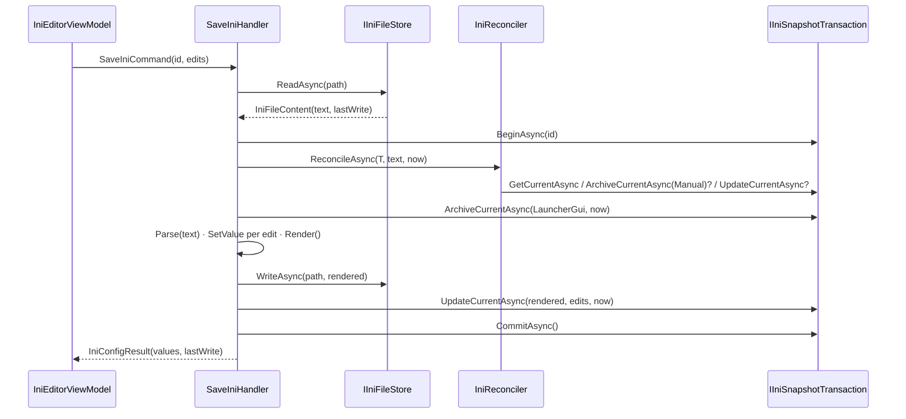

# INI Config Core — Design Spec

> **Slice:** INI Config — core loop (Phase 1 — MVP)
> **Date:** 24 September 2026
> **Author:** Justinian
> **Status:** Approved for implementation
> **Authoritative spec:** [2026-05-26-zoo-tycoon-launcher-design.md](./2026-05-26-zoo-tycoon-launcher-design.md) §5.3, §6.3, §7.1, §7.3, §7.7, §8.1, §8.2, §9.3

---

## 1. Goal

Make the INI Config tab real. When an installation is added or opened, `zoo.ini` is parsed into per-installation snapshots; changes made outside the launcher are detected
(tiered, so the game's own exit-time writes do not flood the history); the tab edits every recognised user-facing setting across the seven non-scenario sections; and **Save**
writes the file atomically — comments, blank lines, key order, casing, line endings, and unrecognised keys preserved byte for byte — after archiving the previous `Current`
snapshot to `Historical`.

This is the **core loop** of the SDD §13.2 "INI Config tab" bullet. The remaining pieces of that bullet each get their own spec (§3.2).

---

## 2. Decisions taken during brainstorming

| # | Question                                           | Decision                                                                                                                                  |
|---|----------------------------------------------------|-------------------------------------------------------------------------------------------------------------------------------------------|
| 1 | Scope                                              | Core loop first: engine + snapshot sync + atomic save + editor for the seven non-scenario sections. Follow-ups get their own specs.       |
| 2 | Drift triggered by the game's own exit-time writes | **Tiered drift.** Keys the registry marks game-managed, plus unrecognised keys, are adopted silently; only user-setting changes archive. |
| 3 | Engine / editor modelling                          | **Registry-driven.** Domain key registry + raw values keyed by `IniKeyId`; Desktop presentation catalogue; one generic section pair.     |
| 4 | UAC VirtualStore redirection                       | **Out of scope.** Recorded as a risk and candidate future slice (§12.1). The launcher assumes it can write `zoo.ini` in place.           |
| 5 | Save base                                          | Save re-reads the file and merges the user's edits onto the **on-disk** text, never onto a possibly stale `Current.StructureBlob`.      |
| 6 | Encoding                                           | Read and write through `Encoding.Latin1` — every byte maps to exactly one `char` and back, so round trips are byte-identical.           |
| 7 | Invalid on-disk values                             | Stored raw; the editor displays the key's default in their place (display-time fallback) and never rewrites a key the user did not edit. |
| 8 | Unsaved-changes prompt                             | Win95 convention: *"Do you want to save the changes to `zoo.ini`?"* `Yes` / `No` / `Cancel`.                                             |
| 9 | Hover help location                                | The editor's own footer label (SDD §9.3.2), not the main-window status bar. `MainWindow.axaml` is untouched (it sits at 93 of 100 lines). |

---

## 3. Scope

### 3.1 In scope

1. **Domain INI engine** — `IniKeyId`, `IniKeyRole`, `IniKeySpec`, `ZooIniDefaults` (56 keys across `[user]`, `[UI]`, `[advanced]`, `[ai]`, `[debug]`, `[language]`,
   `[Map]`); `IniDocument` line model with byte-faithful `Parse` / `Render` and `SetValue`; `IniDriftDetector`.
2. **Real `IIniSnapshotService`** in the Application layer (capture, synchronise, load), including the **first-import path** — every installation registered before this slice
   has a migrated but empty per-installation database because `NullIniSnapshotService` never wrote anything. `NullIniSnapshotService` is deleted.
3. **Save pipeline** — SDD §8.2 ordering inside one transaction, merged against the on-disk text, atomic temp-file + `Move(overwrite: true)` write, orphaned temp-file cleanup.
4. **Boot / launch alignment** — `HasExe && !HasIni` resolves to **Cannot Play** (SDD §7.1.2 — the current `BootHandler` wrongly resolves it to Ready to Play);
   `LaunchGameHandler` treats a vanished `zoo.ini` as `Drifted`; `BootResult` carries an `IniErrorMessage` when synchronisation fails.
5. **Persistence** — migration adding the SDD §6.3 snapshot indexes that `InitialInstallationSchema` omitted; a repository + transaction seam over `InstallationDbContext`.
6. **INI Config tab** — the editor (section list, generic section form, footer with status/help label and `Undo` · `Restore defaults` · `Save` · `Revert`; `Undo` and
   `Restore defaults` visible but disabled), row tooltips plus footer help, and a placeholder sub-state for loading / no INI / unreadable INI.
7. **Pending-changes guard** — `Launch Game` disabled while edits are pending (with a muted explanation), and a `Yes` / `No` / `Cancel` save prompt on window close, File → Exit,
   File → Close Installation, and File → Open Installation….
8. **Desktop unit-test project** — `Erdmier.ZooTycoonLauncher.Desktop.Tests.Unit`, new in this slice, covering the field view models, the editor, the tab host, the guard, and a
   catalogue-integrity check.
9. **Documentation** — SDD revision 1.6 amendments (§10), `conventions.md` §3.3 / §6 update, manual end-to-end test additions.

### 3.2 Out of scope

| Item                                                                   | Where it goes                                                                          |
|------------------------------------------------------------------------|----------------------------------------------------------------------------------------|
| No INI Present actions (Create from defaults, Locate existing)         | Follow-up spec "INI recovery". The placeholder in this slice has no action buttons.    |
| `Restore defaults`, Fix dialogue INI actions                           | Same follow-up spec.                                                                   |
| Restore Previous INI dialogue + `Undo`                                 | Follow-up spec "INI history".                                                          |
| Scenarios section                                                      | After the Phase 0 research (SDD §7.8). `[scenario]` keys are unrecognised until then. |
| Theme tokens, dark mode, icon resolver                                 | Settings + theming slice. This slice uses the existing hard-coded palette.             |
| UAC VirtualStore support                                               | Candidate future slice (§12.1).                                                        |
| General tab reading its resolution from the INI                        | Screen-modes slice.                                                                    |
| `IniChangedMessage`                                                    | Introduced by the first slice with a subscriber (the Restore dialogue).                |
| `InstallationMetadata` table (SDD §6.3)                                | Introduced by the first slice that reads it.                                           |
| Main-window status-bar INI messaging (`conventions.md` §9 "INI loaded") | Not needed — the editor footer carries INI state.                                      |
| Tracking the game process / blocking saves while ZT1 runs              | Not planned (§12.2).                                                                   |

---

## 4. Domain layer

Everything here is pure logic — no I/O, no EF — so it is unit-tested in `Domain.Tests.Unit`.

### 4.1 File layout

```text
Source/Erdmier.ZooTycoonLauncher.Domain/
├── IniSnapshots/        (existing: IniSnapshot, IniValue, IniSnapshotKind, IniSnapshotTrigger, IniValueKind, IniValueSource)
├── IniKeys/
│   ├── IniKeyId.cs
│   ├── IniKeyRole.cs
│   ├── IniKeySpec.cs
│   └── ZooIniDefaults.cs
├── IniDocuments/
│   ├── IniDocument.cs
│   ├── IniLine.cs
│   ├── IniSectionHeader.cs
│   ├── IniKeyValue.cs
│   ├── IniComment.cs
│   └── IniBlank.cs
└── IniDrift/
    ├── IniDriftResult.cs
    ├── IniDriftKind.cs
    └── IniDriftDetector.cs
```

### 4.2 `IniKeyId`, `IniKeyRole`, `IniKeySpec`

```csharp
public readonly record struct IniKeyId(string Section, string Key)   // Equals / GetHashCode are OrdinalIgnoreCase on both parts
{
    public override string ToString() => $"[{Section}]/{Key}";      // "[UI]/tooltipDelay"
}

public sealed class IniKeyRole : SmartEnum<IniKeyRole>
{
    public static readonly IniKeyRole UserSetting = new("UserSetting", 1);   // shown in the editor; a change archives Current
    public static readonly IniKeyRole GameManaged = new("GameManaged", 2);   // hidden; a change is adopted silently
}

public sealed record IniKeySpec(IniKeyId Id, IniValueKind Kind, string? DefaultValue, int? Min, int? Max, IniKeyRole Role)
{
    public bool    IsValid(string? raw);
    public bool    AreEquivalent(string? left, string? right);
    public string? EffectiveValue(string? raw);   // raw when IsValid(raw), otherwise DefaultValue
}
```

Kind-aware rules. `raw` is always trimmed before inspection; `null` means "key absent from the file".

| Kind          | `IsValid(raw)`                                                                 | `AreEquivalent(a, b)`                                                             |
|---------------|--------------------------------------------------------------------------------|-----------------------------------------------------------------------------------|
| `Bool`        | `0`, `1`, `true`, `false` (case-insensitive)                                   | Both valid and denote the same boolean; otherwise ordinal equality of trimmed text |
| `Int`         | Parses as `int` (invariant culture) and lies within `[Min, Max]` when bounded   | Both parse and are numerically equal (`075` ≡ `75`); otherwise ordinal equality    |
| `NullableInt` | Empty / absent, or as `Int`                                                    | Empty ≡ absent; otherwise as `Int`                                                 |
| `Str`         | Any non-null value                                                             | Ordinal equality of trimmed text; absent is never equivalent to a value            |
| `NullableStr` | Anything                                                                       | Empty ≡ absent; otherwise ordinal equality                                         |

Absent is never equivalent to a present value for the non-nullable kinds, so a key disappearing from the file counts as a change.

### 4.3 `ZooIniDefaults` — the key registry

Static, immutable, and the single source of truth for every recognised key. Values carried over from the Ref build's `ZooIniDefaults` / `IniRanges` / section models (for
inspiration: `References/Erdmier.ZooTycoonLauncherRef/Models/`), reimplemented fresh. Section and key casing below is the casing the launcher writes when it has to insert a key.

```csharp
public static class ZooIniDefaults
{
    public static IReadOnlyList<string>     Sections { get; }   // user, UI, advanced, ai, debug, language, Map — SDD §9.3 order
    public static IReadOnlyList<IniKeySpec> Keys     { get; }   // registry order, grouped by section
    public static bool TryGet(IniKeyId id, [ NotNullWhen(true) ] out IniKeySpec? spec);
    public static IReadOnlyDictionary<IniKeyId, string?> ExtractValues(IniDocument document);   // recognised keys present in the document only
}
```

| Section    | Key                           | Kind          | Default               | Min     | Max        | Role        |
|------------|-------------------------------|---------------|-----------------------|---------|------------|-------------|
| `user`     | `fullscreen`                  | `Bool`        | `1`                   |         |            | UserSetting |
| `user`     | `screenwidth`                 | `Int`         | `800`                 | 1       | 16384      | UserSetting |
| `user`     | `screenheight`                | `Int`         | `600`                 | 1       | 16384      | UserSetting |
| `user`     | `UpdateRate`                  | `Int`         | `15`                  | 1       | 60         | UserSetting |
| `user`     | `DrawRate`                    | `Int`         | `60`                  | 15      | 120        | UserSetting |
| `user`     | `lastfile`                    | `NullableStr` | *(none)*              |         |            | GameManaged |
| `user`     | `showUserEntityWarning`       | `Bool`        | `0`                   |         |            | GameManaged |
| `UI`       | `noMenuMusic`                 | `Bool`        | `0`                   |         |            | UserSetting |
| `UI`       | `menuMusic`                   | `Str`         | `sounds/mainmenu.wav` |         |            | UserSetting |
| `UI`       | `menuMusicAttenuation`        | `Int`         | `1500`                | 0       | 10000      | UserSetting |
| `UI`       | `userAttenuation`             | `Int`         | `0`                   | 0       | 10000      | UserSetting |
| `UI`       | `playMovie`                   | `Bool`        | `0`                   |         |            | UserSetting |
| `UI`       | `movievolume1`                | `Int`         | `-1000`               | -10000  | 0          | UserSetting |
| `UI`       | `playSecondMovie`             | `Bool`        | `0`                   |         |            | UserSetting |
| `UI`       | `movievolume2`                | `Int`         | `-1000`               | -10000  | 0          | UserSetting |
| `UI`       | `MSStartingCash`              | `Int`         | `70000`               | 0       | 10000000   | UserSetting |
| `UI`       | `MSCashIncrement`             | `Int`         | `5000`                | 100     | 1000000    | UserSetting |
| `UI`       | `MSMinCash`                   | `Int`         | `10000`               | 0       | 10000000   | UserSetting |
| `UI`       | `MSMaxCash`                   | `Int`         | `500000`              | 0       | 10000000   | UserSetting |
| `UI`       | `useAlternateCursors`         | `Bool`        | `0`                   |         |            | UserSetting |
| `UI`       | `tooltipDelay`                | `Int`         | `1`                   | 0       | 60         | UserSetting |
| `UI`       | `tooltipDuration`             | `Int`         | `3000`                | 0       | 30000      | UserSetting |
| `UI`       | `MessageDisplay`              | `Bool`        | `1`                   |         |            | UserSetting |
| `UI`       | `mouseScrollThreshold`        | `Int`         | `1`                   | 0       | 50         | UserSetting |
| `UI`       | `mouseScrollDelay`            | `Int`         | `1`                   | 0       | 10         | UserSetting |
| `UI`       | `mouseScrollX`                | `Int`         | `27`                  | 1       | 200        | UserSetting |
| `UI`       | `mouseScrollY`                | `Int`         | `27`                  | 1       | 200        | UserSetting |
| `UI`       | `keyScrollX`                  | `Int`         | `64`                  | 1       | 200        | UserSetting |
| `UI`       | `keyScrollY`                  | `Int`         | `64`                  | 1       | 200        | UserSetting |
| `UI`       | `minimumMessageInterval`      | `Int`         | `60`                  | 0       | 3600       | UserSetting |
| `UI`       | `helpType`                    | `Int`         | `1`                   | 0       | 2          | UserSetting |
| `UI`       | `lastWindowX`                 | `NullableInt` | *(none)*              |         |            | GameManaged |
| `UI`       | `lastWindowY`                 | `NullableInt` | *(none)*              |         |            | GameManaged |
| `UI`       | `startedFirstTutorial`        | `Bool`        | `0`                   |         |            | GameManaged |
| `UI`       | `startedDinoTutorial`         | `Bool`        | `0`                   |         |            | GameManaged |
| `UI`       | `startedAquaTutorial`         | `Bool`        | `0`                   |         |            | GameManaged |
| `UI`       | `progresscalls`               | `NullableInt` | *(none)*              |         |            | GameManaged |
| `UI`       | `defaultEditCharLimit`        | `NullableInt` | *(none)*              |         |            | GameManaged |
| `UI`       | `completedExhibitAttenuation` | `NullableInt` | *(none)*              |         |            | GameManaged |
| `advanced` | `level`                       | `Int`         | `2`                   | 0       | 4          | UserSetting |
| `advanced` | `loadHalfAnims`               | `Bool`        | `0`                   |         |            | UserSetting |
| `advanced` | `drag`                        | `Bool`        | `0`                   |         |            | UserSetting |
| `advanced` | `click`                       | `Bool`        | `0`                   |         |            | UserSetting |
| `advanced` | `normal`                      | `Bool`        | `0`                   |         |            | UserSetting |
| `advanced` | `use8BitSound`                | `Bool`        | `0`                   |         |            | UserSetting |
| `ai`       | `maxGuests`                   | `Int`         | `1000`                | 1       | 10000      | UserSetting |
| `debug`    | `drawfps`                     | `Bool`        | `0`                   |         |            | UserSetting |
| `debug`    | `drawfpsx`                    | `Int`         | `720`                 | 0       | 16384      | UserSetting |
| `debug`    | `drawfpsy`                    | `Int`         | `20`                  | 0       | 16384      | UserSetting |
| `debug`    | `logCutoff`                   | `Int`         | `1`                   | 0       | 5          | UserSetting |
| `debug`    | `sendLogfile`                 | `Bool`        | `1`                   |         |            | UserSetting |
| `debug`    | `sendDebugger`                | `Bool`        | `1`                   |         |            | UserSetting |
| `language` | `lang`                        | `Int`         | `9`                   | 0       | 65535      | UserSetting |
| `language` | `sublang`                     | `Int`         | `1`                   | 0       | 65535      | UserSetting |
| `Map`      | `mapX`                        | `Int`         | `75`                  | 1       | 128        | UserSetting |
| `Map`      | `mapY`                        | `Int`         | `75`                  | 1       | 128        | UserSetting |

56 keys: 46 `UserSetting`, 10 `GameManaged`. Reclassifying a key is a one-line change. The game-managed classification follows the Ref build's "read-only runtime state managed
by the game" notes and is a best guess (§12.4).

### 4.4 `IniDocument`

```csharp
public sealed class IniDocument
{
    public static IniDocument Parse(string text);
    public string Render();
    public bool TryGetValue(IniKeyId id, out string? value);   // trimmed value of the first matching key line
    public void SetValue(IniKeyId id, string value);           // an empty value writes "key="
}

public abstract record IniLine(string RawText, string LineEnding);   // LineEnding is "\r\n", "\n", "\r", or "" (last line without a terminator)
public sealed record IniSectionHeader(string Name, string RawText, string LineEnding) : IniLine(RawText, LineEnding);
public sealed record IniKeyValue(string Section, string Key, string Value, string RawText, string LineEnding) : IniLine(RawText, LineEnding);
public sealed record IniComment(string RawText, string LineEnding) : IniLine(RawText, LineEnding);
public sealed record IniBlank(string RawText, string LineEnding) : IniLine(RawText, LineEnding);
```

Rules:

- **Byte fidelity.** Every line keeps its raw text and its own terminator, so files mixing CRLF and LF — and files without a trailing newline — round-trip exactly. A leading
  UTF-8 BOM (which Latin-1 decoding presents as `""`) is held as a preamble and re-emitted. `Parse(text).Render() == text` for every input, including empty.
- **Classification** (on the trimmed line): starts with `[` and contains `]` → section header (name = text between the first `[` and the next `]`, trimmed); starts with `;` or
  `#` → comment; empty → blank; contains `=` → key/value (key = text before the first `=`, trimmed; value = everything after it, trimmed — inline comments are **not**
  recognised); anything else → kept verbatim as a comment.
- **Matching** is case-insensitive on section and key. When a key appears more than once, the first occurrence wins for reads and is the one rewritten. Key lines before any
  section header belong to section `""`, which the registry never recognises. A section header appearing twice is treated as one section.
- **`SetValue` on an existing key** rewrites only the value span: everything up to and including `=` plus the whitespace after it is kept, as is any trailing whitespace; the
  key's casing is untouched.
- **`SetValue` on a missing key** inserts `Key=value` (registry casing) after the last key line of the section's first occurrence. When the section itself is missing, a blank
  line, `[Section]`, and the key line are appended at the end. Inserted lines use the document's dominant line ending (CRLF when there is no line ending to copy); when the last
  line has no terminator, the dominant ending is added to it first.

### 4.5 Drift detection

```csharp
public sealed class IniDriftKind : SmartEnum<IniDriftKind>   // None | GameManagedOnly | UserSettings
public sealed record IniDriftResult(IniDriftKind Kind, IReadOnlyList<IniKeyId> ChangedKeys);

public static class IniDriftDetector
{
    public static IniDriftResult Detect(IReadOnlyDictionary<IniKeyId, string?> currentValues, IReadOnlyDictionary<IniKeyId, string?> diskValues);
}
```

For every registry key, `spec.AreEquivalent(current, disk)` (absent → `null`). Every non-equivalent key is listed in `ChangedKeys`. `Kind` is `UserSettings` when any changed key
is a `UserSetting`, `GameManagedOnly` when changed keys exist but are all `GameManaged`, otherwise `None`. Differences the registry cannot see — comments, blank lines,
`[scenario]`, `[mgr]`, other unrecognised keys — are invisible here; the reconciler (§5.2) catches them by comparing raw text.

### 4.6 Entity change

`IniSnapshot.CapturedUtc` changes from `init` to `set`: the `Current` snapshot is updated in place (§6.2), and its `CapturedUtc` records when the launcher last changed it.

---

## 5. Application layer

### 5.1 New seams (`Common/Abstractions/`, `Common/Models/`)

They replace the SDD's `IIniReader` / `IIniWriter`.

```csharp
public interface IIniFileStore
{
    Task<IniFileContent?> ReadAsync(string installationPath, CancellationToken cancellationToken);             // null when zoo.ini is absent
    Task<DateTime> WriteAsync(string installationPath, string text, CancellationToken cancellationToken);      // atomic; returns the new LastWriteTimeUtc
    Task DeleteOrphanedTempFilesAsync(string installationPath, CancellationToken cancellationToken);           // zoo.ini.tmp.* residue (SDD §7.7)
}

public sealed record IniFileContent(string Text, DateTime LastWriteUtc);

public interface IIniSnapshotRepository
{
    Task<IIniSnapshotTransaction> BeginAsync(Guid installationId, CancellationToken cancellationToken);
}

public interface IIniSnapshotTransaction : IAsyncDisposable                           // disposing without CommitAsync rolls back
{
    Task<IniSnapshot?> GetCurrentAsync(CancellationToken cancellationToken);          // includes Values
    Task AddAsync(IniSnapshot snapshot, CancellationToken cancellationToken);         // first import: Original, then Current
    Task ArchiveCurrentAsync(IniSnapshotTrigger trigger, DateTime capturedUtc, CancellationToken cancellationToken);
    Task UpdateCurrentAsync(string structureBlob, IReadOnlyList<IniValueChange> changes, DateTime capturedUtc, CancellationToken cancellationToken);
    Task CommitAsync(CancellationToken cancellationToken);
}

public sealed record IniValueChange(IniKeyId Id, string? Value, IniValueSource Source);   // Value null ⇒ the key left the file; its row is deleted
public sealed record IniConfigResult(IReadOnlyDictionary<IniKeyId, string?> Values, DateTime FileLastWriteUtc);
```

`UpdateCurrentAsync` touches only the rows named in `changes`, which is what gives SDD §5.1 its mixed-source `Current`: edited rows carry `LauncherGui`, drifted rows `Manual`,
every other row keeps its prior source.

`IIniSnapshotService` gains one method; the two existing signatures are unchanged:

```csharp
Task<ErrorOr<IniConfigResult>> LoadAsync(GameInstallation installation, CancellationToken cancellationToken);   // synchronise, then return the reconciled values
```

### 5.2 `IniReconciler` (`IniConfig/Common/`)

Brings `Current` in line with the on-disk text inside a caller-owned transaction:

```text
ReconcileAsync(transaction, diskText, nowUtc) → IniReconciliation(Values, Outcome)
  document   = IniDocument.Parse(diskText)
  diskValues = ZooIniDefaults.ExtractValues(document)
  current    = transaction.GetCurrentAsync()
  if current is null:                                                    ── first import
      AddAsync(Original  { Trigger = OriginalImport, StructureBlob = diskText, rows = diskValues, Source = OriginalImport })
      AddAsync(Current   { same, new ids })
      return (diskValues, FirstImport)
  drift = IniDriftDetector.Detect(current values, diskValues)
  if drift.Kind == UserSettings:  ArchiveCurrentAsync(Manual, nowUtc)
  if drift.Kind != None or current.StructureBlob != diskText (ordinal):
      UpdateCurrentAsync(diskText, drift.ChangedKeys → IniValueChange(key, diskValues[key] or null, Manual), nowUtc)
  return (diskValues, Unchanged | AdoptedSilently | ArchivedAndAdopted)
```

`IniReconciliationOutcome` (`Unchanged`, `FirstImport`, `AdoptedSilently`, `ArchivedAndAdopted`) exists for logging and tests. Rows carry `ValueKind` from the key's spec.
Unrecognised keys are never stored as rows — they live in the structure blob only.

### 5.3 `IniSnapshotService` (`IniConfig/Common/`)

Implements `IIniSnapshotService`; registered scoped in `AddApplication`. Depends on `IIniFileStore`, `IIniSnapshotRepository`, `IniReconciler`, `TimeProvider`,
`ILogger<IniSnapshotService>`.

- `LoadAsync(installation)`: `!HasIni` → `IniErrors.Missing`. Delete orphaned temp files, read the file (`null` → `Missing`; `IOException` /
  `UnauthorizedAccessException` → `ReadFailed`), begin, reconcile, commit, return `IniConfigResult`. Any other non-cancellation exception from the repository is caught, logged
  at error, and returned as `IniErrors.StoreFailed` — a corrupt per-installation database must degrade to Cannot Play, not kill the boot.
- `SynchroniseAsync(installation)`: `!HasIni` → `Success` (no-op, as today); otherwise `LoadAsync` with the result discarded.
- `CaptureOriginalAsync(installation)`: identical to `SynchroniseAsync` — on a fresh database the reconciler performs the first import.

Logging (information): first import, adoption, archive-and-adopt with the changed-key count. Warnings: read failures, orphan files that could not be deleted.

### 5.4 `IniConfig/Get/` — `GetIniConfigQuery`

```csharp
public sealed record GetIniConfigQuery(Guid InstallationId) : IQuery<ErrorOr<IniConfigResult>>;
```

Handler: resolve the installation (`IniErrors.InstallationNotFound`), then `IIniSnapshotService.LoadAsync`. Because loading reconciles first, the editor always opens on what is
actually on disk — including after a game session while the launcher stayed open.

### 5.5 `IniConfig/Save/` — `SaveIniCommand`

```csharp
public sealed record SaveIniCommand(Guid InstallationId, IReadOnlyDictionary<IniKeyId, string> Edits) : ICommand<ErrorOr<IniConfigResult>>;   // clearing a value sends ""
```

**`SaveIniValidator`:** `InstallationId` not empty; `Edits` not empty; every key is in the registry with role `UserSetting`; every value satisfies `spec.IsValid`; string values
contain no CR / LF and no character above U+00FF (Latin-1 cannot encode it, and a line break would split the INI line).

**Handler** (SDD §8.2, merged against the on-disk text):

```text
 1. installation = GetByIdAsync                                   → InstallationNotFound
 2. content = fileStore.ReadAsync(path)                           → Missing / ReadFailed
 3. await using transaction = repository.BeginAsync(id)
 4. reconciliation = reconciler.ReconcileAsync(transaction, content.Text, now)    ← may archive (Manual) external user-setting drift first
 5. edits = command.Edits where !spec.AreEquivalent(edit, reconciliation.Values[key])
    if none remain: CommitAsync; return (reconciliation.Values, content.LastWriteUtc)
 6. transaction.ArchiveCurrentAsync(LauncherGui, now)
 7. document = IniDocument.Parse(content.Text); SetValue per edit; text = document.Render()
 8. lastWriteUtc = fileStore.WriteAsync(path, text)               → WriteFailed (transaction disposed uncommitted ⇒ rollback)
 9. transaction.UpdateCurrentAsync(text, edits → IniValueChange(key, value, LauncherGui), now)
10. transaction.CommitAsync()
11. return (reconciliation.Values overlaid with edits, lastWriteUtc)
```

The returned values let the editor reset its baseline — including values merged in from disk for keys the user did not touch.



### 5.6 Errors

`IniConfig/Common/IniErrors.cs` — static factory methods returning `ErrorOr.Error`:

| Code                         | Type         | When                                                                                  |
|------------------------------|--------------|---------------------------------------------------------------------------------------|
| `Installation.NotFound`      | `NotFound`   | The installation id does not resolve to a row.                                         |
| `Ini.Missing`                | `NotFound`   | `zoo.ini` is absent (or `HasIni` is false when loading).                              |
| `Ini.ReadFailed`             | `Failure`    | `IOException` / `UnauthorizedAccessException` while reading. Carries the OS message.   |
| `Ini.WriteFailed`            | `Failure`    | `IOException` / `UnauthorizedAccessException` while writing. Carries the OS message.   |
| `Ini.StoreFailed`            | `Unexpected` | The per-installation database failed during load / synchronise. Logged at error.      |

Descriptions are user-readable British English sentences, because the Desktop layer shows them verbatim.

### 5.7 Changes to existing code

- **`BootResult`** gains a trailing `string? IniErrorMessage = null`, set when `SynchroniseAsync` returns an error.
- **`BootHandler.VerifyAsync`**: after the `!HasExe` check, `!result.HasIni` → `CannotPlay` (no synchronisation attempted). A synchronisation error → `CannotPlay` with
  `IniErrorMessage = error.Description`.
- **`LaunchGameHandler`**: re-verification with `!HasIni` → `Drifted` (drift is still persisted first, as today).
- **`AddInstallationHandler`**: behaviour unchanged (capture failure stays non-fatal — the next synchronise retries the first import); the stale "CorruptedIni" comment is
  corrected.
- **`AddApplication`** registers `IIniSnapshotService → IniSnapshotService` (scoped) and `IniReconciler` (singleton, public so it is unit-testable); `AddInfrastructure` stops
  registering `NullIniSnapshotService`.

---

## 6. Infrastructure layer

### 6.1 `IniConfig/IniFileStore.cs`

Implements `IIniFileStore` over `IFileSystem`. The file is `Path.Combine(installationPath, "zoo.ini")`.

- **Read** — `null` when absent; otherwise `File.ReadAllBytes` → `Encoding.Latin1.GetString`, plus `File.GetLastWriteTimeUtc`.
- **Write** — `Encoding.Latin1.GetBytes(text)` to `zoo.ini.tmp.{Guid.NewGuid():N}` **in the same directory** (same volume ⇒ the rename is atomic on NTFS), then
  `File.Move(temp, zoo.ini, overwrite: true)`. On any exception the temp file is deleted (best effort) and the exception rethrown for the Application layer to map. Returns the
  final file's `LastWriteTimeUtc`.
- **Orphan cleanup** — deletes every `zoo.ini.tmp.*` in the directory; a file that cannot be deleted is logged as a warning and skipped.

### 6.2 `Persistence/Installation/IniSnapshotRepository.cs` + `IniSnapshotTransaction.cs`

- `InstallationDbContextFactory` gains `internal Task<InstallationDbContext> OpenAsync(Guid installationId, CancellationToken)` (connection + `MigrateAsync`), which the
  existing `CreateAsync` now wraps. The repository takes the concrete factory, so EF never crosses into Application.
- `BeginAsync` opens a context and `Database.BeginTransactionAsync()`. The transaction (internal sealed class) owns both; `DisposeAsync` rolls back if `CommitAsync` was never
  called, then disposes the context.
- `GetCurrentAsync` — `Snapshots.Include(s => s.Values).SingleOrDefaultAsync(s => s.Kind == IniSnapshotKind.Current)`.
- `AddAsync` — add + `SaveChangesAsync`.
- `ArchiveCurrentAsync` — copies the Current snapshot's `StructureBlob` and every row (with its `Source` and `ValueKind`) into a new `Historical` snapshot with
  `Id = Guid.CreateVersion7()`, the given `Trigger` and `CapturedUtc`.
- `UpdateCurrentAsync` — mutates the tracked Current snapshot in place: `StructureBlob`, `CapturedUtc`, and for each change insert / update (value + source) / delete the row.

### 6.3 Migration `AddSnapshotIndexes`

`IniSnapshotConfiguration` gains the SDD §6.3 indexes that `InitialInstallationSchema` omitted:

- `IX_Snapshots_Kind_Original` — unique, filter `"Kind" = 'Original'`.
- `IX_Snapshots_Kind_Current` — unique, filter `"Kind" = 'Current'`.
- `IX_Snapshots_Kind_CapturedUtc` — non-unique, `(Kind, CapturedUtc DESC)`.

Generated with `dotnet ef migrations add AddSnapshotIndexes --project Source/Erdmier.ZooTycoonLauncher.Infrastructure --context InstallationDbContext --output-dir
Persistence/Installation/Migrations`. Existing per-installation databases are empty, so the unique indexes apply cleanly on their next open.

### 6.4 Registration

`AddInfrastructure`: `IIniFileStore → IniFileStore` (singleton), `IIniSnapshotRepository → IniSnapshotRepository` (singleton); `NullIniSnapshotService` and its registration
are deleted, and the comments in `InfrastructureServiceCollectionExtensions` that name it are updated.

---

## 7. Desktop layer

### 7.1 File layout

```text
Source/Erdmier.ZooTycoonLauncher.Desktop/
├── Models/IniConfig/
│   ├── IniEditorCatalogue.cs          static: the seven IniSectionDescriptors, in SDD §9.3 order
│   ├── IniSectionDescriptor.cs        Section, Descriptor, Footnote?, Groups
│   ├── IniFieldGroupDescriptor.cs     SubHeader?, Fields
│   ├── IniFieldDescriptor.cs          Id?, Label, Control, Hint?, Help, Caption?, Options?, Inverted
│   ├── IniControlKind.cs              Toggle | Number | Text | Choice | LanguagePicker
│   ├── IniChoiceOption.cs             (Raw, Label)
│   └── IniLanguageOption.cs           (Lang, SubLang, Label)
├── ViewModels/
│   ├── Common/IPendingChangesGuard.cs
│   ├── Dialogs/SaveChangesPromptViewModel.cs, ErrorMessageViewModel.cs
│   ├── IniConfig/
│   │   ├── IniEditorViewModel.cs
│   │   ├── IniPlaceholderViewModel.cs
│   │   ├── IniSectionViewModel.cs
│   │   ├── IniFieldGroup.cs           plain model (not a view model) — rendered inline by IniSectionView
│   │   ├── IniFieldFactory.cs         builds the section view models from the catalogue
│   │   └── Fields/IniFieldViewModel.cs (abstract), IniKeyedFieldViewModel.cs (abstract), IniToggleFieldViewModel.cs, IniNumberFieldViewModel.cs,
│   │             IniTextFieldViewModel.cs, IniChoiceFieldViewModel.cs, IniLanguageFieldViewModel.cs
│   └── Tabs/IniConfigTabViewModel.cs  (existing skeleton, filled in)
├── Views/        mirrors ViewModels/ one-to-one: every new concrete *ViewModel has a *View.axaml (+ .axaml.cs); the two abstract field bases have none
└── Composition/  IDialogService (+2 methods), AvaloniaDialogService, SaveChangesChoice.cs
```

### 7.2 Presentation catalogue

`IniFieldDescriptor.Label` is the literal INI key (`conventions.md` §3.1); `Id` is `null` only for the derived language picker. Hints, captions, and help strings are British
English; help is rewritten from the Ref build's `Resources/IniTooltips.axaml` (for inspiration) and serves both the row tooltip and the footer help line. **Game-managed keys have
no descriptor**, so they never render.

| Section    | Descriptor                        | Groups                                              | Footnote                                                                                             |
|------------|-----------------------------------|-----------------------------------------------------|------------------------------------------------------------------------------------------------------|
| `user`     | Display and performance           | one untitled group                                  | —                                                                                                    |
| `UI`       | Audio, gameplay, and interface    | `Audio` · `Gameplay (cash)` · `Interface`           | —                                                                                                    |
| `advanced` | Graphics quality and 8-bit audio  | one untitled group                                  | —                                                                                                    |
| `ai`       | AI behaviour limits               | one untitled group                                  | Raising this above the stock 1,000 limit can make guest pathing thrash; values above 2,500 need a community AI patch. |
| `debug`    | Diagnostic logging and FPS overlay | one untitled group                                 | —                                                                                                    |
| `language` | Windows LANGID / SUBLANGID        | one untitled group                                  | —                                                                                                    |
| `Map`      | Default zoo dimensions            | one untitled group                                  | Default dimensions for new zoos. Doubling both values quadruples world memory; large maps may stutter on the original engine. |

Control overrides and captions (every other key is a plain `Number` or `Text` row whose hint shows its range, e.g. `0–10000`, `1–60 ticks/sec`, `15–120 FPS`, `px`):

| Key                                                     | Control          | Details                                                                                           |
|---------------------------------------------------------|------------------|---------------------------------------------------------------------------------------------------|
| `fullscreen`                                            | `Choice`         | `1` Fullscreen · `0` Windowed; hint "Display mode"                                                |
| `noMenuMusic`                                           | `Toggle`         | **Inverted**; caption "Play menu music"; hint "Inverted in INI"                                  |
| `playMovie`, `playSecondMovie`                          | `Toggle`         | caption "Enabled"                                                                                 |
| `movievolume1`, `movievolume2`                          | `Number`         | hint "-10000 silent → 0 full"                                                                     |
| `useAlternateCursors`, `MessageDisplay`                 | `Toggle`         | captions "Monochrome cursors", "Show in-game messages"                                            |
| `helpType`                                              | `Choice`         | `0` Off · `1` Standard · `2` Verbose                                                              |
| `level`                                                 | `Choice`         | `0 – Total Quality` · `1 – Quality` · `2 – Balance` · `3 – Speed` · `4 – Paused`; hint "Quality preset" |
| `loadHalfAnims`, `drag`, `click`, `normal`, `use8BitSound` | `Toggle`      | "Reduced-detail animations", "Drop quality on drag", "Drop quality on click", "Drop quality in normal play", "Force 8-bit audio" |
| `drawfps`, `sendLogfile`, `sendDebugger`                | `Toggle`         | "Show FPS counter", "Write zoo.log", "OutputDebugString"                                          |
| `logCutoff`                                             | `Number`         | hint "0 verbose → 5 silent"                                                                       |
| *(derived)* `lang / sublang`                            | `LanguagePicker` | first row of `[language]`; hint "Curated LANGID + SUBLANGID"; drives the `lang` and `sublang` rows |
| `lang`, `sublang`                                       | `Number`         | hints "Windows LANGID 0–65535", "Windows SUBLANGID 0–65535"                                       |
| `mapX`, `mapY`                                          | `Number`         | hints "1–128 tiles wide", "1–128 tiles tall"                                                      |

Curated languages (for inspiration: the Ref build's `IniSettingsViewModel.LanguageOptions`): English (United States) 9/1, English (United Kingdom) 9/2, German (Germany) 7/1,
French (France) 12/1, Spanish (Modern) 10/3, Italian (Italy) 16/1, Japanese 17/1, Portuguese (Brazil) 22/1, Dutch (Netherlands) 19/1, Swedish (Sweden) 29/1.

### 7.3 Field view models

`IniFieldViewModel` (abstract, `ObservableObject` via `ViewModelBase`): `Id`, `Label`, `Hint`, `Help`, `[ ObservableProperty ] IsHelpActive`, `Baseline` (raw from
`IniConfigResult`, `null` when absent), abstract `IsDirty`, `Load(string? raw)`, `Reset()`, `TryGetEdit(out string? raw)`.

Shared semantics for keyed fields, where `spec` is the key's `IniKeySpec`:

- `BaselineEffective = spec.EffectiveValue(Baseline)`; `Load(raw)` sets `Baseline` and calls `Reset()`, which sets the control's value from `BaselineEffective`.
- `CurrentRaw` is the control's value as INI text; `IsDirty = !spec.AreEquivalent(CurrentRaw, BaselineEffective)`. Ticking and unticking a box, or typing a number back, leaves
  the field clean. A field whose on-disk value is invalid shows the default and is clean until edited; saving never rewrites it unless the user changes it.
- `TryGetEdit` returns `CurrentRaw` only when dirty.

Per kind:

- **Toggle** — `IsChecked` ⇄ `1` / `0`; `Inverted` flips the mapping (ticked ⇒ `0`).
- **Number** — `decimal? Value` bound to `NumericUpDown` with `Minimum` / `Maximum` from the spec (`int.MinValue` / `int.MaxValue` when unbounded), `Increment 1`,
  `FormatString "0"`. `CurrentRaw` is the invariant integer text.
- **Text** — `string Value`; `CurrentRaw` is the text.
- **Choice** — `Options` + `SelectedOption`; `CurrentRaw` is the selected option's raw value; the selected option is the one `AreEquivalent` to the effective value.
- **LanguagePicker** — holds the `lang` and `sublang` number fields; `SelectedOption` reads the option matching both (none when the pair is not curated) and, when set, writes
  both fields. It listens to both fields to re-raise `SelectedOption`. It is never dirty and never yields an edit — change tracking lives on the two number rows.

### 7.4 Views and layout

- **`IniEditorView`** — prototype layout: left, a muted "Section" caption over a `ListBox` of `[user]` … `[Map]` (mono); right, the selected section's descriptor as a muted caption
  over a white bordered pane hosting `IniSectionView` in a `ScrollViewer`; below, the footer: status/help label on the left, then `Undo` · `Restore defaults` · `Save` (default) ·
  `Revert`. `Undo` and `Restore defaults` are `IsEnabled="False"`. The whole pane is disabled while `IsBusy`.
- **`IniSectionView`** — `[section]` (mono bold) + "section of `zoo.ini`" (muted) header with a 1-px rule; each group's optional sub-header (mono bold, dim); the rows; the optional
  footnote (muted, wrapped). **Row layout lives only here** (`conventions.md` §3): a `Grid` with `ColumnDefinitions="190,*"`, label (mono) over hint (muted mono) on the
  left, and a `ContentControl` bound to the field view model on the right with `MinWidth="0"` and a `MaxWidth` on inputs. The `ViewLocator` resolves the field's view.
  `ToolTip.Tip="{Binding Help}"` sits on the row `Grid` (SDD §7.3.1 parity).
- **Field views** contain only their input: `CheckBox` + caption, `NumericUpDown`, `TextBox`, `ComboBox`.
- **Hover / focus help** — `IniSectionView` code-behind handles the row `Grid`'s `PointerEntered` / `PointerExited` and the input's `GotFocus` / `LostFocus` (bubbling from the
  `ContentControl`) and sets `IsHelpActive` on the row's field. Written once in the row template, so it satisfies `conventions.md` §3.3's "no hand-rolled per-row wiring" intent.
- **`IniPlaceholderView`** — the SDD §9.3.1 "INI status" group box: `warning32.gif` icon (loading uses no icon), bold headline, muted body.

### 7.5 Tab host and loading

`IniConfigTabViewModel(InstallationSummary installation, string? iniErrorMessage, IMediator mediator, IDialogService dialogs)`:

- `[ ObservableProperty ] ViewModelBase Content` — the editor or an `IniPlaceholderViewModel`:
  - `!installation.Validity.HasIni` → **No INI present** — *"This installation has no `zoo.ini` on disk, so its settings cannot be edited."*
  - `iniErrorMessage` set, or a failed load → **`zoo.ini` could not be read** — the error description. Retried on the next activation.
  - otherwise, until the first load completes → **Loading `zoo.ini`…**
- `HasPendingChanges` — the editor's, or `false`.
- `ActivateAsync(CancellationToken)` — called when the tab becomes selected. Unless the `HasIni` placeholder applies or edits are pending, sends `GetIniConfigQuery`; on success
  builds the editor (first time) or calls `editor.Load(result)`, and shows it; on error shows the "could not be read" placeholder. Unexpected exceptions are caught and treated as
  a read failure.
- `SaveAsync(CancellationToken) → bool` and `DiscardChanges()` — used by the guard.

`PlayViewModel` gains `[ ObservableProperty ] int SelectedTabIndex`; `PlayView`'s `TabControl` binds `SelectedIndex` to it; selecting index 1 calls `IniConfigTab.ActivateAsync`.

### 7.6 Change tracking and the footer

Dirty state rolls up field → section → editor (`HasPendingChanges`) → tab. `PlayViewModel` forwards the tab's value to `GeneralTabViewModel.HasPendingIniChanges`, which
joins `CanExecuteLaunch` and shows a muted line under the launch button: *"Save or revert your INI changes to launch."*

Footer label, highest priority first:

1. the active row's help — italic;
2. **"● Unsaved changes"** — maroon, bold;
3. *"All changes saved · Last write: 24/05/2026 19:02"* — muted grey; `FileLastWriteUtc` localised (`dd/MM/yyyy HH:mm`), per SDD §5.1 (store UTC, localise at the boundary).

### 7.7 Save and Revert

- **Save** (`[ RelayCommand ]`, enabled when dirty and not busy) collects `TryGetEdit` from dirty fields and sends `SaveIniCommand`. Success → `Load(result)` (baselines reset,
  merged disk values applied). Failure → `IDialogService.ShowErrorAsync("Cannot Save zoo.ini", description)`; edits are kept.
- **Revert** (enabled when dirty and not busy) sends `GetIniConfigQuery` and `Load`s the result — discarding edits and refreshing from disk. Failure → error dialogue; edits kept.

### 7.8 Pending-changes guard

```csharp
public interface IPendingChangesGuard
{
    bool HasPendingChanges { get; }
    Task<bool> ConfirmLeaveAsync(CancellationToken cancellationToken);   // true ⇒ the caller may proceed
}
```

`PlayViewModel` implements it. With no pending changes it returns `true` immediately. Otherwise it shows the save prompt:

- **Yes** → `IniConfigTab.SaveAsync`; proceed only if the save succeeded (a failed save has already shown its error);
- **No** → `IniConfigTab.DiscardChanges()`; proceed;
- **Cancel** (or the prompt closed via its title bar) → stay.

`MainWindowViewModel`:

- `CloseInstallationAsync` and `OpenInstallationPickerAsync` await the guard (when `ActiveContent is IPendingChangesGuard`) before showing the picker.
- `Exit` becomes async: guard first, then `IsCloseConfirmed = true` and `_lifecycle.RequestShutdown()`.
- `HasPendingChanges` and `ConfirmCloseAsync()` for the window.

`MainWindow` code-behind overrides `OnClosing`: when the view model has pending changes and `IsCloseConfirmed` is false, it sets `e.Cancel = true`, awaits `ConfirmCloseAsync()`,
and on `true` sets `IsCloseConfirmed` and calls `Close()` again (guarded against exceptions). `MainWindow.axaml` does not change. `CloseAfterGameLaunch` cannot collide with pending
edits because Launch is disabled while they exist.

### 7.9 Dialogues

`IDialogService` gains:

```csharp
Task<SaveChangesChoice> ShowSaveChangesPromptAsync();          // Yes | No | Cancel
Task ShowErrorAsync(string title, string message);
```

- **`SaveChangesPromptView`** — modal `Window` in the `LaunchErrorView` style (caption buttons collapsed to close-only, `CanResize="False"`, `CenterOwner`): title
  "Zoo Tycoon Launcher", `warning32.gif`, *"Do you want to save the changes to `zoo.ini`?"*, buttons `Yes` (default) · `No` · `Cancel`. Closing via the title bar returns
  `Cancel`.
- **`ErrorMessageView`** — modal `Window`, same chrome: the given title, `error32.gif`, the message (wrapped), `OK` (default).

Every file-scoped `NoOpDialogService` in the Desktop project implements the two new members (returning `Cancel` / completing immediately).

### 7.10 Other Desktop changes

- **`GeneralTabViewModel`** — `[ ObservableProperty ] bool HasPendingIniChanges` (notifies `LaunchCommand`); `IniErrorMessage` plus an `IsIniUnreadable` flag
  (`HasExe && HasIni && !CanPlay`) that drives a fourth Cannot Play status message, mirroring the existing three: *"The launcher could not read `zoo.ini`."* with the error
  description beneath.
- **`PlayViewModel`** — constructor gains `string? iniErrorMessage`; builds `IniConfigTabViewModel` with it; forwards `HasPendingChanges`; implements `IPendingChangesGuard`.
- **`MainWindowViewModel.RouteResult`** passes `result.IniErrorMessage` to `PlayViewModel`.

---

## 8. Failure model

| Operation                                 | Failure                                                  | User experience                                                                                    |
|-------------------------------------------|----------------------------------------------------------|----------------------------------------------------------------------------------------------------|
| Boot synchronise                          | `zoo.ini` unreadable, or the snapshot database fails     | Cannot Play; General tab shows the fourth status message; INI tab shows "could not be read".       |
| Boot verify                               | `zoo.exe` present, `zoo.ini` absent                      | Cannot Play; INI tab shows "No INI present".                                                       |
| INI tab activation                        | Read / store failure                                     | Placeholder "could not be read"; the next activation retries.                                      |
| Save — validation                         | Out-of-range, unencodable, or multi-line value           | Error dialogue with the validator's message; edits kept. (Controls normally prevent this.)         |
| Save — file vanished                      | `Ini.Missing`                                            | Error dialogue; edits kept.                                                                        |
| Save — write refused                      | Read-only file, access denied, disk full                 | Error dialogue with the OS message; temp file removed; transaction rolled back; edits kept.       |
| Save — crash after the move, before commit | File holds new values, `Current` the old                 | Next synchronise sees user-setting drift, archives the old `Current` (`Manual`), adopts the file. |
| Save — crash before the move              | Orphaned `zoo.ini.tmp.*`                                 | Deleted by the next synchronise.                                                                   |
| Launch                                    | `zoo.ini` vanished since boot                            | `Drifted` → reboot → Cannot Play.                                                                  |
| Guard — Yes, save fails                   | Any save failure                                         | Error dialogue; the close / switch is abandoned; edits kept.                                       |

---

## 9. Testing strategy

### 9.1 `Domain.Tests.Unit`

- `IniDocument` — round-trip byte identity for CRLF, LF, mixed endings, no trailing newline, empty text, BOM preamble, malformed lines, duplicate keys and sections, keys before
  any section, varied casing and whitespace around `=`; `TryGetValue` case-insensitivity and first-occurrence-wins; `SetValue` on an existing key (only the value span changes),
  a missing key (inserted after the section's last key), a missing section (appended), a document without a trailing newline, a section whose header casing differs
  (`[ui]`), and an empty value (writes `key=`).
- `IniKeySpec` — `IsValid`, `AreEquivalent`, `EffectiveValue` for every kind, including bounds, `true` / `1`, leading zeros, empty-versus-absent.
- `ZooIniDefaults` — 56 keys, unique ids, 46 user settings, section order, every default valid under its own spec, `Min ≤ Max`, `ExtractValues` returns only present recognised
  keys.
- `IniDriftDetector` — none; game-managed only; user settings; mixed (user settings wins); key removed; key added; equivalent-but-textually-different values are not drift.
- `IniKeyId` — case-insensitive equality and hashing; `ToString`.

### 9.2 `Application.Tests.Unit`

NSubstitute fakes for `IIniFileStore`, `IIniSnapshotRepository`, `IIniSnapshotTransaction`, `IInstallationRepository`; `FakeTimeProvider`.

- `IniReconciler` — first import writes Original then Current with `OriginalImport`; no drift and identical text writes nothing; game-managed drift updates without archiving;
  user-setting drift archives (`Manual`) then updates; text-only difference updates the blob with no row changes.
- `IniSnapshotService` — `HasIni = false` no-op for synchronise; `Missing` / `ReadFailed` mapping; repository exception → `StoreFailed`; orphan cleanup runs before the read;
  commit happens only after reconciliation.
- `GetIniConfigHandler` — not found; delegates to `LoadAsync`.
- `SaveIniHandler` — call order `Archive(LauncherGui) → WriteAsync → UpdateCurrent → Commit` (`Received.InOrder`); a write failure never commits and returns `WriteFailed`;
  no-op edits commit without writing; external user-setting drift is archived (`Manual`) before the `LauncherGui` archive; untouched keys keep their on-disk values in the
  written text and the result; edits are applied onto the on-disk text, not the stored blob.
- `SaveIniValidator` — unknown key, game-managed key, out-of-range, unparseable, CR / LF, character above U+00FF, empty edits, empty id.
- `BootHandler` — `HasExe && !HasIni` → `CannotPlay` without synchronising; synchronise error → `CannotPlay` with `IniErrorMessage`.
- `LaunchGameHandler` — `!HasIni` at re-verification → `Drifted`, no launch.

### 9.3 `Infrastructure.Tests.Integration`

- `IniFileStore` — all 256 byte values round-trip through read → write; absent file → `null`; a successful write leaves no temp file; a failing move (substituted `IFileSystem`)
  deletes the temp file and rethrows; orphan cleanup deletes `zoo.ini.tmp.*` only.
- `IniSnapshotRepository` (temp-file SQLite through the real factory) — first import round-trips values; archive copies blob, rows, and sources into a new `Historical`; update in
  place inserts / updates / deletes rows and sets blob and `CapturedUtc`; disposing without commit rolls back; the partial unique indexes reject a second `Original` and a second
  `Current`; the migration applies to a fresh database and to one created by `InitialInstallationSchema`.
- Composition — `IIniSnapshotService` resolves to the Application implementation; `NullIniSnapshotService` no longer exists.

### 9.4 `Desktop.Tests.Unit` (new project)

`Tests/Erdmier.ZooTycoonLauncher.Desktop.Tests.Unit` — xUnit, Shouldly, NSubstitute; references the Desktop project; registered in the solution.

- Fields — toggle (plain and inverted), number (bounds, invalid baseline shows the default and is clean), text, choice (bool-backed `fullscreen`, int-backed `level`), language
  picker (selecting writes both rows; editing a row re-selects or clears the option; never dirty); `TryGetEdit` only when dirty; `Load` resets.
- Editor — dirty roll-up; footer priority (help over dirty over saved); save success resets baselines from the result; save failure shows the error dialogue and keeps edits;
  revert reloads.
- Tab host — sub-state selection (no INI, error message, loading, editor); activation skips the reload while dirty; a failed load shows the placeholder.
- `PlayViewModel` guard — no changes ⇒ proceed without prompting; Yes + save success ⇒ proceed; Yes + save failure ⇒ stay; No ⇒ discard and proceed; Cancel ⇒ stay; pending
  changes disable `LaunchCommand`.
- Catalogue integrity — every `UserSetting` has exactly one descriptor; every non-null descriptor id is a registry `UserSetting`; no `GameManaged` key has a descriptor; the only
  descriptors with a null id are language pickers; choice option raws are valid under their key's spec.

### 9.5 `Tests.Architecture`

Existing rules cover the slice (one type per file, no files at project roots, `Application` free of EF / Serilog / Avalonia, `Desktop` reaching `Infrastructure` only from
`Composition`, `MainWindow.axaml` ≤ 100 lines). No new rules.

### 9.6 Manual smoke (added to `docs/test-plans/manual-end-to-end-tests.md`)

1. **First import** — open an installation registered before this slice; the INI tab shows its values; the per-installation database now holds `Original` + `Current`.
2. **Edit and save** — change one value per control kind; Save; `zoo.ini` differs from the previous copy only on the edited lines (`fc /b`); comments and ordering intact.
3. **Revert** — edit, Revert; the values return and the footer reads "All changes saved".
4. **Game session** — with `CloseAfterGameLaunch` off, launch, change the resolution in-game, quit; activate the INI tab; the new resolution shows, and exactly one `Manual`
   history row exists; a session that only moves the window adds no history row.
5. **Guard** — with pending edits, try window close, File → Exit, Close Installation, Open Installation…; exercise Yes, No, and Cancel.
6. **Launch lock** — with pending edits, Launch Game is disabled and the hint shows.
7. **No INI** — rename `zoo.ini`; reboot; Cannot Play; INI tab shows "No INI present".
8. **Write refused** — mark `zoo.ini` read-only; Save; the error dialogue appears and the edits remain.

---

## 10. SDD amendments (revision 1.6)

| SDD section              | Amendment                                                                                                                                         |
|--------------------------|---------------------------------------------------------------------------------------------------------------------------------------------------|
| Revision history         | Add 1.6 summarising the amendments below.                                                                                                        |
| §2.2, §15 (Drift)        | Drift is tiered: game-managed and unrecognised changes are adopted silently; only user-setting changes archive.                                  |
| §4.2                     | Interface list: `IIniFileStore`, `IIniSnapshotRepository` (+ transaction) replace `IIniReader` / `IIniWriter`.                                    |
| §5.1, §5.3               | The registry (`IniKeyId`, `IniKeyRole`, `IniKeySpec`, `ZooIniDefaults`) replaces the typed `ZooIniModel` / submodels / `IniRanges`; raw values with display-time fallback. |
| §6.3                     | Note the indexes arrive in `AddSnapshotIndexes`; `InstallationMetadata` deferred.                                                               |
| §7.1.3, §7.7             | Tiered drift in the happy-path sequence and in the crash-recovery table.                                                                         |
| §7.3.2, §8.2             | Save builds the document from the on-disk text (merge), not from `Current.StructureBlob`; external drift is reconciled inside the save transaction first. |
| §7.4, §7.5, §9.3.1       | Align §7.4 / §7.5 with §9.3.1 (two No-INI actions, no Corrupted INI sub-state); record the placeholder sub-state used until the recovery slice. |
| §8.1                     | Latin-1 byte fidelity, per-line line endings, BOM preamble, no inline-comment parsing.                                                          |
| §9.2.1 Layer 3, §9.2.2   | One generic `IniSectionViewModel` / `IniSectionView` pair plus field pairs under `IniConfig/`, instead of eight bespoke section pairs.            |
| §9.3.2                   | Help comes from the Desktop catalogue; `IIniHelpRegistry` / `IStatusBarSink` are not used.                                                      |
| §11                      | Add `Desktop.Tests.Unit`.                                                                                                                         |
| §14.5                    | Add risks: VirtualStore (§12.1), edits while the game is running (§12.2).                                                                        |

`conventions.md` §3.3 and §6 are updated to match (catalogue help, editor footer instead of `IStatusBarSink`, the row template's single wiring point).

---

## 11. Conventions checklist

- [ ] One type per file; no files at project roots; file-scoped namespaces; `GlobalUsings.cs` updated per assembly.
- [ ] British English in prose, identifiers, XML docs, and UI strings.
- [ ] XML doc comments on every public type and member; `<c>…</c>` with no inside whitespace.
- [ ] Spaced attribute brackets (`[ ObservableProperty ]`); `[ UsedImplicitly ]` not added proactively.
- [ ] UTC for every stored timestamp (`CapturedUtc`, `FileLastWriteUtc`); localised only at the UI boundary.
- [ ] File access through `IFileSystem`; file writes via temp file + `Move(overwrite: true)` inside the SDD §8.2 transaction ordering.
- [ ] Source-generated MVVM; compiled bindings with `x:DataType` on every new XAML file; designer constructors delegating to file-scoped null objects.
- [ ] View-pair rule for every new `*ViewModel`.
- [ ] Markdown hard-wrapped at 180 characters.

---

## 12. Risks and open questions

### 12.1 UAC VirtualStore redirection

When ZT1 lives under `Program Files`, Windows can redirect the 32-bit game's writes to `%LOCALAPPDATA%\VirtualStore\…\zoo.ini`; the launcher (a manifested, non-virtualised
process) would then read a stale file and be refused on write. The maintainer's own Program Files install shows no VirtualStore copy, so this slice assumes the launcher can
write in place and the game reads that file. A refused write surfaces as a normal save error. Candidate future slice if it bites: resolve the effective `zoo.ini` (VirtualStore
copy first) in `IIniFileStore` and `IInstallationVerifier`.

### 12.2 Edits while the game is running

The launcher does not track the game process. If the user saves while ZT1 is running and the game rewrites `zoo.ini` on exit, the game's in-memory values may overwrite the
save. The next activation shows what the game wrote (and archives the launcher's version as `Manual` drift, so it is recoverable once the history dialogue lands).

### 12.3 The game may rewrite the whole file

If ZT1 re-emits `zoo.ini` wholesale on exit (dropping comments or reordering keys), the launcher adopts the new text silently — the structure change is not user-setting drift.
Byte fidelity is guaranteed for the launcher's own writes, not the game's.

### 12.4 Registry data is inherited, not verified

Defaults, ranges, the game-managed classification, and the curated language list come from the Ref build and have not been verified against the game. Each is a one-line change
in the registry or catalogue.

### 12.5 Merge conflict with the parallel installation-management-dialogues branch

`feat/installation-management-dialogues` is expected to touch `IDialogService`, `AvaloniaDialogService`, the file-scoped `NoOpDialogService` classes, and
`MainWindowViewModel`. Before the PR, `main` is merged into this branch and conflicts are resolved by keeping both sides' members.
