# Boot + Basic Installation Management

The following execution paths are being manually tested end-to-end, and the necessary UI is being developed to support them. The UI should resemble the hi-fi mockup made in Claude
Design as closely as possible.

> For Claude: Using the same structure as the following sections, update this file with a stubbed section for every possible execution path in the startup process. Only stub out
> the sections — I will go through and modify them as needed. Each execution path should be unique and represent a point in the process that is either terminal, transitional, or
> progressive. Leave the Notes & Future Tasks/Goals section alone, it's there for me and not needed for this task.

## 1. Initial Render: `LookingForZooTycoon` shown while `BootCommand` is in flight

### Testing Strategy

I set up a few scenarios that triggered a real boot (e.g. the happy path), then artificially extended how long `BootCommand` takes to return so the transitional view stayed on
screen long enough to inspect. I placed the slowdown in `MainWindowViewModel.BootAsync` as a `Task.Delay()`, then confirmed the looking view rendered immediately on launch, and
remained visible until the terminal state replaced it.

### Expected Outcome

> Explain what the expected outcome for this stage in the process should be.

The INI Config tab should be disabled. In the General tab, a single group box labelled "Status" should display the "Looking for Zoo Tycoon" message and an intermediate progress
bar, and cycle through a list of status messages. Unless the process is artificially extended, the view should almost never actually display — modern computers are so fast that the
boot command completes before the view is even rendered.

### Actual Outcome

> Explain what the actual outcome was, how it aligned and/or differed from the expected. If any changes were made, briefly highlight them here (simply to avoid writing multiple
> "Actual Outcome" sections) and then go into more detail in the next section.

The main window renders immediately, horizontally centred and sitting a little above the vertical centre of the desktop. Whilst in this state the window is smaller, displaying only
the "Looking for Zoo Tycoon" message and an intermediate progress bar, and cycling through a list of status messages. To keep the view on screen long enough to test, I artificially
delayed the boot command by 30 seconds; this delay is for testing only and will not ship in the final product.

### Changes

> Walk through any changes made during testing to address any gaps between the expected and actual outcomes or improvements you made.

I made two major changes here, the first of which carries over into the following views. Firstly, I eliminated unnecessary whitespace by sizing the window dynamically to its view;
for this state the window is rather small, so I explicitly programmed it to open front and centre and spare the user from having to hunt for it. Secondly, to emphasise that this
view lies outside the normal states, I stripped most of the surrounding markup — there is no title menu, no tabs, and no group box. The only chrome kept is a slimmed status bar (a
single message panel plus the version, rather than the full complement of panels). This lets the view still surface progress without pulling the rest of the application shell back
in. This view is purely informational, a placeholder until a deterministic state can be landed on.

### UI/UX

#### Hi-Fi Mockup

One thing worth noting is that the substantial whitespace at the bottom, under the status bar, is not intentional and is cropped out in the following high-fidelity screenshots.

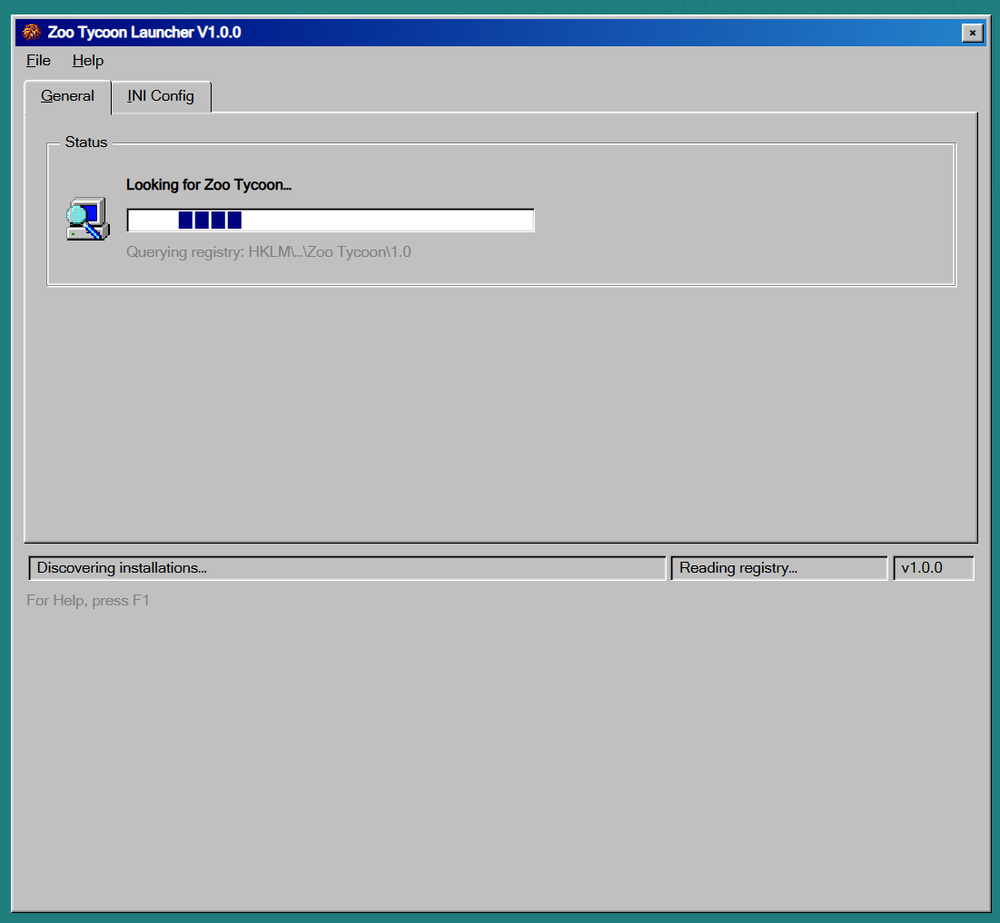

#### Actual Implementation

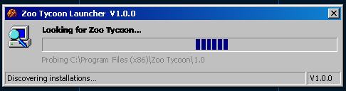

#### Alignment

> Does the implemented UI/UX align with that of the mockup? If not, explain why.

No — and the mismatch is intentional. The mockup renders this transitional state inside the full application chrome: the File / Help menu, the General / INI Config tab strip, and
a "Status" group box wrapping the magnifier icon, the "Looking for Zoo Tycoon…" heading, the progress bar, and the registry-probe status line — all sat above a large block of empty
space that the mockup's own caption flags as unintentional. The implementation instead treats this state as the pure, short-lived placeholder it is. It drops the menu, the tabs,
and the group box; promotes the icon, heading, progress bar, and probe line to sit directly on the window; and dynamically sizes the window to the content so the mockup's dead
space disappears entirely. The window is also explicitly opened front and centre so the user is not left hunting for a small, briefly displayed dialogue. The only chrome retained
is a slimmed status bar at the foot of the window — a single message panel plus the version, rather than the mockup's two message panels, version panel, and "For Help, press F1"
line.

## 2. Open Game Installation: `pref = NoInstallation`

### Testing Strategy

I set the launcher's stored startup preference to `NoInstallation`, then launched the app. I tested both with the installation registry empty and populated — neither should
matter — but it was worth running a test in both states to confirm the branch short-circuited regardless.

### Expected Outcome

> Explain what the expected outcome for this stage in the process should be.

The main window should have the INI Config tab disabled, and the General tab should display a status group box conveying the current state. Underneath the status group box should
be a data grid showing the user's registered installations for them to open as well as an option to add a new one.

### Actual Outcome

> Explain what the actual outcome was, how it aligned and/or differed from the expected. If any changes were made, briefly highlight them here (simply to avoid writing multiple
> "Actual Outcome" sections) and then go into more detail in the next section.

A simplified view similar to the boot state, with the tab control removed. The title menu was made visible again, both to expose alternative ways of triggering the same on-screen
actions and to keep the settings dialogue reachable. There is no data grid: that control has not been implemented yet and cannot be, since it relies on infrastructure that is still
undeveloped. A working data grid does not, however, affect the purpose of this test.

When designing the data grid that will eventually be shown here, I decided that each host (e.g. the Open Installation view or the Installation Manager dialogue) should be
responsible for defining the buttons around the grid. Because of this, the actual implementation includes the buttons, but none of them are currently functional.

### Changes

> Walk through any changes made during testing to address any gaps between the expected and actual outcomes or improvements you made.

Like the boot state, I removed the tab control. It doesn't make sense to have the tabs for a state where no installation is open. Additionally, I promoted the status group box
contents to be top-level. Even though the buttons are not currently functional, I did hard-wire some basic states. Once the data grid is implemented, several buttons (e.g. `Open`
and `Info`) will require a selection in the grid, so assuming no default selection is made or if there are no installations, the buttons should be disabled by default. Also, I
removed the `Add` button from the original mockup. Whilst displaying the data grid in this state is nice for the user to quickly select and open an installation, I do not want this
view to functionally do the same things as the Installation Manager dialogue. And since the `Info` button is disabled by default, I switched it with the `Manage` button, so the
order is more visually appealing. I didn't like having a disabled, enabled, and then disabled button order.

### UI/UX

#### Hi-Fi Mockup

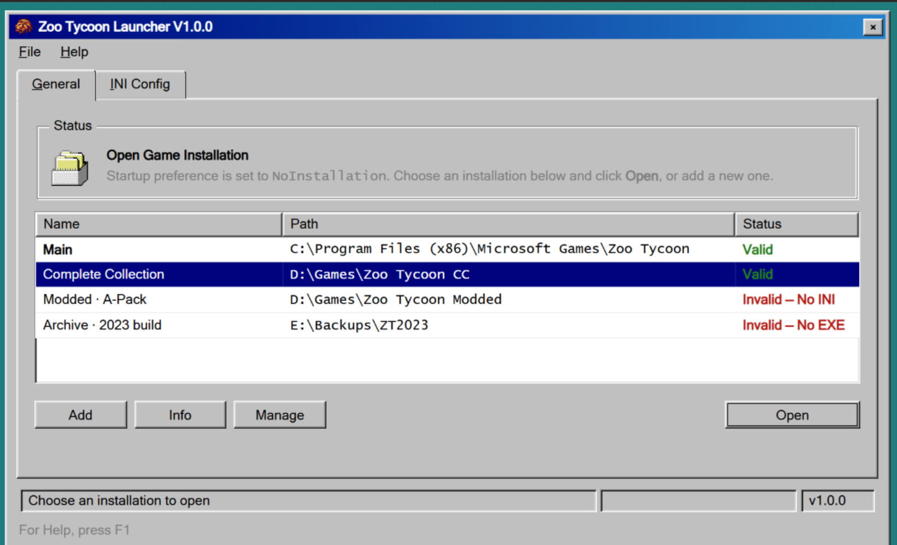

#### Actual Implementation

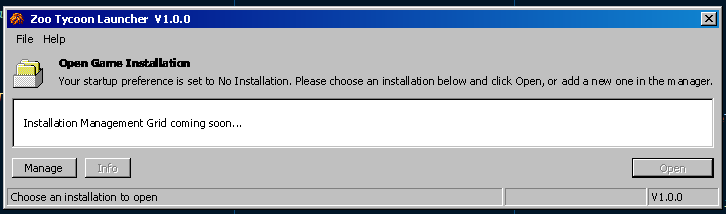

#### Alignment

> Does the implemented UI/UX align with that of the mockup? If not, explain why.

No — and, as with the boot state, the divergences are deliberate rather than accidental. The mockup wraps the informational content in a "Status" group box and nests it inside the
full tabbed shell (General / INI Config). The implementation drops the tab control entirely — tabs make no sense in a state where no installation is open — and promotes the status
content to be top-level, so the folder icon, heading, and message sit directly on the window instead of inside a labelled frame. The title menu and status bar are retained, which
matches the mockup, keeping the same actions (and the settings dialogue) reachable from more than one place.

The data grid is the largest visible difference. The mockup shows a populated Name / Path / Status grid, whereas the implementation shows an "Installation Management Grid coming
soon…" placeholder, because that control depends on infrastructure that has not been built yet. This gap does not undermine the test — the execution path itself is exercised start
to finish regardless of whether a real grid is present.

The buttons around the grid also differ by design. I removed the mockup's `Add` button so this view does not duplicate the Installation Manager dialogue's responsibilities, and I
swapped `Info` and `Manage` so the enabled/disabled ordering reads better. The mockup's Add / Info / Manage arrangement left me with a disabled, enabled, disabled sequence I found
visually jarring. The remaining buttons are hard-wired to the states they will eventually resolve to: `Open` and `Info` require a grid selection, so with no selection made — or
with no installations at all — they default to being disabled.

One smaller copy difference follows from the same decision: the mockup's message ends with "…or add a new one", whereas the implementation ends with "…or add a new one in the
manager". Because the inline `Add` button was dropped, adding an installation is no longer something this view does; the reworded message therefore points the user at the
Installation Manager dialogue instead, keeping the instruction honest about where that action now lives.

### Shortcomings

> Explain any shortcomings not yet implemented, what information/steps are needed to implement them, etc.

The installation data grid and action buttons are not yet implemented/functional. These features require infrastructure not yet implemented. However, for this test plan, these
features are not necessarily needed. The execution path in the startup flow has still been tested from start to finish.

## 3. Auto Locate: `pref = DefaultInstallation`, and `DefaultId = null`, and no rows exist

### Testing Strategy

I reset the installation registry so that no rows exist and the stored `DefaultInstallationId` is null. Then I set the startup preference to `DefaultInstallation`. With a real Zoo
Tycoon installation on disk in a location which one of the locator's probes can discover (registry entry, Steam library, GOG library, or wherever the probes are pointed), I
launched the app. I confirmed the located path is surfaced on the resulting screen.

### Expected Outcome

> Explain what the expected outcome for this stage in the process should be.

Because no installation rows exist and the stored `DefaultInstallationId` is null, the handler should fall through to the auto-locator and probe each of its known locations. Since
a real installation was deliberately placed where one of those probes can reach it, the locator should return a candidate, and the resulting `NoGameInstallationFound` screen should
surface that discovered path so the user can register it in a single step. The INI Config tab should be disabled — no installation is open — and the General tab should present a
status group box carrying the error state (a "No Game Installation Found" heading, an explanatory message, and an `Add Installation` action) above an "Auto-locate trail" group box
that lists every probe that was attempted and why each did or did not yield the game.

### Actual Outcome

> Explain what the actual outcome was, how it aligned and/or differed from the expected. If any changes were made, briefly highlight them here (simply to avoid writing multiple
> "Actual Outcome" sections) and then go into more detail in the next section.

As with the earlier states, the view is the simplified, chrome-light variant: the tab control is gone and the status content is promoted to the top level, though the title menu and
status bar remain. The red error icon, "No Game Installation Found" heading, explanatory message, and `Add Installation` button all render as intended. Crucially for this path, the
located candidate is surfaced — a field labelled "A potential candidate has been located at the following path:" appears beneath the message, populated with the discovered
`C:\Program Files (x86)\Microsoft Games\Zoo Tycoon` path. Below it, the "Auto-locate trail" group box lists each probe (the registry key, the two Program Files directories, and the
last-known path) with a × marker and a short outcome — "no value", "directory missing", or "empty". The `Add Installation` button opens a working Add Installation dialogue. The
trail rows and the candidate path are currently hard-wired rather than produced by a live locate, but that is out of scope here (see Shortcomings) and does not affect the path
under test.

### Changes

> Walk through any changes made during testing to address any gaps between the expected and actual outcomes or improvements you made.

Consistent with the two previous states, I removed the tab control — there is still no open installation, so the INI Config tab has nothing to bind to — and promoted the status
group box contents to be top-level. The title menu stays visible, matching the Open Game Installation view, so the settings dialogue and the menu-driven equivalents of the
on-screen actions remain reachable. I kept the "Auto-locate trail" as a genuine group box, since unlike the redundant "Status" frame, it is a real informational grouping. The main
addition over the mockup is the candidate field: because this path is specifically the "locator found something" case, I added the "A potential candidate has been located at the
following path" label and read-only path field so the discovered installation is surfaced the moment the screen appears. Finally, I wired the `Add Installation` button to open the
Add Installation dialogue.

### UI/UX

#### Hi-Fi Mockup

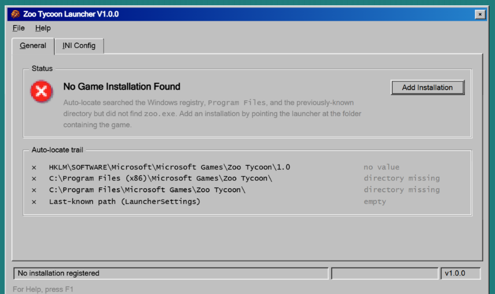

#### Actual Implementation

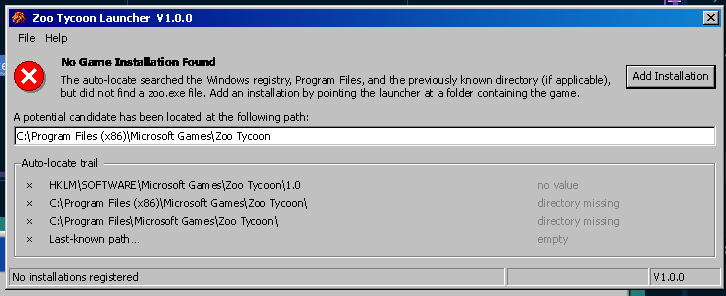

#### Alignment

> Does the implemented UI/UX align with that of the mockup? If not, explain why.

Partially, and the differences follow the now-familiar pattern. The mockup nests everything inside the tabbed shell and a "Status" group box; the implementation drops both,
promoting the error icon, heading, message, and `Add Installation` button to sit directly on the window, sizing the window down to its content, and keeping only the title menu and
a slimmed status bar. The "Auto-locate trail" group box is retained on both, since it is a meaningful grouping rather than redundant chrome.

The most significant divergence is deliberate and specific to this path: the mockup depicts the _no-candidate_ variant of this screen — it shows no located path — whereas this test
exercises the _candidate-found_ variant, so the implementation adds the "A potential candidate has been located…" field the mockup does not contain. That is less a regression
against the mockup than the mockup only illustrating one of the two branches this screen serves; the companion "Auto Locate (no candidate)" section covers the branch the mockup
actually depicts. The remaining differences are minor wording tweaks — the implementation's message spells out "a zoo.exe file" and adds a "(if applicable)" qualifier to the
previously known directory — and are otherwise faithful.

### Shortcomings

> Explain any shortcomings not yet implemented, what information/steps are needed to implement them, etc.

Two pieces remain unfinished; both sit outside the scope of this test and neither changes its outcome:

- The `Add Installation` button opens a fully functional Add Installation dialogue, but the dialogue's rules for autofilling the name input and auto-ticking the "set as default"
  checkbox are not yet working. The dialogue can still be completed manually, so the execution path is unaffected.
- The "Auto-locate trail" group box does not display dynamic data — its rows are hard-wired and do not change between runs. The trail is purely informational at this stage, so a
  static placeholder does not affect whether the located candidate is surfaced or whether the path can be exercised end to end.

## 4. Auto Locate (no candidate): `pref = DefaultInstallation`, and `DefaultId = null`, and no rows exist, and the locator returns nothing

### Testing Strategy

I used the same setup as the previous section — no installation rows, a null `DefaultInstallationId`, and the `DefaultInstallation` preference — but ensured no Zoo Tycoon
installation existed in any of the locator's probe locations. I removed them from the disk, then launched the app, and confirmed that no candidate path is shown on the resulting
screen.

### Expected Outcome

Because no installation rows exist and the stored `DefaultInstallationId` is null, the handler should fall through to the auto-locator and probe each of its known locations exactly
as in the previous section. This time, however, none of those probes reaches a real installation, so the locator should return no candidate. The resulting `NoGameInstallationFound`
screen should therefore present the same error state as the candidate-found variant — a "No Game Installation Found" heading, an explanatory message, and an `Add Installation`
action, above the "Auto-locate trail" group box that lists every probe attempted and why each yielded nothing — but crucially it should _not_ surface a candidate field, because
there is no discovered path to show. The INI Config tab should be disabled (no installation is open) and the General tab should carry the status content.

### Actual Outcome

As with the candidate-found variant, the view is the simplified, chrome-light form: the tab control is gone and the status content is promoted to the top level, whilst the title
menu and status bar remain. The red error icon, "No Game Installation Found" heading, explanatory message, and `Add Installation` button all render as intended. The defining trait
of this path is confirmed by absence — no "A potential candidate has been located…" field appears beneath the message, because the locator returned nothing. Below the message, the
"Auto-locate trail" group box lists each probe (the registry key, the two Program Files directories, and the last-known path) with a × marker and a short outcome — "no value",
"directory missing", and "empty". The `Add Installation` button opens a working Add Installation dialogue. As before, the trail rows are currently hard-wired rather than produced
by a live locate, but that is out of scope here (see Shortcomings) and does not affect the path under test.

### Changes

No new changes were required for this path beyond those already made for the candidate-found variant. Both branches are served by the same `NoGameInstallationFound` view; the only
difference between them is whether the candidate field is present, and that field is conditional — with no located path to bind, it simply does not appear. Consequently the
structural work already described in the previous section (removing the tab control, promoting the status group box contents to the top level, retaining the title menu, keeping the
"Auto-locate trail" as a genuine group box, and wiring the `Add Installation` button to the dialogue) all carries over unchanged, and there was nothing path-specific left to add.

### UI/UX

#### Hi-Fi Mockup

#### Actual Implementation

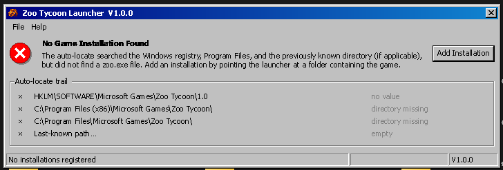

#### Alignment

Yes — and notably, this variant aligns with the mockup _more_ closely than the candidate-found variant did, because the mockup actually depicts this branch: it shows the error
state and the "Auto-locate trail" with no located path. The candidate field that was the previous section's most significant divergence is simply absent here, on both the mockup
and the implementation, so that gap disappears entirely. What remains are the same deliberate, structural differences catalogued throughout the earlier states — the mockup nests
everything inside the tabbed shell and a "Status" group box, whereas the implementation drops both, promotes the error icon, heading, message, and `Add Installation` button to sit
directly on the window, sizes the window down to its content, and keeps only the title menu and a slimmed status bar. The "Auto-locate trail" group box is retained on both, since
it is a meaningful grouping rather than redundant chrome. The only other differences are the same minor wording tweaks noted before — the implementation spells out "a zoo.exe file"
and adds a "(if applicable)" qualifier to the previously known directory — and are otherwise faithful.

### Shortcomings

The same two pieces noted in the previous section remain unfinished; both sit outside the scope of this test and neither changes its outcome:

- The `Add Installation` button opens a fully functional Add Installation dialogue, but the dialogue's rules for autofilling the name input and auto-ticking the "set as default"
  checkbox are not yet working. The dialogue can still be completed manually, so the execution path is unaffected.
- The "Auto-locate trail" group box does not display dynamic data — its rows are hard-wired and do not change between runs. The trail is purely informational at this stage, so a
  static placeholder does not affect whether the no-candidate branch is exercised end to end.

## 5. Default Promotion → Ready: `pref = DefaultInstallation`, `DefaultId = null`, rows ≥ 1, promoted row verifies and synchronises

### Testing Strategy

I set up at least one installation row pointing to a valid on-disk installation (zoo.exe present, zoo.ini present, and parseable) and cleared the stored `DefaultInstallationId` so
the handler was forced to promote. With the startup preference set to `DefaultInstallation`, I launched the app, then afterwards confirmed both that `ReadyToPlay` rendered and that
the settings row now held the promoted installation's id.

### Expected Outcome

> Explain what the expected outcome for this stage in the process should be.

Because installation rows exist but no `DefaultInstallationId` is stored, the handler should fall through to the promotion branch: pick a row, persist its id into the settings row
as the new default, verify it (zoo.exe and zoo.ini both present), synchronise its INI, and — since the promoted row is valid — resolve to `ReadyToPlay`. This is the first genuinely
_terminal, successful_ state in the flow, and the first in which an installation is actually open, so unlike the earlier chrome-light placeholder states the full application shell
should return: the General / INI Config tab strip should be present and, crucially, the INI Config tab should now be _enabled_ rather than disabled. The General tab should show the
installation profile name, a "Status" group box carrying the success state — a green tick, a "Ready to Play" heading, "EXE: Found" and "INI: Found" rows, the installation path, and
an enabled `Launch Game` button — followed by a "Display" group summarising the current screen mode, a "Your System" group summarising the host, and a "Last played" stamp in the
bottom-right corner. After boot, the settings row should hold the promoted installation's id, proving the promotion was persisted rather than merely applied in memory for the one
render.

### Actual Outcome

> Explain what the actual outcome was, how it aligned and/or differed from the expected. If any changes were made, briefly highlight them here (simply to avoid writing multiple
> "Actual Outcome" sections) and then go into more detail in the next section.

The test passed and everything worked as expected. For the first time in the flow the full tabbed shell returned — both the General and INI Config tabs are present, and the INI
Config tab is now enabled rather than greyed out, because an installation is finally open. The General tab shows Installation Profile "Main"; the "Status" group renders the green
tick, the "Ready to Play" heading, "EXE: Found" and "INI: Found" in green, the installation path, and an enabled `Launch Game` button. The "Display" and "Your System" group boxes
render beneath, and a muted "Last played" line sits in the bottom-right — now bound to the row's real `LastPlayedUtc`, reading "Never" here only because the freshly promoted row
has never been launched through the launcher. After boot, I inspected the settings row and confirmed it now held the promoted installation's id, so the default promotion was
persisted as intended. Several of the values on screen are still hard-wired or only partially wired (see Shortcomings), but none of them affects the path under test — the promote →
verify → synchronise → `ReadyToPlay` sequence, and the persistence of the promoted id, were all exercised end to end.

### Changes

> Walk through any changes made during testing to address any gaps between the expected and actual outcomes or improvements you made.

No structural changes were required to make this path pass; the notable point is a design decision that is visible here for the first time. This is the state where the tab control
returns — the earlier states stripped it because no installation was open, whereas here one is, so the General / INI Config tabs are finally meaningful. Because the `ReadyToPlay`
and `CannotPlay` outcomes share an identical layout, they are served by a single `PlayView` / `PlayViewModel` pair rather than one view apiece; the earlier `ReadyToPlayViewModel`
and `CannotPlayViewModel` were consolidated into `PlayViewModel`. A single `CanPlay` flag is threaded down into the tab view models, and that one flag toggles the difference
between the two outcomes — the tick versus the warning icon, the "Ready to Play" versus "Cannot Play" heading, and the status-row colours — so the `CannotPlay` sibling test
(section 6) exercises the same view from the opposite side of that flag.

### UI/UX

#### Hi-Fi Mockup

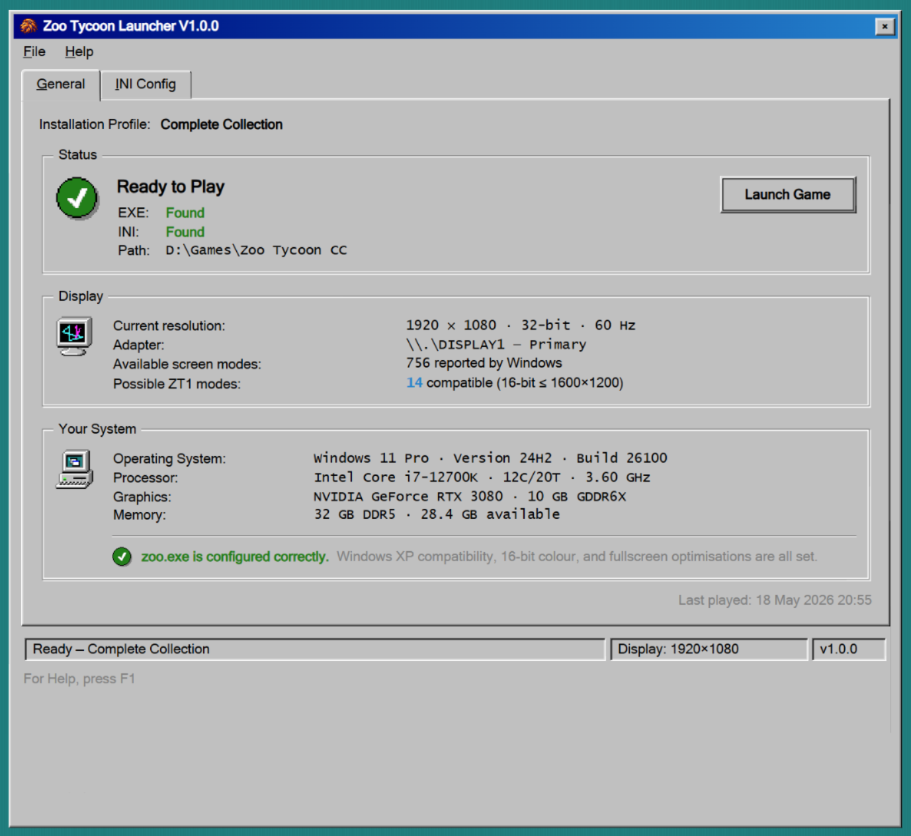

#### Actual Implementation

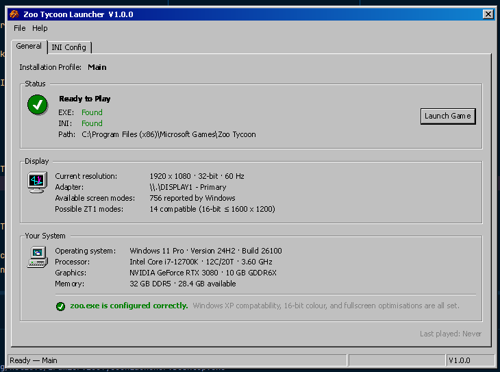

#### Alignment

> Does the implemented UI/UX align with that of the mockup? If not, explain why.

Yes — and this is the first state whose implementation closely tracks the mockup, precisely because it is a real terminal state with an open installation rather than the
chrome-light placeholder the earlier states deliberately became. Both the mockup and the implementation keep the full tabbed shell (General / INI Config), the title menu, the
"Status", "Display", and "Your System" group boxes, and the status bar; structurally they line up. The remaining differences are cosmetic or data-level rather than structural, and
all trace back to features that are not yet implemented:

- The "Display" and "Your System" groups display hard-coded values in the implementation. The screen-mode enumeration and host/system detection that would populate them are not yet
  built, so the figures shown (resolution, adapter, screen-mode counts, OS, processor, graphics, memory) are placeholders that happen to mirror the mockup's.
- The "Last played" stamp is now bound to the row's real `LastPlayedUtc`, but it reads "Last played: Never" in the implementation versus the mockup's real "18 May 2026 20:55"
  because the freshly promoted row has never been launched through the launcher, so its `LastPlayedUtc` is null and falls back to "Never". When a value _is_ present, it is
  converted to local time before display, matching the style of the mockup's timestamp.
- The second status-bar cell is empty in the implementation, whereas the mockup shows "Display: 1920×1080". This cell is meant to surface the current display resolution, so it
  stays blank until the display feature lands.
- Minor cosmetics: the "Possible ZT1 modes" count is plain text rather than the mockup's blue link, and the differing profile name ("Main" vs "Complete Collection") is simply the
  test data I happened to register.

None of these change the alignment verdict — the structural intent of the mockup is faithfully reproduced.

### Shortcomings

> Explain any shortcomings not yet implemented, what information/steps are needed to implement them, etc.

Four pieces on this screen are placeholders; all sit outside the scope of this test, and none affects whether the promotion-then-`ReadyToPlay` path is exercised end to end:

- The "Display" group is hard-coded. Populating it needs the screen-mode enumeration feature (via `IScreenModeEnumerator`) to be implemented and bound to the view model.
- The "Your System" group is hard-coded. Populating it needs host/system detection (OS, processor, graphics, memory) to be implemented and bound.
- The "Last played" stamp is wired to the row's `LastPlayedUtc` and converted to local time (`ToLocalTime()`) at the UI boundary before display. One gap remains: the binding is
  one-shot — `InstallationLastPlayed` is a plain property with no change notification, so the stamp does not refresh in real time after the game is launched from the GUI; it would
  only pick up a new value on the next boot.
- The second status-bar cell is empty rather than showing the current display resolution; it depends on the same display feature as the "Display" group.

## 6. Default Promotion → Cannot Play (`HasExe = false`): `pref = DefaultInstallation`, `DefaultId = null`, rows ≥ 1, promoted row fails verification

### Testing Strategy

I set up an installation row pointing at an otherwise-valid on-disk installation, then renamed its `zoo.exe` so the file no longer existed at the path the launcher probes —
verification would therefore find the executable missing whilst `zoo.ini` remained present and parseable. I cleared the stored `DefaultInstallationId` so the handler was forced to
promote a row, set the startup preference to `DefaultInstallation`, and launched the app. Afterwards I confirmed both that the promotion had still been persisted (the settings row
held the promoted id) and that the resulting screen resolved to the `HasExe = false` variant of `CannotPlay` rather than silently falling back to another row or crashing.

### Expected Outcome

> Explain what the expected outcome for this stage in the process should be.

Because installation rows exist but no `DefaultInstallationId` is stored, the handler should fall through to the promotion branch exactly as in section 5: pick a row, persist its
id into the settings row as the new default, and verify it. This time verification finds `zoo.exe` missing (`HasExe = false`) whilst `zoo.ini` is present, so the row is invalid and
the flow should resolve to `CannotPlay` rather than `ReadyToPlay`. Crucially, the promotion should still be persisted — a failed verification does not undo the fact that a default
was chosen — so the settings row should hold the promoted id afterwards.

Because an installation is now open, the full application shell should return just as it does for `ReadyToPlay`, rather than the chrome-light placeholder of the earlier
no-installation states: the General / INI Config tab strip should be present and the INI Config tab enabled. The General tab should carry the failure state — a warning icon, a red
"Cannot Play" heading, an "EXE: Not found" row (red) above an "INI: Found" row (green), the installation path, and a muted explanatory line naming the missing `zoo.exe` — followed
by the "Display" and "Your System" groups and a "Last played" stamp in the bottom-right corner. The status bar should surface a "Fix required" cue.

### Actual Outcome

> Explain what the actual outcome was, how it aligned and/or differed from the expected. If any changes were made, briefly highlight them here (simply to avoid writing multiple
> "Actual Outcome" sections) and then go into more detail in the next section.

The test passed and the correct state was reached. Renaming `zoo.exe` drove the promoted row to fail verification on `HasExe`, and the flow resolved to the missing-executable
variant of `CannotPlay` rather than promoting a different row. After boot, I inspected the settings row and confirmed it held the promoted installation's id, so — as expected — the
failed verification did not roll back the promotion itself.

The full tabbed shell returned, matching `ReadyToPlay`: both the General and INI Config tabs are present and the INI Config tab is enabled, because an installation is open. On the
General tab the profile reads "Main"; the "Status" group renders the yellow warning icon, the red "Cannot Play" heading, "EXE: Not found" in red and "INI: Found" in green, the
installation path, and the muted line "zoo.exe is missing from this installation's directory. The game cannot be started because it technically doesn't exist. Open the installation
manager to try fixing the problem." In the top-right of the status group, in the slot the launch button occupies on `ReadyToPlay`, sits an enabled "Open Installation Manager…"
button instead. The "Display" and "Your System" groups render beneath with their (still hard-coded) values, each carrying a state-specific footnote described below, and the muted
"Last played" line reads "03 July 2026 01:56". As in section 5 several of these values are placeholders (see Shortcomings), but none affects the promote → verify → `CannotPlay`
path under test.

### Changes

> Walk through any changes made during testing to address any gaps between the expected and actual outcomes or improvements you made.

I made three deliberate UI decisions here that diverge from the mockup; each is a design choice rather than an accident of unfinished work.

First, the launch affordance. The mockup handles the invalid state by disabling the "Launch Game" button in the top-right and adding a separate "Fix" button (alongside "Manage
Installations") inside the status group — effectively duplicating in the main window the fix action that already lives in the Installation Manager dialogue. I did neither. Instead,
I repurposed the launch button itself: when `CanPlay` is false the same top-right slot renders an enabled "Open Installation Manager…" button that takes the user to the
Installation Manager to fix the installation there. This keeps a single, always-meaningful primary action in one place rather than a dead button plus a duplicated fix control.

Second, the "Display" group. The mockup mutes that group's text when the game cannot play. I chose not to — an invalid _game_ installation says nothing about the validity of the
machine's physical _display_ configuration, which the launcher detected successfully regardless. The values therefore stay in normal text; the only concession to the failure state
is a muted, italic footnote beneath them ("Display detection succeeded, but the game cannot launch until the EXE is restored"), which is enough to explain why the otherwise-valid
display information cannot yet be acted on.

Third, the "Your System" group, for the same reason. Those host details (OS, processor, graphics, memory) remain true whether the game installation is valid, so I left their
text unmuted as well. But because that group is specifically about the _game's_ optimisation, I added a footnote flagging that there is nothing to optimise: a red error icon with
"zoo.exe is missing" followed by the muted "There's no game to configure" — the failure-state counterpart to the mockup's green "zoo.exe is configured correctly" tick.

### UI/UX

#### Hi-Fi Mockup

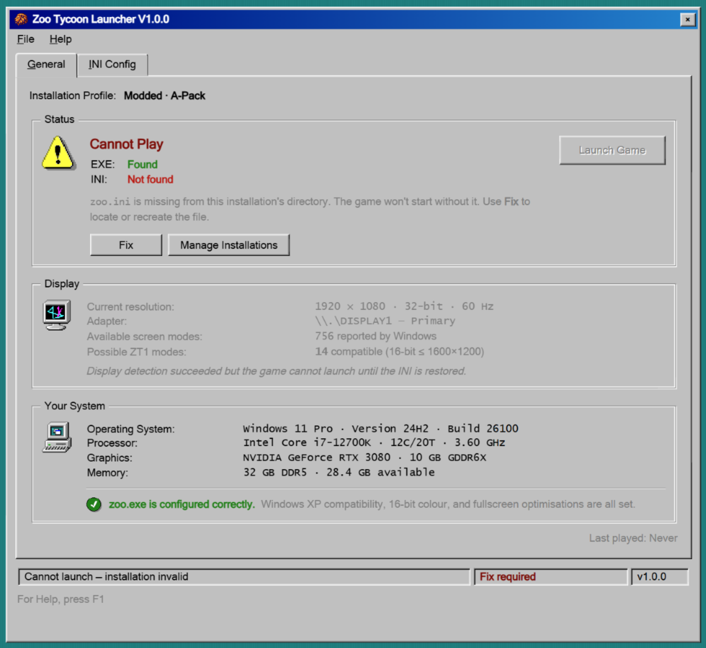

#### Actual Implementation

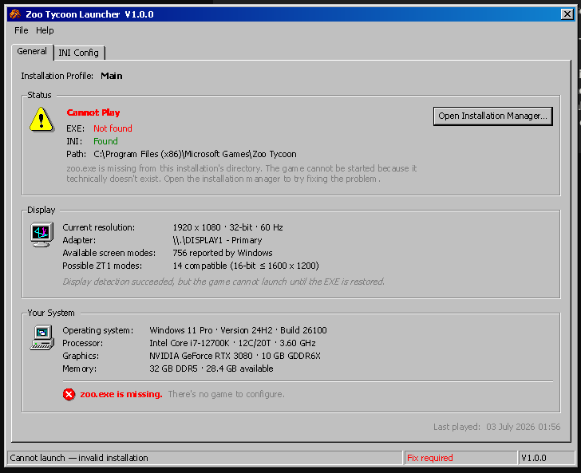

#### Alignment

> Does the implemented UI/UX align with that of the mockup? If not, explain why.

Partially, and every divergence is one of the three deliberate decisions above rather than an accident.

The most conspicuous surface difference is _which_ file is missing. The mockup depicts the `zoo.ini`-missing substate (EXE found, INI not found), whereas this test exercises the
`zoo.exe`-missing substate (EXE not found, INI found). That is not a mismatch against intent: the styling for either missing file is identical, so the mockup only ever needed to
illustrate one of the two substates. The implementation drives the same layout from the opposite flag — the "EXE" and "INI" rows swap which is red and which is green, and the muted
status line, the display footnote, and the system footnote all switch to their EXE-missing wording. Structurally, the two screens are the same.

The remaining differences are the intentional changes catalogued above: the single "Open Installation Manager…" button in place of the mockup's disabled "Launch Game" plus in-panel
"Fix" button; the unmuted "Display" group with only a footnote added; and the unmuted "Your System" group with a "nothing to configure" footnote in place of the mockup's
"configured correctly" tick. Elsewhere, the two-line up — the full tabbed shell, the title menu, the "Status" / "Display" / "Your System" group boxes, the warning icon and red
"Cannot Play" heading, and the "Fix required" status-bar cue are all present on both. The profile name ("Main" vs "Modded · A-Pack") is simply the test data I registered, and the
"Last played" stamp shows a real local-time value here ("03 July 2026 01:56") because this row has been launched before, rather than the mockup's "Never".

### Shortcomings

> Explain any shortcomings not yet implemented, what information/steps are needed to implement them, etc.

The placeholders are largely the same ones noted for `ReadyToPlay` in section 5, since both outcomes are served by the single `PlayView` / `PlayViewModel` pair; none affects
whether the `CannotPlay` path is exercised end to end:

- The "Display" group is hard-coded, pending the screen-mode enumeration feature (via `IScreenModeEnumerator`).
- The "Your System" group is hard-coded, pending host/system detection (OS, processor, graphics, memory).
- The "Last played" stamp is bound to the row's `LastPlayedUtc` and converted to local time at the UI boundary, but the binding is one-shot — it will not refresh live.
- The second status-bar cell is empty rather than showing the current display resolution; it depends on the same display feature as the "Display" group.
- The "Open Installation Manager…" button renders and is enabled, but it is not yet wired to a command — the Installation Manager dialogue it should open has not been built, so the
  button is presently inert. This sits outside the scope of this test, which covers the boot-time resolution to `CannotPlay`, not the downstream fix workflow.

## 7. Default Promotion → Cannot Play (sync failure): `pref = DefaultInstallation`, `DefaultId = null`, rows ≥ 1, promoted row fails INI synchronisation

> **Skipped for now.** This path hinges on driving the promoted row to *fail INI synchronisation*, which in turn depends on the INI parsing / synchronisation feature being fully
> implemented — and it is not yet. Until that feature lands, there is no genuine way to force a real sync failure, so this section is deferred rather than tested against a stub.

### Testing Strategy

I'll set up at least one installation row whose path has a valid zoo.exe but whose zoo.ini cannot be synchronised — for example, a malformed file the parser rejects, a
permissions-locked file, or a file held open exclusively by another process. I'll clear the stored `DefaultInstallationId`, ensure the startup preference is `DefaultInstallation`,
and launch the app.

### Expected Outcome

> Explain what the expected outcome for this stage in the process should be.

### Actual Outcome

> Explain what the actual outcome was, how it aligned and/or differed from the expected. If any changes were made, briefly highlight them here (simply to avoid writing multiple
> "Actual Outcome" sections) and then go into more detail in the next section.

### Changes

> Walk through any changes made during testing to address any gaps between the expected and actual outcomes or improvements you made.

### UI/UX

#### Hi-Fi Mockup

> Add a screenshot of the particular view in question from the hi-fi mockup in Claude Design.

#### Actual Implementation

> Add a screenshot of the actual implementation.

#### Alignment

> Does the implemented UI/UX align with that of the mockup? If not, explain why.

### Shortcomings

> Explain any shortcomings not yet implemented, what information/steps are needed to implement them, etc.

### Notes/Thoughts

## 8. Stale `DefaultId`: `pref = DefaultInstallation`, `DefaultId` is set, but `GetByIdAsync` returns null

### Testing Strategy

I made the stored `DefaultInstallationId` point at a Guid that is not present in the installation registry — writing an arbitrary fresh Guid into the settings row so the pointer
was guaranteed to be dangling — and set the startup preference to `DefaultInstallation`. Because a stale pointer simply re-enters the ordinary `DefaultInstallation` resolution
cascade (promote a row, else auto-locate), rather than landing on any state of its own, I exercised all three arrangements that cascade can resolve to, launching the app once per
arrangement:

1. **Promotion candidate present.** At least one installation row existed alongside the dangling pointer, so the handler could promote a row as the new default.
2. **No promotion candidate, but a locator candidate present.** No installation rows existed, but a real Zoo Tycoon installation sat on the disk where one of the locator's probes
   could reach it.
3. **Neither present.** No installation rows existed, and no installation sat in any of the locator's probe locations.

After each run I inspected the settings row to confirm the dangling pointer had not survived boot — either replaced by a valid promoted id or cleared to null.

### Expected Outcome

> Explain what the expected outcome for this stage in the process should be.

Because the startup preference is `DefaultInstallation` and a `DefaultInstallationId` is stored, the handler should read that id and call `GetByIdAsync`. As the id is stale, the
lookup returns null, so the handler must not treat the pointer as resolved: it should fall straight through the `row is not null` gate into exactly the same promote → auto-locate
cascade it uses when no default was ever set. The stale pointer must never survive the boot. Concretely, the three arrangements should be resolved as follows:

1. **Promotion candidate present** — the handler promotes a row, overwrites the stale pointer with the *promoted* row's id, persists it, and verifies the promoted row, resolving to
   `ReadyToPlay` or `CannotPlay` exactly as sections 5 and 6 describe.
2. **No promotion candidate, but a locator candidate present** — with no row to promote the handler clears the stale pointer to null, persists that, and falls to the auto-locator,
   which returns the discovered path. The screen is the candidate-found `NoGameInstallationFound` variant from section 3.
3. **Neither present** — the handler again clears the stale pointer to null and auto-locates, but the locator returns nothing, so the screen is the no-candidate
   `NoGameInstallationFound` variant from section 4.

In all three the defining, path-specific assertion is behavioural rather than visual: the stale `DefaultInstallationId` is gone by the time boot completes, replaced (variant 1) or
nulled (variants 2 and 3). This path introduces no new or unique on-screen state — every screen it can produce is one already covered by sections 3–6.

### Actual Outcome

> Explain what the actual outcome was, how it aligned and/or differed from the expected. If any changes were made, briefly highlight them here (simply to avoid writing multiple
> "Actual Outcome" sections) and then go into more detail in the next section.

All three arrangements passed and behaved exactly as expected. In variant 1 the handler promoted the surviving row, and the post-boot settings row held the *promoted* row's id
rather than the dangling Guid I had written; the screen resolved through the section 5 / 6 machinery. In variant 2 the handler found nothing to promote, cleared the stale pointer
to null, and surfaced the discovered `C:\Program Files (x86)\Microsoft Games\Zoo Tycoon` path on the candidate-found `NoGameInstallationFound` screen. In variant 3 the pointer was
likewise cleared to null and the no-candidate `NoGameInstallationFound` screen rendered with no path surfaced. In every case the stale pointer was gone once boot completed — the
central guarantee of this path. No screenshots were captured because the path produces no new or unique UI/UX; it is entirely behind the scenes and exercises the logical flow
alone, so each arrangement simply reuses a screen already documented in sections 3–6.

### Changes

> Walk through any changes made during testing to address any gaps between the expected and actual outcomes or improvements you made.

The change this path drove is the stale-default handling in `BootHandler.ResolveDefaultAsync`. The stored id is read behind an `is not null` guard and looked up, but a stale id
makes that lookup return null, so the row-found gate is skipped and the handler continues into the shared promotion branch (`FindDefaultPromotionCandidateAsync`) rather than
stopping. Two write behaviours were added around that continuation so the dangling pointer can never persist: when a promotion candidate is found the pointer is *overwritten* with
the promoted row's id; when none is found the pointer is explicitly *cleared* to null before auto-locating (a write operation that is skipped when the id was already null, i.e.
when no default was ever set). Both are persisted via `UpdateAsync` before the outcome is returned. No UI work was needed — the states this path resolves to were all already built
for sections 3–6.

### UI/UX

#### Alignment

> Does the implemented UI/UX align with that of the mockup? If not, explain why.

Not applicable in any new sense. This path renders no screen of its own — it only re-enters the `DefaultInstallation` cascade and lands on one of the states already documented in
sections 3 (candidate-found `NoGameInstallationFound`), 4 (no-candidate `NoGameInstallationFound`), and 5 / 6 (`ReadyToPlay` / `CannotPlay`). Each of those sections already records
its own mockup alignment, and nothing about arriving there via a stale pointer changes the pixels. For that reason no Hi-Fi Mockup or Actual Implementation screenshots are included
here: the path is purely behind-the-scenes control flow, and capturing the same screens a third or fourth time would add nothing over the sections that already own them.

### Shortcomings

> Explain any shortcomings not yet implemented, what information/steps are needed to implement them, etc.

None specific to this path. The stale-pointer resolution — promote-and-overwrite, or clear-and-auto-locate — is fully implemented and behaves as intended for all three
arrangements. The only outstanding gaps are the ones already inherited from the destination screens: the hard-wired "Auto-locate trail" and the not-yet-functional Add Installation
autofill rules on `NoGameInstallationFound` (sections 3 and 4), and the placeholder "Display" / "Your System" groups on `ReadyToPlay` / `CannotPlay` (sections 5 and 6). None of
them affects whether the stale pointer is cleared or overwritten, which is the whole of what this path tests.

### Notes/Thoughts

Worth restating why this section has three variants but no screenshots: the stale-`DefaultId` case is not a state, it is a *guard failure that re-enters an existing branch*. The
value of testing it is entirely in the invariant — a dangling default pointer must never outlive a boot — and that invariant is verified by inspecting the settings row afterwards,
not by looking at the window. The three variants exist only to prove the invariant holds down every leg of the cascade the stale id can fall into.

## 9. Happy Path: `pref = DefaultInstallation`, `DefaultId` is set, row verifies and synchronises

### Testing Strategy

I'll set up at least one installation row pointing to a valid on-disk installation (zoo.exe present, zoo.ini present, and parseable), and set the stored `DefaultInstallationId` to
that row's id. With the startup preference set to `DefaultInstallation`, I'll launch the app and confirm the right installation surfaces on `ReadyToPlay`.

### Expected Outcome

> Explain what the expected outcome for this stage in the process should be.

### Actual Outcome

> Explain what the actual outcome was, how it aligned and/or differed from the expected. If any changes were made, briefly highlight them here (simply to avoid writing multiple
> "Actual Outcome" sections) and then go into more detail in the next section.

### Changes

> Walk through any changes made during testing to address any gaps between the expected and actual outcomes or improvements you made.

### UI/UX

#### Hi-Fi Mockup

> Add a screenshot of the particular view in question from the hi-fi mockup in Claude Design.

#### Actual Implementation

> Add a screenshot of the actual implementation.

#### Alignment

> Does the implemented UI/UX align with that of the mockup? If not, explain why.

### Shortcomings

> Explain any shortcomings not yet implemented, what information/steps are needed to implement them, etc.

### Notes/Thoughts

## 10. Cannot Play (`HasExe = false`): `pref = DefaultInstallation`, `DefaultId` is set, row fails verification

### Testing Strategy

I'll set up an installation row and set the stored `DefaultInstallationId` to match, then remove or rename zoo.exe at the row's path so verification fails. I'll ensure the startup
preference is `DefaultInstallation`, then launch the app.

### Expected Outcome

> Explain what the expected outcome for this stage in the process should be.

### Actual Outcome

> Explain what the actual outcome was, how it aligned and/or differed from the expected. If any changes were made, briefly highlight them here (simply to avoid writing multiple
> "Actual Outcome" sections) and then go into more detail in the next section.

### Changes

> Walk through any changes made during testing to address any gaps between the expected and actual outcomes or improvements you made.

### UI/UX

#### Hi-Fi Mockup

> Add a screenshot of the particular view in question from the hi-fi mockup in Claude Design.

#### Actual Implementation

> Add a screenshot of the actual implementation.

#### Alignment

> Does the implemented UI/UX align with that of the mockup? If not, explain why.

### Shortcomings

> Explain any shortcomings not yet implemented, what information/steps are needed to implement them, etc.

### Notes/Thoughts

## 11. Cannot Play (sync failure): `pref = DefaultInstallation`, `DefaultId` is set, row fails INI synchronisation

> **Skipped for now.** This path hinges on driving the promoted row to *fail INI synchronisation*, which in turn depends on the INI parsing / synchronisation feature being fully
> implemented — and it is not yet. Until that feature lands, there is no genuine way to force a real sync failure, so this section is deferred rather than tested against a stub.

### Testing Strategy

I'll set up an installation row whose path has a valid zoo.exe but a zoo.ini the synchroniser cannot process (malformed, locked, or otherwise unreadable), and set the stored
`DefaultInstallationId` to match. I'll ensure the startup preference is `DefaultInstallation`, then launch the app.

### Expected Outcome

> Explain what the expected outcome for this stage in the process should be.

### Actual Outcome

> Explain what the actual outcome was, how it aligned and/or differed from the expected. If any changes were made, briefly highlight them here (simply to avoid writing multiple
> "Actual Outcome" sections) and then go into more detail in the next section.

### Changes

> Walk through any changes made during testing to address any gaps between the expected and actual outcomes or improvements you made.

### UI/UX

#### Hi-Fi Mockup

> Add a screenshot of the particular view in question from the hi-fi mockup in Claude Design.

#### Actual Implementation

> Add a screenshot of the actual implementation.

#### Alignment

> Does the implemented UI/UX align with that of the mockup? If not, explain why.

### Shortcomings

> Explain any shortcomings not yet implemented, what information/steps are needed to implement them, etc.

### Notes/Thoughts

## 12. Last Played → Ready: `pref = LastPlayedInstallation`, a candidate exists, verifies, and synchronises

### Testing Strategy

I'll set up at least two installation rows with distinct `LastPlayedUtc` values, both pointing at valid on-disk installations, and set the startup preference to
`LastPlayedInstallation`. I'll launch the app and confirm the row with the newer `LastPlayedUtc` is the one that surfaces — not the other valid row.

### Expected Outcome

> Explain what the expected outcome for this stage in the process should be.

### Actual Outcome

> Explain what the actual outcome was, how it aligned and/or differed from the expected. If any changes were made, briefly highlight them here (simply to avoid writing multiple
> "Actual Outcome" sections) and then go into more detail in the next section.

### Changes

> Walk through any changes made during testing to address any gaps between the expected and actual outcomes or improvements you made.

### UI/UX

#### Hi-Fi Mockup

> Add a screenshot of the particular view in question from the hi-fi mockup in Claude Design.

#### Actual Implementation

> Add a screenshot of the actual implementation.

#### Alignment

> Does the implemented UI/UX align with that of the mockup? If not, explain why.

### Shortcomings

> Explain any shortcomings not yet implemented, what information/steps are needed to implement them, etc.

### Notes/Thoughts

## 13. Last Played → Cannot Play (`HasExe = false`): `pref = LastPlayedInstallation`, a candidate exists, fails verification

### Testing Strategy

I'll use the same setup as the previous section — multiple rows with distinct `LastPlayedUtc` values and the `LastPlayedInstallation` preference — but with the row holding the
newer `LastPlayedUtc` having no zoo.exe at its path. I'll launch the app and confirm `CannotPlay` surfaces for that row; the handler should not silently fall back to another row.

### Expected Outcome

> Explain what the expected outcome for this stage in the process should be.

### Actual Outcome

> Explain what the actual outcome was, how it aligned and/or differed from the expected. If any changes were made, briefly highlight them here (simply to avoid writing multiple
> "Actual Outcome" sections) and then go into more detail in the next section.

### Changes

> Walk through any changes made during testing to address any gaps between the expected and actual outcomes or improvements you made.

### UI/UX

#### Hi-Fi Mockup

> Add a screenshot of the particular view in question from the hi-fi mockup in Claude Design.

#### Actual Implementation

> Add a screenshot of the actual implementation.

#### Alignment

> Does the implemented UI/UX align with that of the mockup? If not, explain why.

### Shortcomings

> Explain any shortcomings not yet implemented, what information/steps are needed to implement them, etc.

### Notes/Thoughts

## 14. Last Played → Cannot Play (sync failure): `pref = LastPlayedInstallation`, a candidate exists, fails INI synchronisation

> **Skipped for now.** This path hinges on driving the promoted row to *fail INI synchronisation*, which in turn depends on the INI parsing / synchronisation feature being fully
> implemented — and it is not yet. Until that feature lands, there is no genuine way to force a real sync failure, so this section is deferred rather than tested against a stub.

### Testing Strategy

I'll use the same setup as the previous two sections, but with the row that would be selected by `LastPlayedUtc` having a valid zoo.exe and a zoo.ini the synchroniser cannot
process. Then I'll launch the app.

### Expected Outcome

> Explain what the expected outcome for this stage in the process should be.

### Actual Outcome

> Explain what the actual outcome was, how it aligned and/or differed from the expected. If any changes were made, briefly highlight them here (simply to avoid writing multiple
> "Actual Outcome" sections) and then go into more detail in the next section.

### Changes

> Walk through any changes made during testing to address any gaps between the expected and actual outcomes or improvements you made.

### UI/UX

#### Hi-Fi Mockup

> Add a screenshot of the particular view in question from the hi-fi mockup in Claude Design.

#### Actual Implementation

> Add a screenshot of the actual implementation.

#### Alignment

> Does the implemented UI/UX align with that of the mockup? If not, explain why.

### Shortcomings

> Explain any shortcomings not yet implemented, what information/steps are needed to implement them, etc.

### Notes/Thoughts

## 15. Last Played Fallback: `pref = LastPlayedInstallation`, no row has `LastPlayedUtc`, falls back to `DefaultInstallation` resolution

### Testing Strategy

I'll set the startup preference to `LastPlayedInstallation` and ensure every installation row has a null `LastPlayedUtc` (i.e. the game has never been launched through the launcher
for any of these rows). Then I'll arrange the rest of the state to exercise whichever `DefaultInstallation` sub-path I want to see kick in after the fallback — for example, no rows
plus no locator candidate to land on `NoGameInstallationFound`, or one valid row with a null stored `DefaultInstallationId` to drive the promotion-then-`ReadyToPlay` flow — and
launch the app.

### Expected Outcome

> Explain what the expected outcome for this stage in the process should be.

### Actual Outcome

> Explain what the actual outcome was, how it aligned and/or differed from the expected. If any changes were made, briefly highlight them here (simply to avoid writing multiple
> "Actual Outcome" sections) and then go into more detail in the next section.

### Changes

> Walk through any changes made during testing to address any gaps between the expected and actual outcomes or improvements you made.

### UI/UX

#### Hi-Fi Mockup

> Add a screenshot of the particular view in question from the hi-fi mockup in Claude Design.

#### Actual Implementation

> Add a screenshot of the actual implementation.

#### Alignment

> Does the implemented UI/UX align with that of the mockup? If not, explain why.

### Shortcomings

> Explain any shortcomings not yet implemented, what information/steps are needed to implement them, etc.

### Notes/Thoughts

## 16. Last Opened → Ready: `pref = LastOpenedInstallation`, a candidate exists, verifies, and synchronises

### Testing Strategy

I'll set up at least two installation rows with distinct `LastOpenedUtc` values, both pointing at valid on-disk installations, and set the startup preference to
`LastOpenedInstallation`. I'll launch the app and confirm the row with the newer `LastOpenedUtc` is the one that surfaces.

### Expected Outcome

> Explain what the expected outcome for this stage in the process should be.

### Actual Outcome

> Explain what the actual outcome was, how it aligned and/or differed from the expected. If any changes were made, briefly highlight them here (simply to avoid writing multiple
> "Actual Outcome" sections) and then go into more detail in the next section.

### Changes

> Walk through any changes made during testing to address any gaps between the expected and actual outcomes or improvements you made.

### UI/UX

#### Hi-Fi Mockup

> Add a screenshot of the particular view in question from the hi-fi mockup in Claude Design.

#### Actual Implementation

> Add a screenshot of the actual implementation.

#### Alignment

> Does the implemented UI/UX align with that of the mockup? If not, explain why.

### Shortcomings

> Explain any shortcomings not yet implemented, what information/steps are needed to implement them, etc.

### Notes/Thoughts

## 17. Last Opened → Cannot Play (`HasExe = false`): `pref = LastOpenedInstallation`, a candidate exists, fails verification

### Testing Strategy

I'll use the same setup as the previous section, but with the row holding the newer `LastOpenedUtc` having no zoo.exe at its path. I'll launch the app and confirm `CannotPlay`
surfaces for that row; the handler should not silently fall back to another row.

### Expected Outcome

> Explain what the expected outcome for this stage in the process should be.

### Actual Outcome

> Explain what the actual outcome was, how it aligned and/or differed from the expected. If any changes were made, briefly highlight them here (simply to avoid writing multiple
> "Actual Outcome" sections) and then go into more detail in the next section.

### Changes

> Walk through any changes made during testing to address any gaps between the expected and actual outcomes or improvements you made.

### UI/UX

#### Hi-Fi Mockup

> Add a screenshot of the particular view in question from the hi-fi mockup in Claude Design.

#### Actual Implementation

> Add a screenshot of the actual implementation.

#### Alignment

> Does the implemented UI/UX align with that of the mockup? If not, explain why.

### Shortcomings

> Explain any shortcomings not yet implemented, what information/steps are needed to implement them, etc.

### Notes/Thoughts

## 18. Last Opened → Cannot Play (sync failure): `pref = LastOpenedInstallation`, a candidate exists, fails INI synchronisation

> **Skipped for now.** This path hinges on driving the promoted row to *fail INI synchronisation*, which in turn depends on the INI parsing / synchronisation feature being fully
> implemented — and it is not yet. Until that feature lands, there is no genuine way to force a real sync failure, so this section is deferred rather than tested against a stub.

### Testing Strategy

I'll use the same setup as the previous two sections, but with the row that would be selected by `LastOpenedUtc` having a valid zoo.exe and a zoo.ini the synchroniser cannot
process. Then I'll launch the app.

### Expected Outcome

> Explain what the expected outcome for this stage in the process should be.

### Actual Outcome

> Explain what the actual outcome was, how it aligned and/or differed from the expected. If any changes were made, briefly highlight them here (simply to avoid writing multiple
> "Actual Outcome" sections) and then go into more detail in the next section.

### Changes

> Walk through any changes made during testing to address any gaps between the expected and actual outcomes or improvements you made.

### UI/UX

#### Hi-Fi Mockup

> Add a screenshot of the particular view in question from the hi-fi mockup in Claude Design.

#### Actual Implementation

> Add a screenshot of the actual implementation.

#### Alignment

> Does the implemented UI/UX align with that of the mockup? If not, explain why.

### Shortcomings

> Explain any shortcomings not yet implemented, what information/steps are needed to implement them, etc.

### Notes/Thoughts

## 19. Last Opened Fallback: `pref = LastOpenedInstallation`, no row has `LastOpenedUtc`, falls back to `DefaultInstallation` resolution

### Testing Strategy

I'll set the startup preference to `LastOpenedInstallation` and ensure every installation row has a null `LastOpenedUtc` (i.e. the launcher has never opened any of these rows on
the handler's behalf). Then I'll arrange the rest of the state to exercise whichever `DefaultInstallation` sub-path I want to see kick in after the fallback — the same options as
the `LastPlayedInstallation` fallback case — and launch the app.

### Expected Outcome

> Explain what the expected outcome for this stage in the process should be.

### Actual Outcome

> Explain what the actual outcome was, how it aligned and/or differed from the expected. If any changes were made, briefly highlight them here (simply to avoid writing multiple
> "Actual Outcome" sections) and then go into more detail in the next section.

### Changes

> Walk through any changes made during testing to address any gaps between the expected and actual outcomes or improvements you made.

### UI/UX

#### Hi-Fi Mockup

> Add a screenshot of the particular view in question from the hi-fi mockup in Claude Design.

#### Actual Implementation

> Add a screenshot of the actual implementation.

#### Alignment

> Does the implemented UI/UX align with that of the mockup? If not, explain why.

### Shortcomings

> Explain any shortcomings not yet implemented, what information/steps are needed to implement them, etc.

### Notes/Thoughts

## 20. Verification Drift Persisted (progressive): `HasExe` and/or `HasIni` change during `Verify`, handler writes the new flags to the row before continuing

### Testing Strategy

I'll set up an installation row whose stored `HasExe` and `HasIni` reflect a previous state — for example, both flags true. Then I'll change reality before launching so the values
diverge: removing zoo.exe so the actual `HasExe` should be false, or restoring a previously missing zoo.ini so the actual `HasIni` should now be true. I'll note the stored flags
before boot for comparison, then run any scenario that drives the handler through a `Verify(row)` for this installation (the happy path or a `LastPlayed`/`LastOpened` candidate all
work). After boot completes, I'll inspect the row again to confirm the stored `HasExe` / `HasIni` (and `ModifiedUtc`) now match disk reality. The downstream UI outcome —
`CannotPlay` or `ReadyToPlay` — depends on the new flag values; both are acceptable here, as the point is that the row was updated.

### Expected Outcome

> Explain what the expected outcome for this stage in the process should be.

### Actual Outcome

> Explain what the actual outcome was, how it aligned and/or differed from the expected. If any changes were made, briefly highlight them here (simply to avoid writing multiple
> "Actual Outcome" sections) and then go into more detail in the next section.

### Changes

> Walk through any changes made during testing to address any gaps between the expected and actual outcomes or improvements you made.

### UI/UX

#### Hi-Fi Mockup

> Add a screenshot of the particular view in question from the hi-fi mockup in Claude Design.

#### Actual Implementation

> Add a screenshot of the actual implementation.

#### Alignment

> Does the implemented UI/UX align with that of the mockup? If not, explain why.

### Shortcomings

> Explain any shortcomings not yet implemented, what information/steps are needed to implement them, etc.

### Notes/Thoughts

## 21. `LastOpenedUtc` Stamp (progressive): handler stamps `LastOpenedUtc` on the row before returning `ReadyToPlay`

### Testing Strategy

I'll note the row's current `LastOpenedUtc` before boot, or null it out beforehand so the change is unmistakable. I'll run any scenario that lands on `ReadyToPlay` (the happy path
is easiest), then after boot completes, inspect the row and confirm `LastOpenedUtc` has been updated to a value close to "now" (within whatever drift the handler's `TimeProvider`
allows).

### Expected Outcome

> Explain what the expected outcome for this stage in the process should be.

### Actual Outcome

> Explain what the actual outcome was, how it aligned and/or differed from the expected. If any changes were made, briefly highlight them here (simply to avoid writing multiple
> "Actual Outcome" sections) and then go into more detail in the next section.

### Changes

> Walk through any changes made during testing to address any gaps between the expected and actual outcomes or improvements you made.

### UI/UX

#### Hi-Fi Mockup

> Add a screenshot of the particular view in question from the hi-fi mockup in Claude Design.

#### Actual Implementation

> Add a screenshot of the actual implementation.

#### Alignment

> Does the implemented UI/UX align with that of the mockup? If not, explain why.

### Shortcomings

> Explain any shortcomings not yet implemented, what information/steps are needed to implement them, etc.

### Notes/Thoughts

## 22. Unexpected Handler Failure: `BootCommand` returns a non-success `ErrorOr`, `MainWindowViewModel` falls back to `NoGameInstallationFoundViewModel(null)`

### Testing Strategy

I'll force `BootCommand` to return a non-success `ErrorOr` so the Desktop-layer fallback engages, breaking the handler's environment in a way that surfaces as an error rather than
a crash. For example, I could corrupt the launcher database file, hold an exclusive lock on it, point the storage path at a directory that cannot be created, or substitute an
infrastructure dependency that returns a typed error on its first call. Then I'll launch the app and confirm `NoGameInstallationFound` renders with no candidate path and the app
stays responsive rather than crashing.

### Expected Outcome

> Explain what the expected outcome for this stage in the process should be.

### Actual Outcome

> Explain what the actual outcome was, how it aligned and/or differed from the expected. If any changes were made, briefly highlight them here (simply to avoid writing multiple
> "Actual Outcome" sections) and then go into more detail in the next section.

### Changes

> Walk through any changes made during testing to address any gaps between the expected and actual outcomes or improvements you made.

### UI/UX

#### Hi-Fi Mockup

> Add a screenshot of the particular view in question from the hi-fi mockup in Claude Design.

#### Actual Implementation

> Add a screenshot of the actual implementation.

#### Alignment

> Does the implemented UI/UX align with that of the mockup? If not, explain why.

### Shortcomings

> Explain any shortcomings not yet implemented, what information/steps are needed to implement them, etc.

### Notes/Thoughts

---

# Notes & Future Tasks/Goals

1. Abstract shared string literals used in the UI into a single constants/helper class so that everything can be easily updated in one single place and also eliminate duplication.
   For example, the version number in the title bar and the two status bar versions are hardcoded and duplicated when it could be read from a single source of truth. Similar thing
   for the status messages; they're not duplicated, but you as of right now, every view model is responsible for defining the appropriate strings. If all the strings were in one
   class, the view models could still be responsible for setting/passing along the info. However, the source text would be in one, central location, meaning that the devs don't
   have to hunt down string literals just to update or add.
2. The "Auto-locate trail" group box on the "No Installation Found" screen needs to be dynamically populated. It's currently hardcoded.
    1. The boot command result currently only takes the path for a located candidate. However, it could be given the `LocatedDirectory` record itself, which not only has the path,
       but also the list of all the checked locations and status.
3. The "Name" field in the "Add Installation" dialogue needs to be set as well as the default checkbox based on the business rules described in the SDD.
4. When landing on the ready to play state, the second status cell is not displaying the display resolution, even though it is hard-coded in
   `MainWindowViewModel.UpdateStatusMessages()`. Even though the feature for detecting the display resolution is not yet implemented, the second status cell should still display a
   placeholder value, such as "Display: 1920 × 1080".
5. The "Your System" group box on the "Ready to Play" screen needs to be dynamically populated. It's currently hardcoded. Not only is this feature not yet implemented, it was added
   to the mockup after the SDD was written. As such, this feature is not even planned, and there are no specs for it. I've gone ahead and added a hard-coded placeholder for it to
   match the mockup, but as part of writing the spec, it needs to be researched if this feature can even be developed in the first place.
6. Ensure spacing, padding, and margins are consistent across all views.
7. Create reusable controls for commonly configured stack and dock panels.
